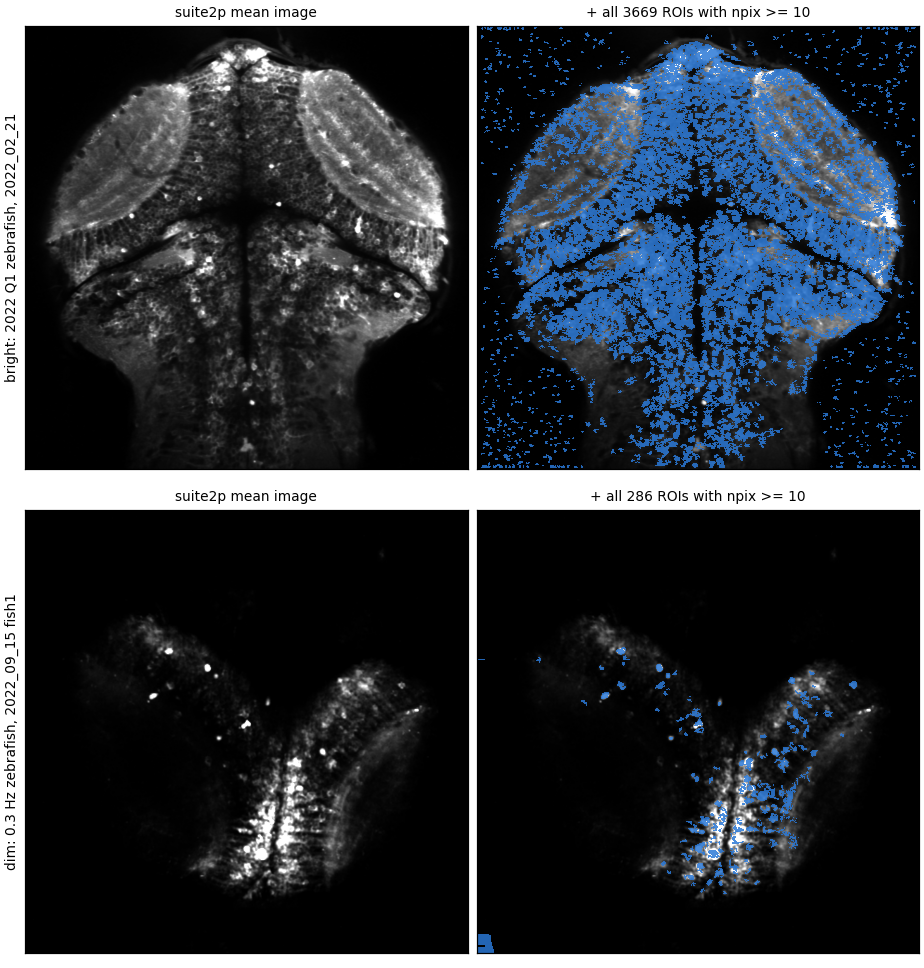
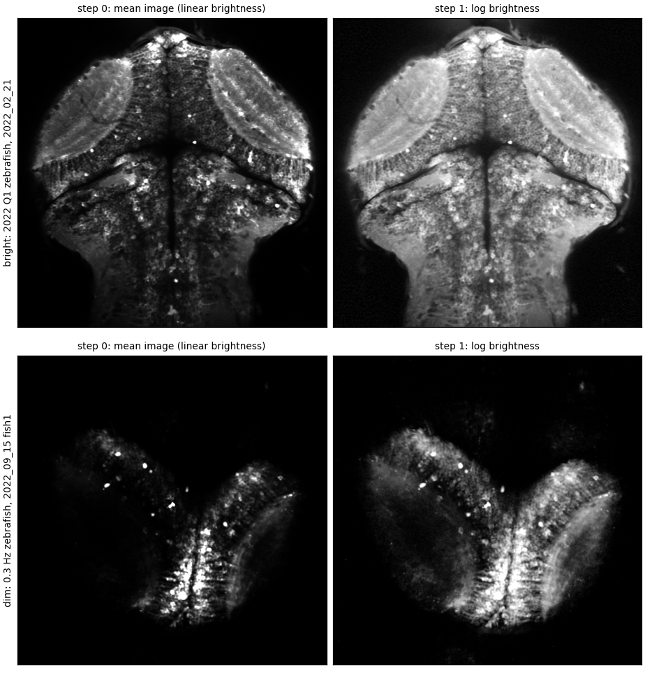
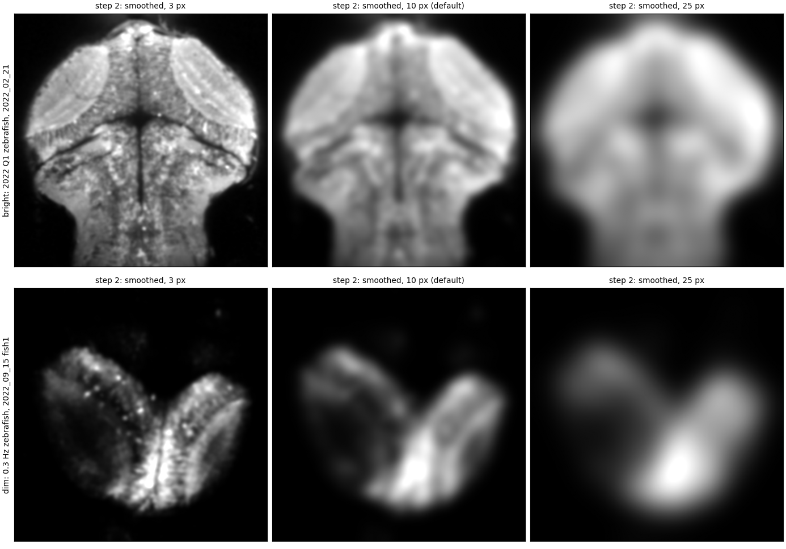
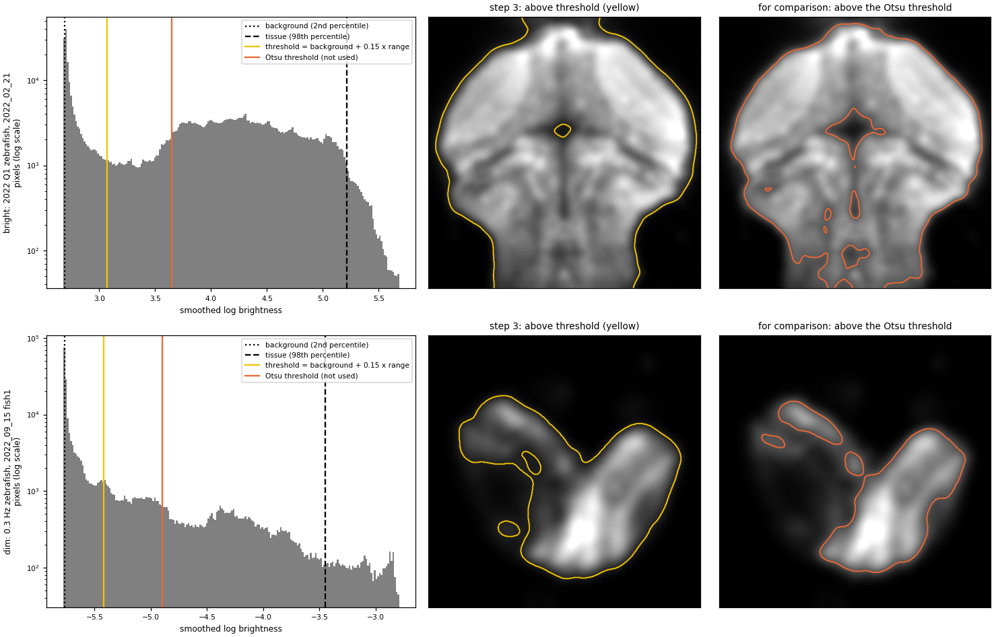
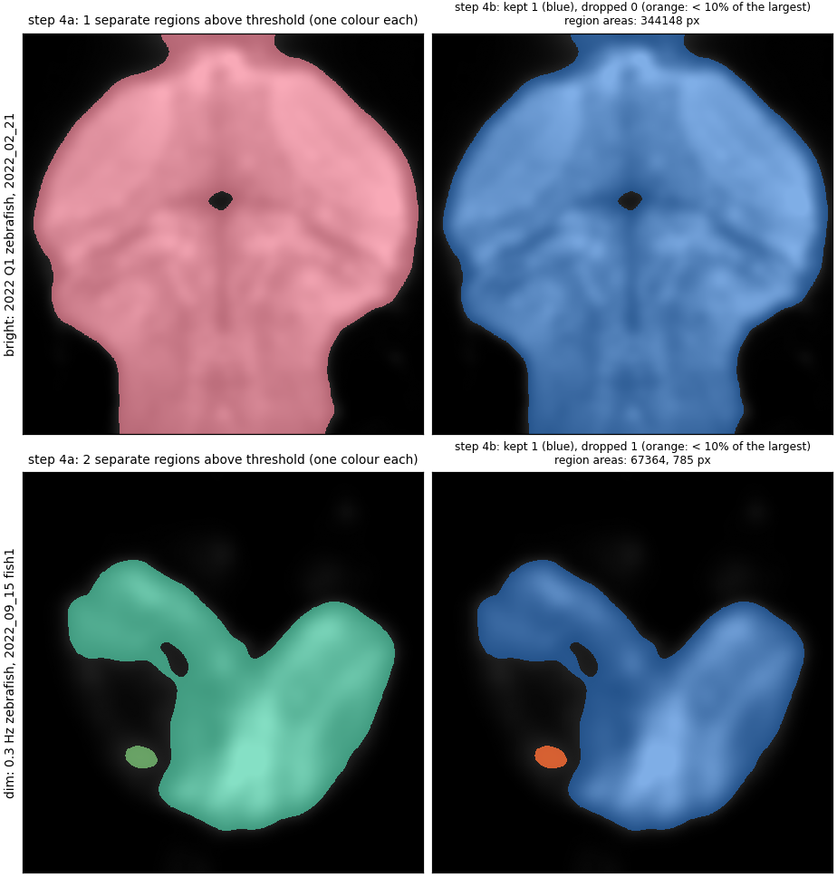
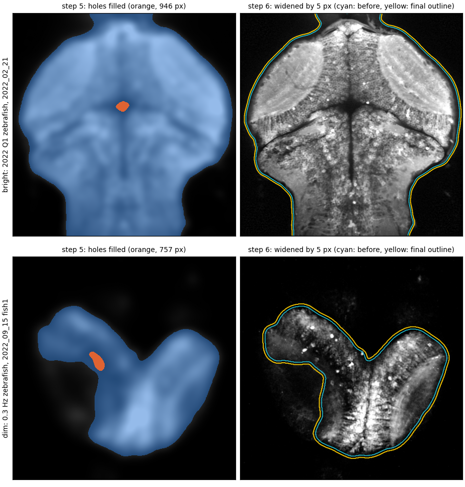
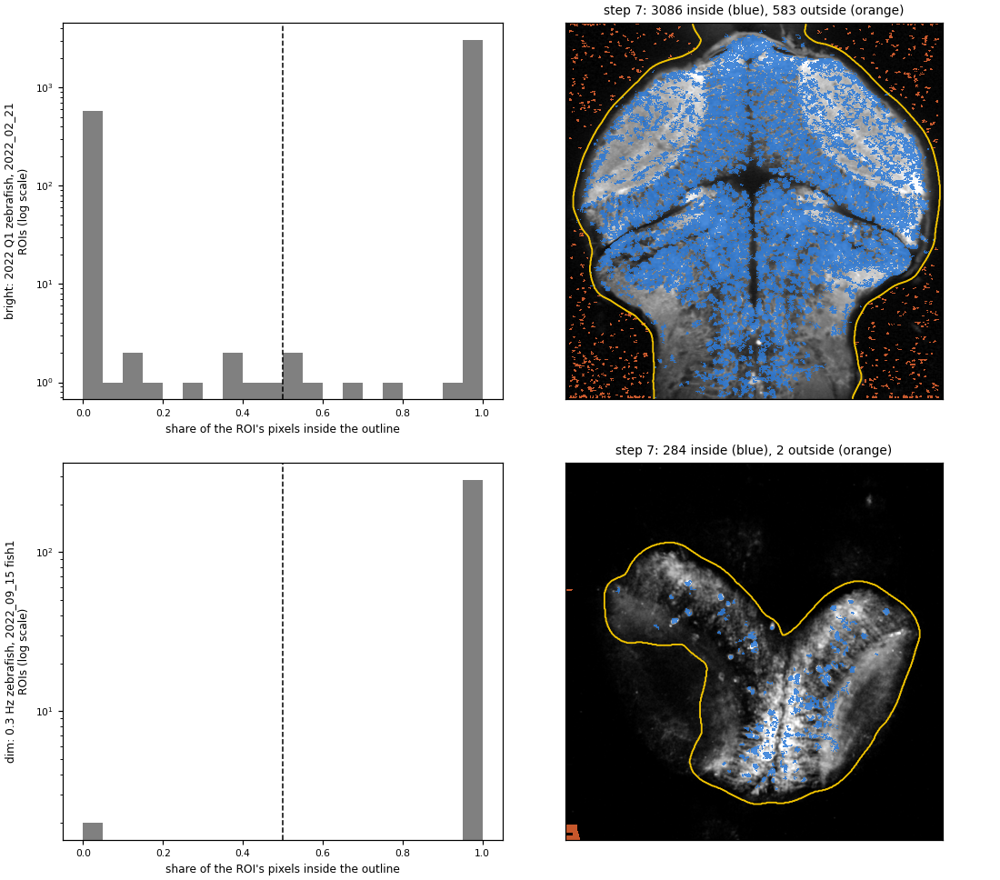
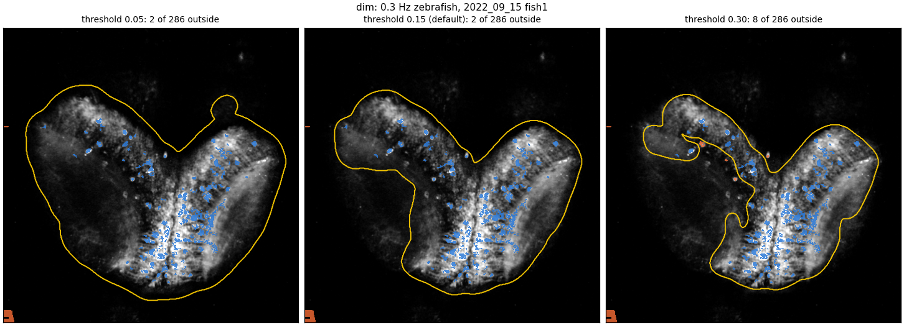

# Outlining the fish to remove ROIs that lie outside it

**Date:** 2026-10-02. **Scripts:** `docs/nfc_finite_sample_bias/body_mask.py` (the method),
`docs/body_outline/body_outline_figures.py` (this report's figures),
`docs/nfc_finite_sample_bias/body_outline_gui.ipynb` (slider GUI).

## The question

suite2p segments the whole imaging frame, not just the fish. In every recording it puts
hundreds of ROIs on the dark background around the brain (Figure 1). These cannot be neurons.
Can the outline of the fish be found automatically from data we already have, so every ROI
outside it can be dropped?

The approach uses one image per field of view: suite2p's **mean image** (`meanImg`), the
average of every frame of the recording. Tissue is brighter than the background in it, even in
the dim recordings. The method turns that image into a yes/no map of "fish" pixels, then
classifies each ROI by where its pixels fall. Nothing in it uses the ROI traces, P(iscell) or
the stimulus.

**Terms used below.**

| term | meaning |
|---|---|
| field of view | one imaging plane with one suite2p segmentation. Repeat trials of one fish share a field of view. |
| mean image | suite2p's `meanImg`: the time-averaged brightness of every pixel |
| outline | the boundary of the region the method calls "fish" (yellow line in the figures) |
| inside / outside ROI | a ROI with at least / less than half of its pixels inside the outline |

**Two example fields of view** are used throughout, chosen because they are the two extremes:

- **bright:** 2022 Q1 zebrafish, `2022_02_21`. Ordinary fluorescence; the mean image spans
  about 5,000 to 6,300.
- **dim:** 0.3 Hz zebrafish, `2022_09_15` fish1. Floor-clipped (photon-starved); the whole
  mean image lies between 50.0 and 50.6, and most of the frame sits at exactly 50.0.



<sub>**Figure 1. ROIs outside the fish.** *Left:* the mean image. *Right:* the same with every ROI of 10 or more pixels drawn in blue. Top: the bright example; bottom: the dim example. In the bright example hundreds of small ROIs are scattered over the black background on both sides of the brain.</sub>

## The method, step by step

### Step 1: take the logarithm of the brightness

**What it does.** Each pixel's brightness above the image's darkest pixel is replaced by its
logarithm: log(brightness − minimum + offset). The offset is 5% of the image's bright end
(its 98th percentile above the minimum); it keeps pixels at the minimum from going to minus
infinity.

**Why.** Tissue brightness varies a lot: a few bright cell bodies, much larger areas of
dimmer neuropil and dim brain regions. On a linear scale those dim regions are almost as dark
as the background, and any threshold that keeps them also has to sit very close to the
background. The logarithm compresses the bright end and spreads out the dim end, so dim tissue
separates clearly from the background (Figure 2, bottom row: the left lobe and the area
between the lobes become visible). Defining the offset relative to the image makes the step
behave the same in an image spanning 50.0–50.6 and one spanning 5,000–6,300.



<sub>**Figure 2. Step 1, log brightness.** *Left:* the mean image on a linear scale. *Right:* after the log transform. Both are shown with the same display stretch (1st to 99.5th percentile). In the dim example (bottom) the log reveals tissue that is nearly invisible on the linear scale.</sub>

### Step 2: blur the image

**What it does.** The log image is blurred with a Gaussian of a given width ("smoothing",
default 10 pixels).

**Why.** The outline should follow the tissue, not individual cells. Unblurred, the image is
speckled: bright cells, dark gaps between them, and pixel noise in the background. A threshold
on that would give a ragged outline full of holes and specks. Blurring averages each pixel
with its neighbours, so a pixel's value reflects whether it sits in a region of tissue.
Figure 3 shows the trade-off. At 3 pixels the cell-level speckle is still there. At 25 pixels
the image is so blurred that the outline would bulge well past the edge of the brain and fill
in real gaps (such as the notch between the lobes in the dim example).



<sub>**Figure 3. Step 2, blurring.** The log image blurred with a Gaussian of 3, 10 (default) and 25 pixels, for each example (rows).</sub>

### Step 3: threshold

**What it does.** Pixels brighter than a threshold are called fish. The threshold is set
relative to each image's own brightness range:

- **background level** = the 2nd percentile of the blurred image (almost all fields of view
  have at least 2% background);
- **tissue level** = the 98th percentile;
- **threshold** = background + 0.15 × (tissue − background). The 0.15 is the main slider in
  the GUI ("threshold").

**Why not a standard automatic threshold?** The usual choice, Otsu's method, picks the value
that best splits the brightness histogram into two groups. Here those two groups are often
not "fish" and "background" but "bright tissue" and "everything else". In both examples the
Otsu threshold (orange in Figure 4) sits in the middle of the tissue part of the histogram:
it cuts out the dark ventricle and fibre tracts in the bright example, and drops the dim upper
part of the left lobe in the dim example. A threshold close to the background level instead
keeps all tissue that is detectably brighter than background.



<sub>**Figure 4. Step 3, threshold.** *Left:* histogram of the blurred log image (log count scale), with the background level (dotted), tissue level (dashed), the threshold used (yellow) and Otsu's threshold for comparison (orange). In both examples the tall spike at the left is the background. *Middle:* pixels above the threshold used (inside the yellow line). *Right:* pixels above Otsu's threshold, which is not used.</sub>

### Step 4: drop small separate specks

**What it does.** The above-threshold pixels form one or more separate connected regions.
Every region smaller than 10% of the largest one is dropped ("min region" slider).

**Why.** A bright speck of debris or a lone bright cell outside the fish can pass the
threshold and form its own small region (orange in Figure 4, bottom: a 785-pixel blob below the
left lobe). Keeping every region at least 10% the size of the largest, rather than only the
largest, matters in dim recordings: there the two tectal lobes can be separate regions of
similar size, and keeping only the largest would discard a whole lobe.



<sub>**Figure 5. Step 4, regions.** *Left:* each separate above-threshold region in its own colour. *Right:* regions kept (blue) and dropped for being smaller than 10% of the largest (orange). The bright example has one region; the dim example has two, and the small one is dropped.</sub>

### Steps 5 and 6: fill holes, then add a margin

**What they do.** Step 5 fills any hole enclosed by a kept region. Step 6 widens the result
by 5 pixels on every side ("margin" slider): every pixel within 5 pixels of the region is
added.

**Why.** Holes appear where tissue is dark but clearly inside the fish: the ventricle in the
bright example (946 pixels) and a dim patch in the left lobe of the dim example (757 pixels,
Figure 6 left). ROIs there are still inside the brain. The margin protects cells at the very
edge of the brain: the blurred edge falls off gradually, so the threshold crossing can sit a
few pixels inside the real edge.



<sub>**Figure 6. Steps 5 and 6.** *Left:* the kept regions (blue) and the holes filled in step 5 (orange). *Right:* the outline before (cyan) and after (yellow) the 5-pixel margin, drawn on the log image. The yellow line is the final outline.</sub>

### Step 7: classify each ROI

**What it does.** For each ROI, the share of its pixels inside the final outline is computed.
A ROI is inside if that share is at least one half.

**Why one half?** In practice it hardly matters: almost every ROI is either entirely inside
or entirely outside (Figure 7, left; note the log count scale). Only a handful straddle the
outline.



<sub>**Figure 7. Step 7, classifying ROIs.** *Left:* the share of each ROI's pixels that lie inside the outline (log count scale); the dashed line is the cut at one half. *Right:* ROIs inside (blue) and outside (orange) the final outline (yellow). Bright example: 583 of 3,669 ROIs outside. Dim example: 2 of 286 outside, both in the frame-edge artifact at the left and bottom-left corner.</sub>

## Choosing the parameters

**The question.** The defaults work on both examples, but how sensitive is the outline to
them, and do they suit every field of view?

**Sensitivity.** The threshold matters most. Figure 8 shows the dim example at three
thresholds. At 0.05 the outline is loose and includes the dark region between the lobes; at
0.30 it starts cutting into the dim tissue of the left lobe. The default 0.15 sits between.
In this field of view almost no ROIs lie in the uncertain zone, so the count outside barely
moves (2, 2 and 8).



<sub>**Figure 8. Effect of the threshold.** The dim example with thresholds 0.05, 0.15 (default) and 0.30 of the way from background to tissue level. Blue: ROIs inside; orange: outside; yellow: outline.</sub>

**Not every field of view suits the defaults.** In the 0.3 Hz zebrafish `2022_09_14` fish2,
faint tissue above the tectum falls outside the default outline, and 30 ROIs that pass the
production P(iscell)/npix cut sit there (`fig_body_mask.pdf`, page 4). That field of view
needs a lower threshold. This is why the parameters can be set per field of view.

**The GUI.** `docs/nfc_finite_sample_bias/body_outline_gui.ipynb` shows one field of view at
a time with four sliders (threshold, smoothing, margin, min region). Open it in VS Code,
select the magneto2 environment as the kernel, and run all cells. When you move a slider and
then switch to another field of view, the settings are saved as a `body_outline:` block in
every experiment YAML that uses the field of view you left (all repeat trials of a fish; for
2022 Q1 also the visual, visualmagnet and nostim recordings). **Save** accepts the settings
without moving a slider. A progress line lists the fields of view still without settings.
`body_mask.py` reads the YAML blocks; recordings without one use the defaults. The
`body_outline` field is in the experiment schema but is not yet applied by the analysis
stage; once the outlines are set, it can be applied at analysis time alongside
`iscell_threshold` and `npix_threshold`.

## Results with the defaults, all fields of view

| set of recordings | ROIs (npix ≥ 10) | outside | of those passing the production cut, outside | median P(iscell) outside / inside |
|---|---|---|---|---|
| 2022 Q1 zebrafish (0.4 Hz and visual-only share these fields of view) | 6,968 | 729 | 62 of 2,876 | 0.07 / 0.46 |
| 0.3 Hz zebrafish | 1,431 | 77 | 30 of 496 | 0.56 / 0.43 |
| 0.1 Hz zebrafish | 4,427 | 154 | 31 of 1,629 | 0.34 / 0.48 |
| medaka | 1,469 | 179 | 11 of 585 | 0.59 / 0.75 |

- **In the bright 2022 Q1 recordings the outside ROIs are clearly noise** (median P(iscell)
  0.07), and P(iscell) already removes most of them: 62 of 729 pass the production cut.
- **In the dim recordings far fewer ROIs fall outside** than with the first version of this
  method, which used log(1 + brightness). On images spanning 50.0–50.6 that transform is
  almost linear, so dim tissue fell outside and its ROIs were wrongly flagged (an earlier
  count was 169 outside in the 0.3 Hz recordings; now 77, most of them in `2022_09_14` fish2,
  above).
- **Medaka's outside ROIs** are mostly the column of small ROIs along the left edge of the
  frame (an edge artifact), with zero coverage.

## Limitations

- The outline is only as good as the mean image. Tissue too dim to rise above the background
  noise even after blurring cannot be found; for those fields of view, lower the threshold in
  the GUI and check by eye.
- The outline is drawn in 2-D on one plane. It says nothing about whether an inside ROI is a
  cell; that is still P(iscell)'s and npix's job.
- The 98th percentile is taken as the tissue level. A field of view with a very bright
  object outside the fish (the bright blob next to `2022_10_02` fish1) can raise that level;
  the threshold is relative to it, so it rises too. The min-region step and the GUI handle the
  cases seen so far.

## Reproducing

```bash
python docs/nfc_finite_sample_bias/coverage_vs_roi_quality.py   # per-ROI table (P(iscell), npix, coverage)
python docs/nfc_finite_sample_bias/fov_images.py                # once: copy mean images from the NAS (gitignored cache)
python docs/nfc_finite_sample_bias/body_mask.py                 # outline every field of view: fig_body_mask.pdf
python docs/body_outline/body_outline_figures.py                # this report's figures
python docs/nfc_finite_sample_bias/make_body_outline_gui.py     # regenerate the GUI notebook
```
