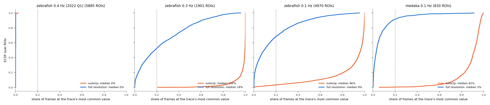
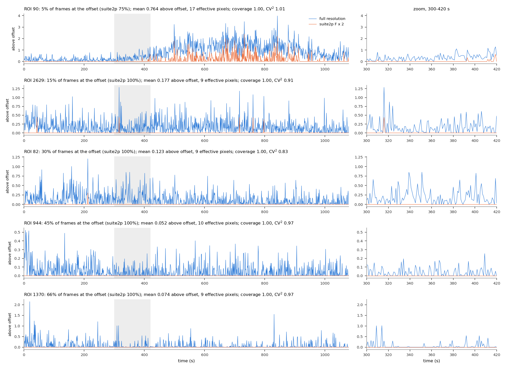
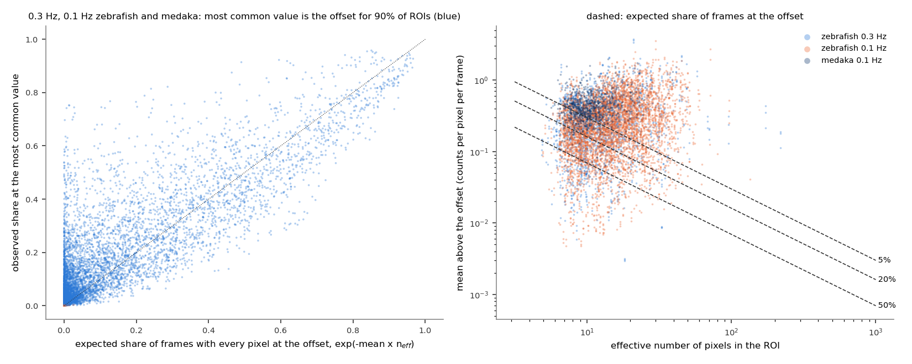
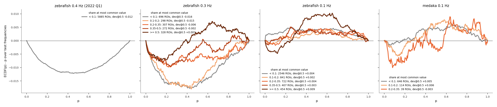

# Coverage after the full-resolution re-extraction: is there still a floor?

**Date:** 2026-10-05. **Branch:** `fullres-imaging-traces`. **Script:**
`docs/coverage_full_resolution/coverage_full_res.py` (~5 min; `--figures-only` replots).
Background: [`cv2.md`](cv2.md), section 4 (why suite2p's traces had a floor) and
[`full_resolution_rerun.md`](full_resolution_rerun.md) (what the re-extraction changed).

**Summary.**
- **About a third of full-resolution traces still sit at one value in ≥ 20% of frames** (0.3 Hz
  48%, 0.1 Hz 32%, medaka 8%), against nearly all of suite2p's traces.
- **That value is the detector offset.** It is the frame in which every pixel of the ROI recorded
  zero photons. How often that happens follows from the ROI's brightness and size, as Poisson
  counts predict.
- **It doesn't make a floor in the sense that mattered.** The traces carry continuous signal
  around it. No ROI has coverage below 0.33 (median 1.0). The p-values where nothing was presented are
  calibrated at every share of frames at the offset.
- **So the coverage threshold has nothing left to remove.** It is set to 0 in every imaging
  YAML; whether to delete it from the code is open.

## Terms

| term | meaning |
|---|---|
| offset | the value a pixel reads with no photons: 100 in these tiffs (25,600 in `20221002_fish1`, whose tiffs are stored ×256) |
| share at the most common value | the share of a trace's frames at its single most common value |
| coverage | share of 60 s windows with at least 3 frames above the trace's floor, where the floor is a value the trace sits at in ≥ 20% of frames (`pipeline/roi_coverage.py`). A trace with no such value has coverage 1 |
| effective pixels | 1 / Σw², with w the ROI's normalised suite2p weights; how many pixels the trace effectively averages |
| test frequencies, dev@0.5 | as in [`cv2.md`](cv2.md): frequencies where nothing was presented, and the share of p ≤ 0.5 minus 0.5 (0 = calibrated) |

**Population:** production ROIs on the full-resolution traces (P(iscell) > 0.5, npix ≥ 10, inside the fish outline, flatline removal), every recording of the Fig 2C magnetic pool.

## 1. How many traces still sit at one value?

**The question.** After re-extraction, how often is a trace at its most common value, compared
with suite2p's trace of the same ROI?



<sub>**Figure 1. Share of frames at each trace's most common value**, ECDF over ROIs: suite2p (orange) and full resolution (blue). Dashed: the 20% that `roi_coverage.py` takes as a floor.</sub>

| | ROIs | median share, suite2p → full | ≥ 20% of frames, suite2p → full |
|---|---|---|---|
| zebrafish 0.3 Hz | 1,901 | 100% → 18% | 100% → 48% |
| zebrafish 0.1 Hz | 4,970 | 96% → 9% | 97% → 32% |
| medaka 0.1 Hz | 830 | 92% → 3% | 99% → 8% |
| zebrafish 0.4 Hz (2022 Q1) | 5,885 | 0% → 0% | 0% → 0% |

- **Re-extraction removes most of it** (Figure 1), but not all: in the 0.3 Hz recordings half
  the traces still spend at least a fifth of their frames at one value.

## 2. What do those traces look like, and why?

**The question.** Is the remaining most-common value a floor like suite2p's, or something else?



<sub>**Figure 2. Five ROIs of one 0.1 Hz recording** (`engert_20221001_fish2_magneto_0`), from 5% to 66% of frames at the most common value. Blue: full resolution; orange: suite2p (×2), both above the offset. *Right:* zoom on 300–420 s.</sub>



<sub>**Figure 3. The most common value is the offset, at the rate Poisson counts predict.** *Left:* observed share at the most common value against exp(−mean × effective pixels), the share of frames in which every pixel records zero photons if counts are Poisson. Blue: ROIs whose most common value is the offset (90%). *Right:* brightness (mean counts per pixel per frame above the offset) against effective pixels; dashed lines: where 5%, 20% and 50% of frames are expected at the offset.</sub>

- **The traces are continuous** (Figure 2). Even the ROI at the offset in 66% of frames varies
  between the zero frames, and its events and slow changes are visible. suite2p's version of
  each ROI is flat at 0 almost throughout.
- **The repeated value is the offset in 90% of ROIs** (Figure 3, left): frames in which none of
  the ROI's pixels caught a photon.
- **Its share is set by brightness and size** (Figure 3; correlation 0.85 between expected and
  observed). Dim, small ROIs average a fraction of a photon per frame over a handful of
  effective pixels, so many frames contain no photons at all. That is the shot noise of a
  photon-starved movie, not a clipped signal.

## 3. Do those traces need excluding?

**The question.** Do ROIs that sit at the offset more often have miscalibrated p-values, and
would the coverage threshold remove any of them?



<sub>**Figure 4. Calibration where nothing was presented, ROIs binned by share at the most common value.** ECDF(p) − p over each ROI's test frequencies, averaged over the ROIs in each bin; production null. Bins with fewer than 20 ROIs are not drawn.</sub>

| dev@0.5 at test frequencies (ROIs) | < 10% | 10–20% | 20–35% | 35–50% | ≥ 50% |
|---|---|---|---|---|---|
| zebrafish 0.3 Hz | −0.016 (696) | −0.015 (298) | −0.006 (307) | −0.002 (272) | +0.003 (328) |
| zebrafish 0.1 Hz | +0.004 (2546) | +0.002 (841) | +0.004 (722) | +0.003 (407) | +0.009 (454) |
| medaka 0.1 Hz | +0.005 (646) | +0.006 (114) | −0.003 (39) | — | — |

- **Calibrated in every bin** (Figure 4): within 0.02 of 0 everywhere. The suite2p traces gave
  +0.14 to +0.15 for their worst ROIs ([`cv2.md`](cv2.md), Figure 4). The ROIs most often at
  the offset are no worse than the rest.
- **Their CV² is close to 1** (median 0.87–0.92 in the highest bin), so the power spectrum has the
  exponential spread the null assumes.
- **The coverage threshold would remove nothing:**
  - On the full-resolution traces no ROI has coverage below 0.1. The median is 1.0, and the
    minimum is 0.33 (0.3 Hz), 0.50 (0.1 Hz) and 0.94 (medaka). Frames at the offset are
    interleaved with frames above it, in nearly every 60 s window.
  - On suite2p's traces of the same ROIs, the threshold of 0.1 removed 68% (0.3 Hz), 35%
    (0.1 Hz) and 4% (medaka).

## What this establishes

| | finding |
|---|---|
| **Established** | After re-extraction, 8–48% of traces still spend ≥ 20% of frames at one value. That value is the detector offset (frames with no photons in the ROI), at the rate expected from the ROI's brightness and size. |
| **Established** | Those traces are continuous, have CV² ≈ 1, and are calibrated where nothing was presented. No ROI has coverage below 0.33, so the coverage threshold (0.1) would remove nothing. |
| **Open** | Whether to delete `coverage_threshold` and `pipeline/roi_coverage.py` from the pipeline, or keep them as a diagnostic. |

## Reproducing

```bash
python docs/coverage_full_resolution/coverage_full_res.py                 # writes results_coverage_full_res*.csv/npz and fig_cov_*.png
python docs/coverage_full_resolution/coverage_full_res.py --figures-only
```
