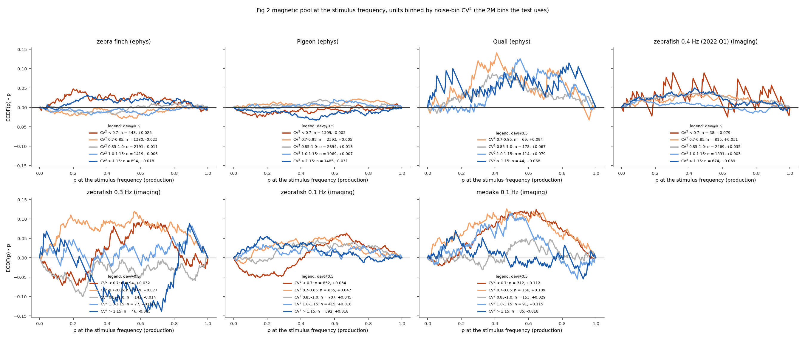
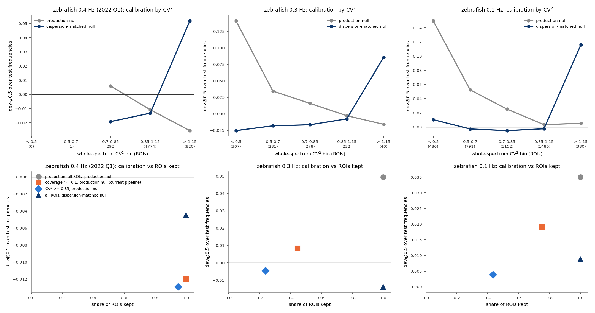
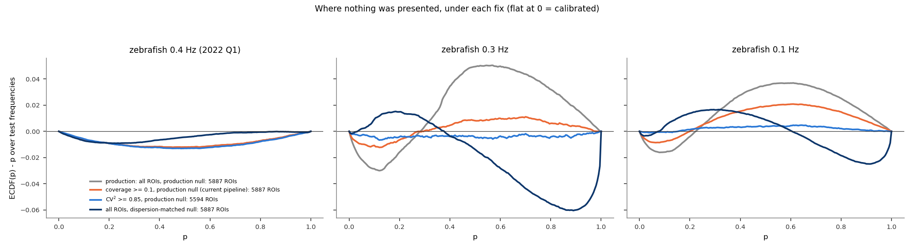

# CV²: what it measures, how it predicts the imaging p-value bump, and how the fixes compare

**Date:** 2026-10-05. **Branch:** `guard-band-null`. **Scripts:** `docs/cv2/cv2_marginals.py`
(per-unit CV² for ephys and imaging, ~2 min) and `docs/cv2/cv2_report.py` (imaging p-values by
CV², ~5 min; `--figures-only` replots). Related:
[`few_event_spectra.md`](few_event_spectra.md) (the mechanism, trace by trace),
[`dispersion_matched_null.md`](dispersion_matched_null.md) and
[`guard_band_null.md`](guard_band_null.md) (two attempted fixes).

**The problem.** In the floor-clipped zebrafish recordings (0.1 Hz and 0.3 Hz), the p-values
pile up in the middle of the range at every frequency, including where nothing was presented:
the "bump" in ECDF(p) − p. This document shows that one number per neuron, CV², predicts which
neurons produce the bump, and uses it to compare the fixes on the same footing.

## What CV² is

CV² is the squared coefficient of variation, variance / mean², of a neuron's periodogram powers
\|Y_k\|² across frequency bins.

- **Production's null assumes CV² = 1.** For Gaussian noise each bin's power is exponential,
  and an exponential's SD equals its mean.
- **A trace with few events has CV² < 1.** Its Fourier coefficient at each frequency is a sum
  of one contribution per event. With event sizes a_j, CV² = 1 − Σa_j⁴ / (Σa_j²)², which is
  1 − 1/K for K equal events: 0 for one event, 0.5 for two, approaching 1 only for many.
  Power that varies too little across frequencies means the analysis bin rarely strays far
  from its neighbours, so NFC is rarely very large or very small, and p lands in the middle
  ([`few_event_spectra.md`](few_event_spectra.md), Figure 1).
- **For ephys** each spike is one equal-sized event, so CV² ≈ 1 − 1/(spike count), close to 1
  for any unit with more than a few dozen spikes.

Two versions are used:

| version | over which bins | used for |
|---|---|---|
| whole-spectrum | every bin from 0.05 Hz up, away from the stimulus window, each power divided by the mean of its 51 neighbours (so the spectrum's slope does not count). Hundreds of bins, little sampling noise | imaging (raw traces needed) |
| noise-bin | the 2M noise bins at the stimulus frequency, as saved in each NWB file. Few bins, so noisy and slightly below 1 even for Gaussian noise; compared against an exact-null draw with the same M | every unit with an NWB file, ephys and imaging |

## 1. How is CV² distributed?

**The question.** Is low CV² specific to the floor-clipped recordings, or common to all the
data?


<sub>**Figure 1. Noise-bin CV² for every unit in the Fig 2 magnetic pool.** *A:* ephys, *B:* imaging; ECDF over units (solid) and, dotted, the same statistic for 2M independent exponential powers with each unit's own M (what CV² looks like if the production null holds exactly). *C:* ephys units' median CV² against spike count, with the exact-null median (dotted) and 1 − 1/spikes times that median (gray). Mouse and owl have no NWB file and are not included. 27,206 units.</sub>

| dataset | units | median CV² | exact-null median | CV² < 0.5 | exact null |
|---|---|---|---|---|---|
| zebra finch (ephys) | 6332 | 0.94 | 0.96 | 0.6% | 0.4% |
| pigeon (ephys) | 10050 | 0.91 | 0.94 | 1.4% | 0.9% |
| quail (ephys) | 411 | 0.96 | 0.99 | 0.2% | 0% |
| zebrafish 0.4 Hz, 2022 Q1 (imaging) | 5887 | **0.98** | 0.98 | 0% | 0% |
| zebrafish 0.3 Hz (imaging) | 508 | **0.86** | 0.97 | 2.0% | 0% |
| zebrafish 0.1 Hz (imaging) | 3221 | **0.83** | 0.94 | 5.6% | 0.2% |
| medaka 0.1 Hz (imaging) | 797 | **0.77** | 0.88 | 13.7% | 2.9% |

- **Ephys and 2022 Q1 imaging sit essentially on the null.** Ephys is very slightly low at
  small spike counts (Figure 1C: 0.89 against 0.95 at about 60 spikes), as bursts acting like
  fewer, larger events would predict.
- **The floor-clipped imaging sets are shifted low** by about 0.11 in median, with a tail the
  null almost never produces.

With the whole-spectrum version (zebrafish imaging only, before the coverage threshold), median
CV² is 0.99 for 2022 Q1, 0.82 for 0.1 Hz and 0.69 for 0.3 Hz, and 0%, 11% and 27% of ROIs are
below 0.5.

## 2. Does CV² predict the bump?

**The question.** If ROIs are grouped by CV², does the bump sit in the low-CV² groups and
vanish in the groups near 1?


<sub>**Figure 2. The p-value distribution where nothing was presented, ROIs binned by whole-spectrum CV².** ECDF(p) − p over each ROI's test frequencies (every 3rd bin from 0.05 Hz, away from the stimulus; 106–266 per recording), averaged over the ROIs in each CV² bin. *Top row:* production null. *Bottom row:* dispersion-matched null (section 4). Population: production before the coverage threshold (P(iscell) > 0.5, npix ≥ 10, inside the fish outline, flatline removal). Legends give ROIs and dev@0.5 per bin; bins with fewer than 20 ROIs are not drawn.</sub>

| dev@0.5, production null | CV² < 0.5 | 0.5–0.7 | 0.7–0.85 | 0.85–1.15 | > 1.15 |
|---|---|---|---|---|---|
| zebrafish 0.3 Hz | **+0.141** (307) | +0.035 (281) | +0.016 (278) | −0.003 (232) | −0.016 (40) |
| zebrafish 0.1 Hz | **+0.150** (486) | +0.052 (791) | +0.025 (1152) | +0.003 (1486) | +0.005 (380) |
| zebrafish 0.4 Hz (2022 Q1) | — (0) | — (1) | +0.006 (292) | −0.011 (4774) | −0.025 (820) |

(ROIs in brackets.)

- **Yes** (Figure 2, top). The bump grows steadily as CV² falls: ROIs with CV² < 0.5 sit at
  +0.14 to +0.15, with a curve 3–4 times the height of the whole set's. ROIs with CV² 0.85–1.15
  are calibrated in every set, floor-clipped or not.
- **It is the same shape at every CV²,** only smaller: too few p-values below about 0.2 and
  too many in the middle. That is the under-dispersed NFC of
  [`few_event_spectra.md`](few_event_spectra.md).
- **The same holds in 2022 Q1,** which has almost no low-CV² ROIs: its slight negative
  deviation comes from its ROIs with CV² > 1.15.

## 3. Does it hold across datasets at the stimulus frequency?

**The question.** Using the noise-bin CV², which exists for every unit, does the same pattern
appear at the stimulus frequency in ephys and imaging?



<sub>**Figure 3. The Fig 2 magnetic pool at the stimulus frequency, units binned by noise-bin CV².** ECDF(p) − p of each unit's production p-value at the stimulus frequency, per CV² bin (bins with fewer than 30 units not drawn). Legends: units and dev@0.5 per bin. For Gaussian noise the noise-bin CV² is independent of the unit's own p-value, so this binning does not by itself bend the curves.</sub>

- **Ephys shows no trend with CV²** (top left): every bin is within a few hundredths of 0 in
  zebra finch and pigeon. Quail's units sit above 0 in every bin, so whatever moves them is
  not CV².
- **Imaging is much noisier here** than in Figure 2: one p-value per ROI instead of 100–270,
  and a CV² from 2M bins instead of hundreds. The lowest-CV² bins are among the highest in
  medaka and 0.1 Hz zebrafish, but the trend is not clean. Figure 2's whole-spectrum version
  is the reliable test.

## 4. How do the fixes compare across CV²?

**The question.** For each fix, how calibrated is each CV² group, and how many ROIs are kept?

The fixes compared, all on the same ROIs and test frequencies:

| fix | keeps | null |
|---|---|---|
| production | all ROIs | F(2, 4M) |
| coverage threshold (current pipeline) | ROIs active in ≥ 10% of 60 s windows | F(2, 4M) |
| CV² selection | ROIs with whole-spectrum CV² ≥ 0.85 | F(2, 4M) |
| dispersion-matched null | all ROIs | F(2k, 4Mk), k = 1/CV² ([`dispersion_matched_null.md`](dispersion_matched_null.md)) |

The guard band ([`guard_band_null.md`](guard_band_null.md)) is left out: it does not use CV²
and did not calibrate.



<sub>**Figure 4. Each fix by CV² and by ROIs kept.** *Top:* dev@0.5 over test frequencies per CV² bin (ROIs in brackets), production null (gray) and dispersion-matched null (navy). *Bottom:* each fix's dev@0.5 over the whole set against the share of the set's ROIs it keeps.</sub>



<sub>**Figure 5. The whole p-value distribution where nothing was presented, under each fix.** ECDF(p) − p over test frequencies, averaged over the ROIs each fix keeps. Legends give the ROIs kept.</sub>

| dev@0.5 over test frequencies (share of ROIs kept) | 0.3 Hz zebrafish | 0.1 Hz zebrafish | 2022 Q1 zebrafish |
|---|---|---|---|
| production, all ROIs | +0.049 (100%) | +0.035 (100%) | −0.012 (100%) |
| coverage ≥ 0.1 (current pipeline) | +0.008 (45%) | +0.019 (75%) | −0.012 (100%) |
| CV² ≥ 0.85 | **−0.005 (24%)** | **+0.004 (43%)** | −0.013 (95%) |
| dispersion-matched null, all ROIs | −0.014 (100%) | +0.009 (100%) | −0.004 (100%) |

- **CV² selection is the only fix that is flat across the whole p range** (Figure 5, blue). It
  removes exactly the ROIs the bump comes from, but keeps only 24% (0.3 Hz) and 43% (0.1 Hz)
  of the ROIs.
- **The coverage threshold is a weaker proxy for CV².** At 0.3 Hz it does nearly as well at
  p = 0.5 with twice the ROIs, but at 0.1 Hz it keeps 75% and leaves half the bump, because
  many ROIs active in 10–40% of windows still have low CV² (see
  [`few_event_spectra.md`](few_event_spectra.md), Figure 3).
- **The dispersion-matched null looks good at p = 0.5 but not across the range** (Figure 2,
  bottom row). In every CV² bin below 1.15 it turns the bump into an S: too many p-values
  below 0.3 and a pile just below 1, growing as CV² falls. And it breaks the ROIs above 1.15,
  which production had calibrated: they go from −0.016 to −0.025 under production to +0.05 to
  +0.12 under the matched null. Its near-zero averages come from these errors cancelling.

## Other ways to deal with the bump (not tried)

The fixes above either drop neurons (coverage, CV² selection) or construct a per-neuron null
(dispersion-matched). Other directions, roughly from most to least direct:

1. **Recover what the floor hides.** The traces sit at exactly 50.0 for 91–98% of frames, so
   the floor is an offset clipped somewhere in acquisition or extraction, not a property of
   the cells. If the raw movies carry information below it, re-extracting fluorescence without
   the clip would restore continuous noise between events, CV² near 1, and the production
   null, without dropping anyone. If the movies are truly photon-starved at that level, there
   is nothing to recover. Checking the raw tiffs' pixel values would settle it.
2. **Combine repeat trials of the same ROI.** In the 0.3 Hz and 0.1 Hz zebrafish each fish's
   three trials share one segmentation. Adding a ROI's powers across its trials, at the same
   frequency, gives three times the events per test and pushes CV² toward 1, with an exact null
   for Gaussian noise (F(6, 12M)). It changes the unit of analysis from ROI-trial to ROI and
   does not apply to medaka, whose trials have separate segmentations.
3. **Select on CV², but report it.** CV² does not use the stimulus, so a CV² ≥ 0.85 rule is a
   legitimate, stimulus-blind inclusion criterion that targets the cause directly. The cost is
   the neuron count above.
4. **Calibrate each ROI against its own spectrum.** A ROI's p-value would be the share of its
   own test frequencies with an NFC at least as large as at the stimulus. This needs no model
   of the power's shape, but it is the empirical null already considered and set aside, and its
   resolution is limited by the 100–270 test frequencies.
5. **Keep everything and state the deviation.** It is +0.003 for CV² near 1 and present at
   every frequency, so it is not a magnetic response; Fig 2C's imaging excess can be reported
   with that caveat.

## What this establishes

| | finding |
|---|---|
| **Established** | CV² below 1 is specific to the floor-clipped imaging recordings; ephys and 2022 Q1 imaging sit on the null. |
| **Established** | Within the floor-clipped recordings, CV² predicts the bump: +0.14 to +0.15 for CV² < 0.5, calibrated for CV² 0.85–1.15. |
| **Established** | Selecting CV² ≥ 0.85 calibrates the whole p range, at the cost of most ROIs. The coverage threshold is a weaker proxy. The dispersion-matched null cancels errors rather than calibrating, and miscalibrates the high-CV² ROIs that production handled correctly. |
| **Open** | Whether the floor can be undone at extraction (option 1), which would fix the cause instead of the symptom. |

## Reproducing

```bash
python docs/cv2/cv2_marginals.py              # results_cv2_marginals.csv, fig_cv2_marginals.png
python docs/cv2/cv2_report.py                 # results_cv2_rois.csv, results_cv2_ecdf.npz, fig_cv2_{binned,stimulus_binned,fixes,fixes_curves}.png
python docs/cv2/cv2_report.py --figures-only
```
