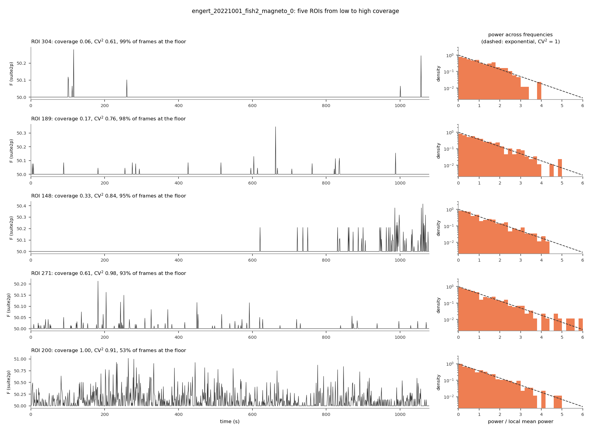
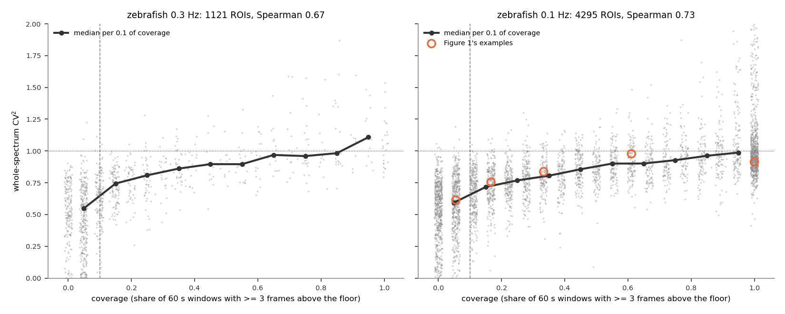
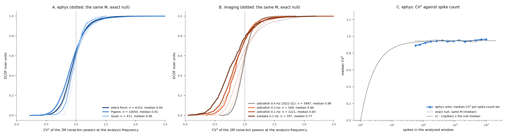
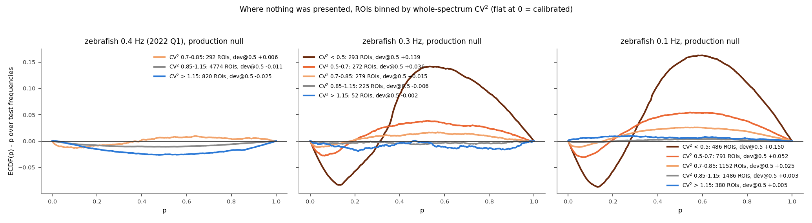
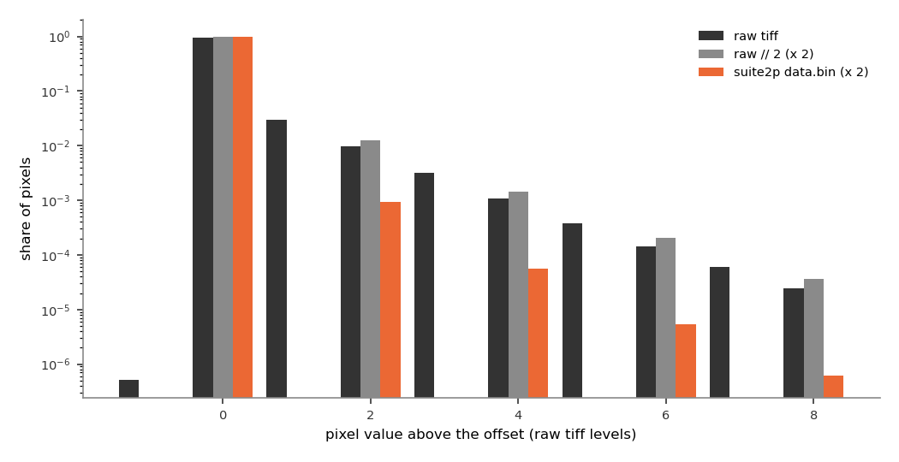
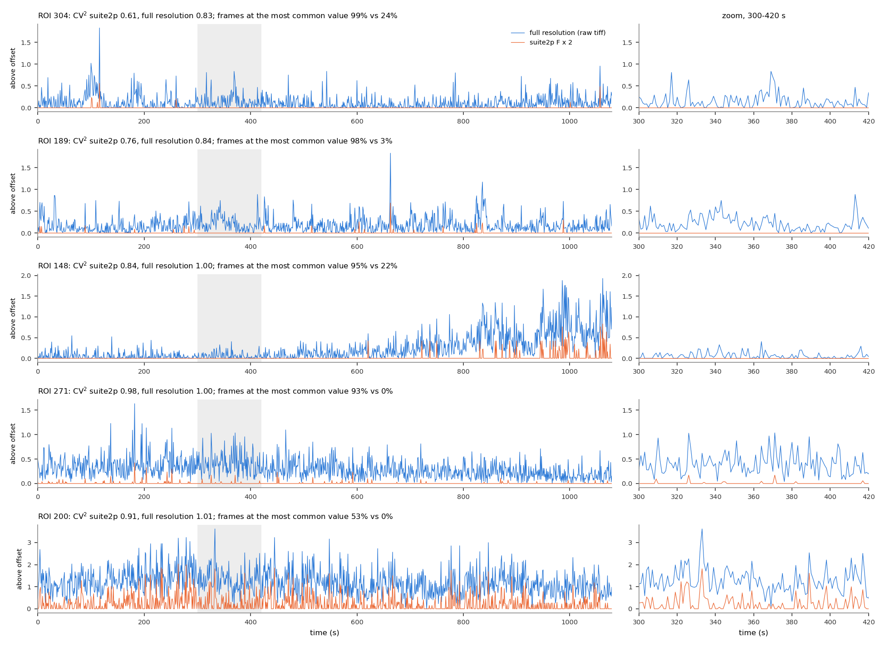
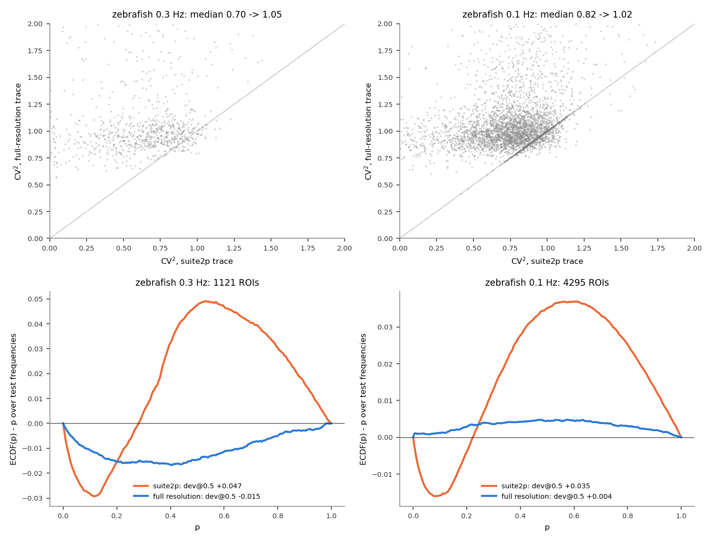

# CV²: what it measures in the imaging traces, and where the low values come from

**Date:** 2026-10-05. **Branch:** `guard-band-null`. **Scripts:**
- `docs/cv2/cv2_marginals.py`: per-unit CV² for ephys and imaging, ~2 min.
- `pipeline/ophys_extraction.py` (processing, since this report): the full-resolution traces from the raw tiffs, stored in each NWB file next to suite2p's.
- `docs/cv2/cv2_report.py`: everything else, ~5 min; `--figures-only` replots.

Related:
- [`few_event_spectra.md`](few_event_spectra.md): the mechanism, trace by trace.
- [`dispersion_matched_null.md`](dispersion_matched_null.md) and [`guard_band_null.md`](guard_band_null.md): two attempted fixes.

**Summary.**
- **Low CV² is behind the p-value bump** in the 0.1 Hz and 0.3 Hz zebrafish recordings.
- **It tracks coverage,** so it can be seen in the raw traces.
- **It is an artifact of how suite2p stored these movies.** suite2p's integer halving and truncation erased the faint signal between events and created the floor at 50.0. Re-extracted from the raw tiffs without those two steps:
  - the floor goes away;
  - CV² is about 1;
  - the production null is calibrated, with every ROI kept.

## What CV² is

CV² is the squared coefficient of variation, variance / mean², of a ROI's periodogram powers
\|Y_k\|² across frequency bins. Each power is divided by the mean of its 51 neighbours, so the
spectrum's overall slope does not count. CV² is taken over every bin from 0.05 Hz up, away from
the stimulus.

- **Gaussian noise gives CV² = 1,** which production's null assumes. Each bin's power is then
  exponential, and an exponential's SD equals its mean.
- **A trace that is flat except for K events has CV² ≈ 1 − 1/K.** Its Fourier coefficient at
  each frequency is a sum of one contribution per event: one event gives the same power
  everywhere (CV² = 0), and only many events give the exponential spread.
- **Low CV² puts p in the middle.** The analysis bin rarely strays far from its neighbours, so
  NFC is rarely very large or very small.

Figure 3 uses a second version, noise-bin CV², which exists for ephys too. It is taken over
only the 2M noise bins at the stimulus frequency saved in each NWB file. With so few bins it is
noisy, so it is compared with an exact-null draw of the same M.

## 1. What does low CV² look like in a trace?

**The question.** What separates a low-CV² trace from a high-CV² one, and does CV² follow
coverage?

Coverage is the share of 60 s windows in which the trace has at least 3 frames above its floor
(`pipeline/roi_coverage.py`).



<sub>**Figure 1. Five ROIs of one 0.1 Hz recording, from low to high coverage.** *Left:* the suite2p trace (production's input). *Right:* the distribution of its power across frequencies, each power divided by the local mean power (log scale). Dashed: the exponential, CV² = 1. Each ROI is the median-CV² ROI among those at its coverage.</sub>

- **A low-coverage trace sits at exactly 50.0** except for a handful of isolated events
  (Figure 1, top). With so few events its power is too even across frequencies. The
  histogram lacks the exponential's long tail and has CV² 0.61.
- **As coverage rises, the events multiply** and the power approaches the exponential: CV²
  0.76, 0.84, 0.98. The fully covered ROI at the bottom is still at the floor half the time,
  but has enough events for CV² 0.91.



<sub>**Figure 2. CV² against coverage, every ROI of the 0.3 Hz and 0.1 Hz recordings.** Gray: ROIs (coverage jittered; it comes in steps of one 60 s window). Black: median CV² per 0.1 of coverage. Dashed: the pipeline's coverage threshold, 0.1. Orange rings: Figure 1's ROIs. Population: production before the coverage threshold (P(iscell) > 0.5, npix ≥ 10, inside the fish outline, flatline removal).</sub>

- **CV² rises steadily with coverage** (Figure 2): median 0.5–0.6 below coverage 0.1, about 1
  at full coverage. Spearman correlation 0.68 (0.3 Hz) and 0.73 (0.1 Hz).
- **But at any coverage the spread is wide.** Below the 0.1 threshold, CV² runs from 0 to 1.
  This is why the coverage threshold removes only part of the bump: it judges how often a trace
  is active, while CV² measures how many events it has.

## 2. How is CV² distributed across datasets?

**The question.** Is low CV² specific to the floor-clipped recordings, or common to all the
data?



<sub>**Figure 3. Noise-bin CV² for every unit in the Fig 2 magnetic pool.** *A:* ephys. *B:* imaging. ECDF over units (solid), and, dotted, the same statistic for 2M independent exponential powers with each unit's own M (what CV² looks like if the production null holds exactly). *C:* ephys units' median CV² against spike count, with the exact-null median (dotted) and 1 − 1/spikes times that median (gray). Mouse and owl have no NWB file and are not included. 27,206 units.</sub>

| dataset | units | median CV² | exact-null median | CV² < 0.5 | exact null |
|---|---|---|---|---|---|
| zebra finch (ephys) | 6332 | 0.94 | 0.96 | 0.6% | 0.4% |
| pigeon (ephys) | 10050 | 0.91 | 0.94 | 1.4% | 0.9% |
| quail (ephys) | 411 | 0.96 | 0.99 | 0.2% | 0% |
| zebrafish 0.4 Hz, 2022 Q1 (imaging) | 5887 | **0.98** | 0.98 | 0% | 0% |
| zebrafish 0.3 Hz (imaging) | 508 | **0.86** | 0.97 | 2.0% | 0% |
| zebrafish 0.1 Hz (imaging) | 3221 | **0.83** | 0.94 | 5.6% | 0.2% |
| medaka 0.1 Hz (imaging) | 797 | **0.77** | 0.88 | 13.7% | 2.9% |

- **Ephys and 2022 Q1 imaging sit essentially on the null.** For ephys each spike is one
  equal-sized event, so CV² ≈ 1 − 1/(spike count), close to 1 above a few dozen spikes
  (Figure 3C).
- **The floor-clipped imaging sets are shifted low,** with a tail the null almost never
  produces.

With the whole-spectrum version, median CV² is:

| set | median CV² | ROIs below 0.5 |
|---|---|---|
| 2022 Q1 | 0.99 | 0% |
| 0.1 Hz | 0.82 | 11% |
| 0.3 Hz | 0.70 | 27% |

## 3. Does CV² predict the bump?

**The question.** If ROIs are grouped by CV², does the bump sit in the low-CV² groups and
vanish near 1?



<sub>**Figure 4. The p-value distribution where nothing was presented, ROIs binned by CV².** ECDF(p) − p over each ROI's test frequencies, averaged over the ROIs in each CV² bin; production null. Test frequencies are every 3rd bin from 0.05 Hz, away from the stimulus; 106–266 per recording. dev@0.5 = ECDF(0.5) − 0.5, 0 when calibrated. Legends give ROIs and dev@0.5 per bin; bins with fewer than 20 ROIs are not drawn.</sub>

| dev@0.5 (ROIs) | CV² < 0.5 | 0.5–0.7 | 0.7–0.85 | 0.85–1.15 | > 1.15 |
|---|---|---|---|---|---|
| zebrafish 0.3 Hz | **+0.139** (293) | +0.036 (272) | +0.015 (279) | −0.006 (225) | −0.002 (52) |
| zebrafish 0.1 Hz | **+0.150** (486) | +0.052 (791) | +0.025 (1152) | +0.003 (1486) | +0.005 (380) |
| zebrafish 0.4 Hz (2022 Q1) | — (0) | — (1) | +0.006 (292) | −0.011 (4774) | −0.025 (820) |

- **Yes** (Figure 4). The bump grows steadily as CV² falls, and ROIs with CV² 0.85–1.15 are
  calibrated in every set. Its shape is the same in every group, only smaller: too few
  p-values below about 0.2 and too many in the middle.

## 4. Where does the floor come from?

**The question.** The suite2p traces sit at exactly 50.0 for 91–98% of frames. Is that floor
in the raw movies, or was it created later? If later, is the signal under it recoverable?

suite2p (version 0.10.1) stores its registered movie as 16-bit signed integers. These tiffs
are unsigned, so it first halves every pixel (integer division, `// 2`). After registration,
which shifts and interpolates each frame (bilinear, sub-pixel), it truncates back to integers.
Applying exactly these steps to the raw tiffs, with the stored shifts and ROI weights,
reproduces suite2p's F.npy to float precision in all 16 recordings (max error 2 × 10⁻⁵;
6 × 10⁻³ for `20221002_fish1`, whose values are 256 times larger). The same steps without the
halving and truncation give the full-resolution trace.



<sub>**Figure 5. Pixel values at each step, one 0.1 Hz recording (`engert_20221001_fish2_magneto_0`, first 200 frames).** Share of pixels at each value above the tiff's offset of 100 (log scale). Black: raw tiff. Gray: after suite2p's halving (shown ×2). Orange: suite2p's registered movie (×2).</sub>

- **The raw movie is photon-starved, but not floored** (Figure 5, black): 95.6% of pixels are
  at the offset (100) in a given frame, 3.0% at 101, 1.0% at 102, and so on. These look like
  single photon counts.
- **Halving merges 101 into 100** (gray). Every odd level joins the even level below it, so a
  pixel with one count above the offset becomes indistinguishable from an empty one.
- **Truncation after interpolation removes most of the rest** (orange). Interpolation spreads
  an isolated count over neighbouring pixels as fractions (e.g. 50.4), and truncation rounds
  those fractions down to 50. In the registered movie 99.9% of pixels are at 50, and level 2
  is about 10 times rarer than in the raw tiff.



<sub>**Figure 6. Figure 1's ROIs, suite2p trace (orange) and full-resolution trace (blue) on top of each other.** Both are in raw tiff levels above the offset: full resolution − 100, and suite2p F × 2 − 100. Same ROI weights and registration shifts; the only difference is the halving and truncation. *Right:* zoom on 300–420 s (shaded on the left).</sub>

- **The full-resolution trace is continuous** (Figure 6, blue): a fraction of a count per
  pixel per frame, with slow fluctuations and the events on top. The suite2p trace (orange)
  keeps only the frames where enough pixels are bright enough to survive both lossy steps, and
  is 0 otherwise.
- **The low-coverage ROIs are not silent.** ROI 304 is at suite2p's floor in 99% of frames,
  but its full-resolution trace is at its most common value in 17%. ROI 189's suite2p trace
  is empty over the whole zoom window (98% at the floor), while the full-resolution trace
  clearly varies.



<sub>**Figure 7. CV² and calibration, suite2p traces against full-resolution traces of the same ROIs.** *Top:* each ROI's CV², suite2p (x) against full resolution (y); dotted: equal. *Bottom:* ECDF(p) − p over test frequencies, production null, mean over ROIs. All 16 recordings, each on its own tiff's frames (see the note below).</sub>

| | 0.3 Hz zebrafish | 0.1 Hz zebrafish |
|---|---|---|
| ROIs | 1,121 | 4,295 |
| frames at the trace's most common value, median: suite2p → full resolution | 98% → 9% | 95% → 7% |
| median CV² | 0.70 → 1.05 | 0.82 → 1.02 |
| ROIs with CV² < 0.5 | 26% → 0.1% | 11% → 0% |
| dev@0.5 at test frequencies | **+0.048 → −0.015** | **+0.035 → +0.004** |

- **At full resolution CV² is about 1 for nearly every ROI** (Figure 7, top). The ROIs that
  suite2p put lowest move the most.
- **The bump is gone at 0.1 Hz** (Figure 7, bottom right): flat within 0.005 everywhere, with
  every ROI kept, no coverage threshold and no change to the null. Split by suite2p CV², every
  group is between +0.002 and +0.010, where it was +0.003 to +0.150 (Figure 4).
- **At 0.3 Hz the bump becomes a slight deficit,** −0.015 at p = 0.5 and −0.008 to −0.039
  across CV² groups. This is the same size and sign as 2022 Q1's −0.012 (Figure 4), whose
  traces were never floored.
- **One recording is a built-in control.** `20221002_fish1`'s tiff is stored 256 times
  larger (offset 25600), so halving and truncation lose almost nothing. There suite2p and
  full resolution agree (the dense diagonal in Figure 7, top right; median CV² 0.92 for both).
  It is at its floor in only 33% of frames, and it had no bump to begin with (dev@0.5 +0.006,
  against +0.03 to +0.06 in every other recording).

**Note on frames.** Before the pipeline change, production's magneto_1 and magneto_2 of the two
0.3 Hz fish started 60 frames early, in the previous trial's tiff:
- **Cause:** `magpyneto2.engert_helpers.get_len_df` subtracts the first tiff's length from
  every cumulative end, where it should subtract each tiff's own length.
- **Who is affected:** these sessions' first tiff is 1,260 frames and the rest 1,200, so the
  offset matters only here.
- **Fixed:** processing now takes each trial's frames from suite2p's own file list, and
  `get_len_df` is corrected. Both stored traces use each tiff's own frames.

**Medaka and 2022 Q1:** the same re-extraction now runs for every imaging recording. For medaka,
see [`full_resolution_rerun.md`](full_resolution_rerun.md) and
[`coverage_full_resolution.md`](coverage_full_resolution.md). 2022 Q1's traces were never
floored.

## What this establishes

| | finding |
|---|---|
| **Established** | In the 0.3 Hz and 0.1 Hz zebrafish, CV² below 1 predicts the p-value bump: +0.14 to +0.15 for CV² < 0.5, calibrated for 0.85–1.15. Ephys and 2022 Q1 sit at CV² ≈ 1. |
| **Established** | CV² follows coverage (Spearman 0.68–0.73), with a wide spread at any coverage. |
| **Established** | The floor, the low CV² and the bump were created by suite2p's integer halving and post-registration truncation of photon-starved movies. Re-extracting without them restores CV² ≈ 1 and calibrates the production null at 0.1 Hz (+0.004) with every ROI kept. At 0.3 Hz it leaves a slight deficit (−0.015), like the never-floored 2022 Q1 recordings. |
| **Done since** | The full-resolution traces are now what the pipeline analyses (`pipeline/ophys_extraction.py`; [`full_resolution_rerun.md`](full_resolution_rerun.md)). |

## Reproducing

```bash
python docs/cv2/cv2_marginals.py                                               # Figure 3
python docs/cv2/cv2_report.py                                                  # Figures 1, 2, 4-7
python docs/cv2/cv2_report.py --figures-only
```
