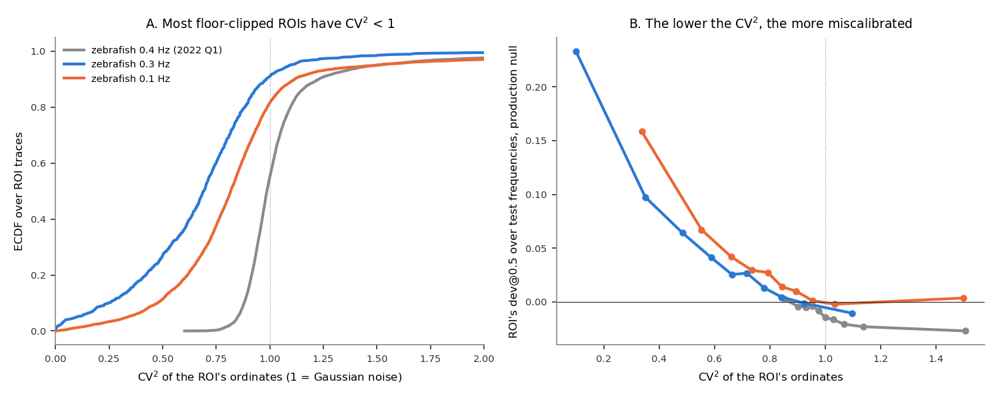
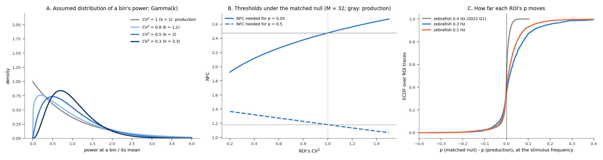
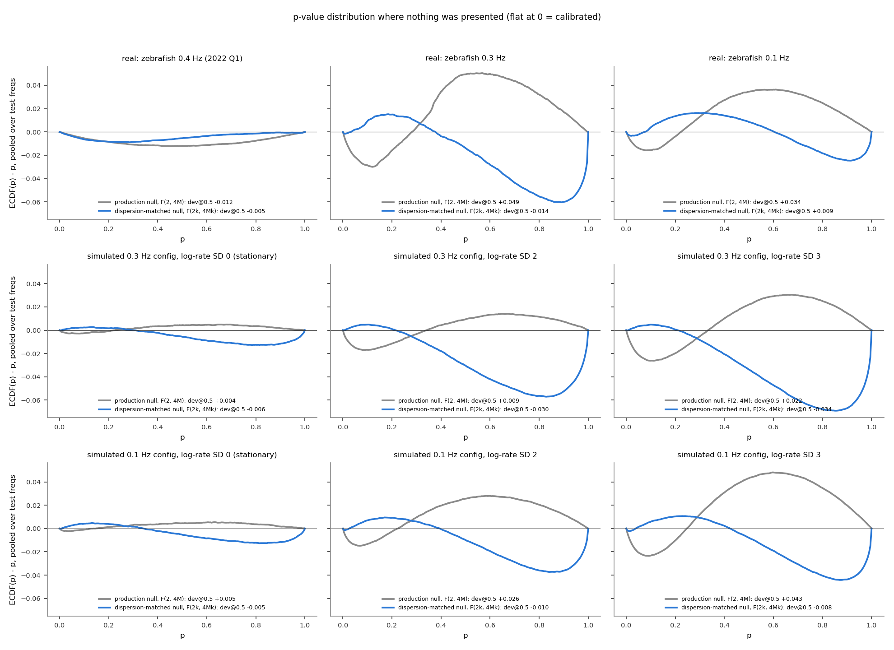
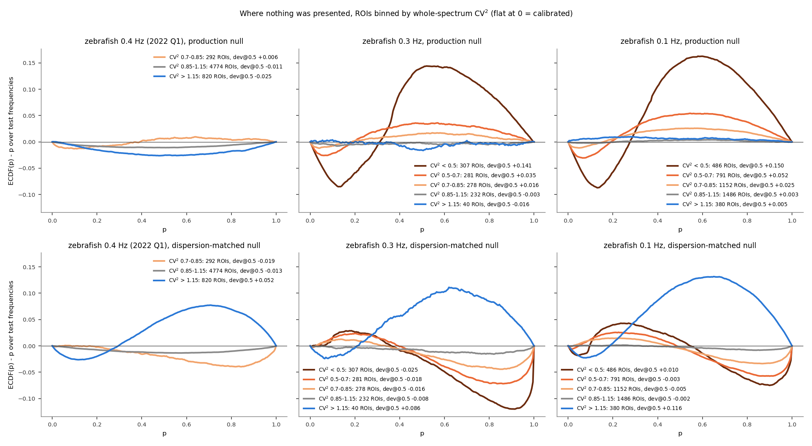
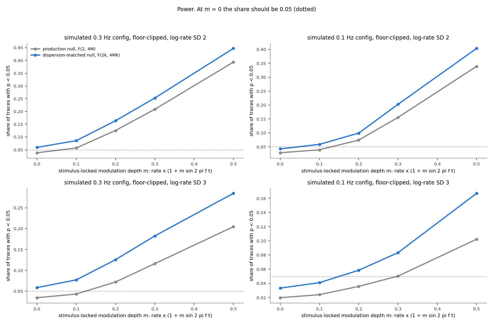
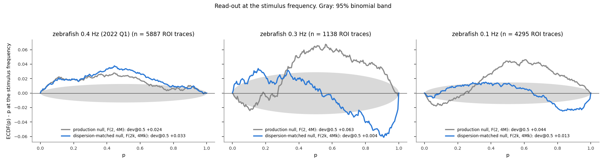

# A null matched to each ROI's spread: does it fix the imaging null?

**Date:** 2026-10-03, split from the guard-band report on 2026-10-05. **Branch:**
`guard-band-null`. **Script:** `docs/dispersion_matched_null/dispersion_null.py` (~5 min;
`--figures-only` replots). Zebrafish only: the 0.3 Hz and 0.1 Hz sets of recordings, where the
null is miscalibrated, and the 2022 Q1 0.4 Hz set, where it is not, as a control. Background:
[`nfc_finite_sample_bias.md`](nfc_finite_sample_bias.md), section "Slow variation and
floor-clipped traces", and [`few_event_spectra.md`](few_event_spectra.md), which shows why a
trace with few events has the narrow spread this null tries to account for. A separate
approach, a guard band, is in [`guard_band_null.md`](guard_band_null.md).

**The idea.** Production's null assumes that the power at every frequency bin is exponentially
distributed, which is what Gaussian noise gives. A trace whose power comes from a handful of
events has power that is more even than that: its spread, CV², is below 1. The
dispersion-matched null measures each ROI's CV² and replaces the exponential with a Gamma
distribution of the same spread, then computes the p-value under that.

## Summary

- **A ROI's CV² predicts its miscalibration** (Figure 1B). In the floor-clipped recordings
  the quarter of ROIs with the lowest CV² sits at +0.10 to +0.15, the highest quarter at 0.
- **For most ROIs the matched null is close to production** (Figure 2C). 81% of 2022 Q1 ROIs
  have CV² between 0.85 and 1.15, and their p-values move by a median of 0.006. In the
  floor-clipped recordings the median ROI's p moves by 0.02–0.03, and 9–16% move by more than
  0.1.
- **At p = 0.5 it nearly removes the excess** where nothing was presented: 0.1 Hz +0.035 →
  +0.008, 0.3 Hz +0.048 → −0.019, 2022 Q1 −0.013 → −0.007 (Figure 3).
- **But the shape is wrong in the other direction** (Figure 3): the hump turns into an S, with
  slightly too many small p-values and a pile near p = 1. It overshoots in the simulations
  too.
- **Split by CV², the good average is errors cancelling** (Figure 4). Every group below
  CV² 0.85 gets the S, and the ROIs above 1.15, which production had calibrated, get a hump
  of +0.05 to +0.12.
- **Power** rises 21–66% in simulation, with the false-positive rate at 0.033–0.059 instead of
  production's 0.020–0.038 (Figure 5).
- **At the stimulus frequency** the 0.3 Hz excess goes from +0.063 to +0.004 and the 0.1 Hz
  from +0.044 to +0.013 (Figure 6).
- **Verdict:** right direction, wrong shape. The Gamma family matches a ROI's spread but not
  the bounded, U-shaped distribution of power that a few events actually produce.

## Terms

| term | meaning |
|---|---|
| ordinate | one value of a trace's periodogram: the power \|Y_k\|² at frequency bin k |
| analysis bin | the bin NFC is computed at (the stimulus bin, or a test frequency) |
| noise bins, M | the M bins on each side of the analysis bin, whose mean power is NFC's noise estimate |
| power ratio R | analysis-bin power / mean noise-bin power. NFC² / 2 = R |
| CV² | variance / mean² of a ROI's ordinates, each divided by the mean of its 51 neighbours (so the spectrum's overall shape does not count as spread), over its whole spectrum away from the stimulus. 1 for Gaussian noise; below 1 means the power is more even across frequencies than noise |
| Gamma(k) | a family of distributions for a positive quantity, with one shape parameter k. k = 1 is the exponential; larger k is more even (CV² = 1/k) |
| test frequencies | analysis bins where nothing was presented (every 3rd bin from 0.05 Hz up, away from the stimulus). Calibration is judged there |
| dev@0.5 | ECDF(0.5) − 0.5: the share of p-values below 0.5, minus the 0.5 expected. 0 = calibrated. Here computed per test frequency and averaged over test frequencies |

The population is today's production population before the coverage threshold (P(iscell) >
0.5, npix ≥ 10, inside the fish outline, flatline removal), because the point is to keep as
many neurons as possible: 4,295 ROI traces (0.1 Hz, 10 recordings), 1,138 (0.3 Hz, 6) and
5,887 (2022 Q1, 6). Each ROI contributes one p-value per test frequency (98–266 per
recording). The test frequencies and simulated traces are the same as in the guard-band
report.

## 1. What predicts a ROI's miscalibration?

**The question.** Which property of a trace makes its p-values pile up in the middle?



<sub>**Figure 1. The spread of a ROI's ordinates and its miscalibration.** *A:* distribution over ROI traces of CV² (dotted: 1, Gaussian noise). *B:* each set of recordings' ROIs grouped into ten equal-sized groups by CV²; y is the group's mean dev@0.5 over the test frequencies under the production null.</sub>

| dev@0.5 by quarter of CV² (median CV² in brackets) | lowest | 2nd | 3rd | highest |
|---|---|---|---|---|
| 0.3 Hz zebrafish | +0.145 (0.31) | +0.040 (0.61) | +0.017 (0.76) | −0.004 (0.95) |
| 0.1 Hz zebrafish | +0.099 (0.51) | +0.031 (0.75) | +0.010 (0.88) | +0.000 (1.07) |
| 2022 Q1 zebrafish | −0.002 (0.89) | −0.006 (0.96) | −0.017 (1.02) | −0.024 (1.17) |

- **The miscalibration rises steadily as CV² falls below 1** (Figure 1B). The relation runs
  both ways: in 2022 Q1, ROIs with CV² above 1 are miscalibrated in the opposite direction.
- **Low CV² is common in the floor-clipped recordings** (Figure 1A): 27% of 0.3 Hz ROIs and
  11% of 0.1 Hz ROIs have CV² < 0.5, against none in 2022 Q1. Median CV² is 0.69, 0.82 and
  0.99.
- **Why.** A floor-clipped trace is zero between events, so each Fourier coefficient is a sum
  of one contribution per event. With K events of similar size CV² ≈ 1 − 1/K: one event gives
  the same power at every frequency (CV² = 0), and only many events give the exponential
  spread the null assumes. [`few_event_spectra.md`](few_event_spectra.md) follows this through
  trace by trace.

## 2. The dispersion-matched null

**The question.** What does the null look like, and how different is it from production's?

| null | assumes every bin's power is | R = NFC²/2 ~ |
|---|---|---|
| production | exponential, i.e. Gamma with shape 1 (CV² = 1) | F(2, 4M) |
| dispersion-matched | Gamma with shape k = 1/CV², this ROI's own spread | F(2k, 4Mk) |

The power at the analysis bin is one draw from the assumed distribution, and the noise mean
averages 2M of them; their ratio then follows the F distribution in the table. At CV² = 1 the
two nulls are identical.



<sub>**Figure 2. What the dispersion-matched null is, and how far it moves p.** *A:* the assumed distribution of a bin's power (divided by its mean) for four values of CV². Gray, CV² = 1: production's exponential. *B:* the NFC a ROI needs to reach p = 0.05 (solid) and p = 0.5 (dashed), against its CV², for M = 32 (the 0.1 Hz recordings). Gray lines: production's thresholds, the same for every ROI. *C:* at the stimulus frequency, each ROI's p under the matched null minus its p under production; ECDF over ROI traces.</sub>

- **Lower CV² makes the assumed power more even** (Figure 2A): the exponential's pile near 0
  and long tail give way to a hump around the mean.
- **That moves both thresholds toward the middle** (Figure 2B). A ROI with CV² = 0.5 needs
  NFC ≈ 2.2 instead of 2.48 for p = 0.05, and NFC ≈ 1.3 instead of 1.18 for p = 0.5. Its
  large NFCs become more significant and its small ones less, which spreads its p-values out of
  the middle.
- **For most ROIs it is close to production** (Figure 2C):

  | | CV² within 0.85–1.15 | median \|Δp\| at the stimulus frequency | \|Δp\| > 0.1 |
  |---|---|---|---|
  | 2022 Q1 zebrafish | 81% | 0.006 | 2% |
  | 0.1 Hz zebrafish | 35% | 0.020 | 9% |
  | 0.3 Hz zebrafish | 20% | 0.030 | 16% |

## 3. Does it restore calibration?

**The question.** Where nothing was presented, are the p-values uniform under the matched
null, in the real recordings and in simulated traces where the null is true by construction?



<sub>**Figure 3. The whole p-value distribution where nothing was presented.** ECDF(p) − p, pooled over all test frequencies and ROIs (flat at 0 = calibrated). Gray: production null. Blue: dispersion-matched null. *Top row:* real recordings. *Middle and bottom rows:* simulated floor-clipped traces (Poisson events, 2 s decay, noise, a floor; 4,000 per condition) in the 0.3 Hz and 0.1 Hz configurations, stationary (left) and with slow rate modulation (τ = 100 s, log-rate SD 2 and 3). Legends give dev@0.5.</sub>

| dev@0.5 at test frequencies | production | dispersion-matched |
|---|---|---|
| 0.3 Hz zebrafish | +0.048 | −0.019 |
| 0.1 Hz zebrafish | +0.035 | +0.008 |
| 2022 Q1 zebrafish | −0.013 | −0.007 |
| simulated 0.3 Hz config, stationary / SD 2 / SD 3 | +0.004 / +0.009 / +0.022 | −0.006 / −0.030 / −0.034 |
| simulated 0.1 Hz config, stationary / SD 2 / SD 3 | +0.005 / +0.026 / +0.043 | −0.005 / −0.010 / −0.008 |

- **At p = 0.5 it nearly works** in the 0.1 Hz recordings and simulations, and improves 2022
  Q1 too.
- **The shape is wrong in the other direction** (Figure 3, blue). Production's hump (too many
  p-values around 0.5, too few near 0 and 1) becomes an S: slightly too many p-values below
  0.2 (up to +0.015) and a pile right below 1. It overshoots most in the 0.3 Hz recordings and
  simulations, where CV² is lowest.
- **Why it overshoots.** Gamma(k) matches a ROI's spread but not the shape of its power
  distribution. With a few events the power is bounded and piles up near 0 whenever the
  events' contributions cancel ([`few_event_spectra.md`](few_event_spectra.md), Figure 1C);
  Gamma(k) with k > 1 has almost no mass near 0. Bins with near-zero power are therefore
  called extremely unlikely under the matched null, and get p close to 1.



<sub>**Figure 4. Figure 3's real recordings, ROIs binned by CV².** ECDF(p) − p over each ROI's test frequencies, averaged over the ROIs in each CV² bin. *Top row:* production null. *Bottom row:* dispersion-matched null. Legends give ROIs and dev@0.5 per bin; bins with fewer than 20 ROIs are not drawn.</sub>

| dev@0.5, production → matched | CV² < 0.5 | 0.5–0.7 | 0.7–0.85 | 0.85–1.15 | > 1.15 |
|---|---|---|---|---|---|
| 0.3 Hz zebrafish | +0.141 → −0.025 | +0.035 → −0.018 | +0.016 → −0.016 | −0.003 → −0.008 | −0.016 → **+0.086** |
| 0.1 Hz zebrafish | +0.150 → +0.010 | +0.052 → −0.003 | +0.025 → −0.005 | +0.003 → −0.002 | +0.005 → **+0.116** |
| 2022 Q1 zebrafish | — | — | +0.006 → −0.019 | −0.011 → −0.013 | −0.025 → **+0.052** |

- **Below CV² 0.85, the matched null trades the hump for an S** (Figure 4, bottom): close to 0
  at p = 0.5, but too many p-values below 0.3 and too few just below 1, more so the lower the
  CV².
- **Above CV² 1.15 it creates a hump** where production had almost none. For CV² > 1, k < 1,
  and Gamma(k) has a heavier tail than the exponential, so ordinary NFCs get p-values near
  the middle.
- **So the near-zero averages in Figure 3 come from these errors cancelling,** not from a
  calibrated null.

## 4. What does it cost in power?

**The question.** A correction that calibrates by making every p-value larger would also hide
real responses. How often does the matched null detect a stimulus-locked response that is
known to be there?



<sub>**Figure 5. Detection of a simulated stimulus-locked response.** Simulated floor-clipped traces whose event rate is multiplied by 1 + m sin(2πft) at the configuration's stimulus frequency, with slow rate modulation of log-rate SD 2 (top) and 3 (bottom). y: share of traces with p < 0.05. At m = 0 there is no response and the share should be 0.05 (dotted).</sub>

| share with p < 0.05 | m = 0 (no response) | m = 0.3 |
|---|---|---|
| 0.1 Hz config, SD 2: production / matched | 0.028 / 0.042 | 0.156 / 0.202 |
| 0.1 Hz config, SD 3: production / matched | 0.020 / 0.033 | 0.050 / 0.083 |
| 0.3 Hz config, SD 2: production / matched | 0.038 / 0.059 | 0.209 / 0.253 |
| 0.3 Hz config, SD 3: production / matched | 0.034 / 0.058 | 0.116 / 0.182 |

- **Production is conservative in the tail.** With no response it calls only 2.0–3.8% of
  traces significant at 0.05, because few-event traces rarely produce small p-values.
- **The matched null brings the false-positive rate near 0.05 and detects 21–66% more
  responses** at m = 0.3. In the 0.3 Hz configuration it slightly overshoots 0.05 (0.058–0.059),
  the same overshoot as in Figures 3–4.

## 5. At the stimulus frequency

**The question (read-out only).** What happens to the real recordings' p-values at the
stimulus frequency under the matched null?



<sub>**Figure 6. p-value distributions at the stimulus frequency.** ECDF(p) − p for every ROI trace, production null (gray) and dispersion-matched null (blue). Legends give dev@0.5. Gray band: 95% binomial band.</sub>

| at the stimulus frequency | dev@0.5, production | dev@0.5, matched | p < 0.05, production | p < 0.05, matched |
|---|---|---|---|---|
| 0.3 Hz zebrafish | +0.063 | +0.004 | 3.8% | 6.8% |
| 0.1 Hz zebrafish | +0.044 | +0.013 | 3.4% | 4.3% |
| 2022 Q1 zebrafish | +0.024 | +0.033 | 6.2% | 6.1% |

- **0.3 Hz and 0.1 Hz zebrafish:** the excess largely goes, with the same S-shape as at the
  test frequencies. The share below 0.05 rises to about the 5% expected (6.8% at 0.3 Hz, in
  line with the overshoot in Figures 3–5). Nothing stimulus-specific stands out.
- **2022 Q1:** the excess stays. Its stimulus bin carries a known local stimulus-locked
  component in `20220301` (background report, Figure 12), which a different null would not
  remove.

## What this establishes

| | finding |
|---|---|
| **Established** | A ROI's miscalibration under the production null is predicted by the spread of its periodogram (CV²), in both directions: CV² < 1 (few-event, floor-clipped traces) piles p-values in the middle; CV² > 1 does the opposite. |
| **Established** | For most ROIs with CV² near 1, including 81% of 2022 Q1, the matched null is practically production's. It matters for the low-CV² ROIs of the floor-clipped recordings. |
| **Established** | Matching the spread with a Gamma distribution removes most of the excess at p = 0.5, brings the false-positive rate near 0.05 and gains 21–66% power in simulation, but overshoots into an S-shape below CV² 0.85 and creates a hump above 1.15 (Figure 4); its overall calibration is errors cancelling. |
| **Not adopted** | The Gamma shape is wrong for few-event traces (bounded, piling up near 0). Fixing it would mean an even more constructed, per-ROI null. |
| **Alternative** | Keep only ROIs whose CV² shows the production null applies: those with CV² ≥ 0.85 are calibrated under it (dev@0.5 +0.004 at 0.1 Hz, −0.005 at 0.3 Hz), but they are 43% of the 0.1 Hz ROIs and 24% of the 0.3 Hz ROIs. |
| **Since found** | The low CV² is not a property of the cells: suite2p's integer halving and truncation of these photon-starved movies created the floor. Re-extracted at full resolution, CV² is about 1 and the production null is calibrated without any change to the null ([`cv2.md`](cv2.md), section 4). |

## Reproducing

```bash
python docs/dispersion_matched_null/dispersion_null.py                  # ~5 min, writes results_dm_*.csv and fig_dm_*.png
python docs/dispersion_matched_null/dispersion_null.py --figures-only   # replot from the CSVs
```
