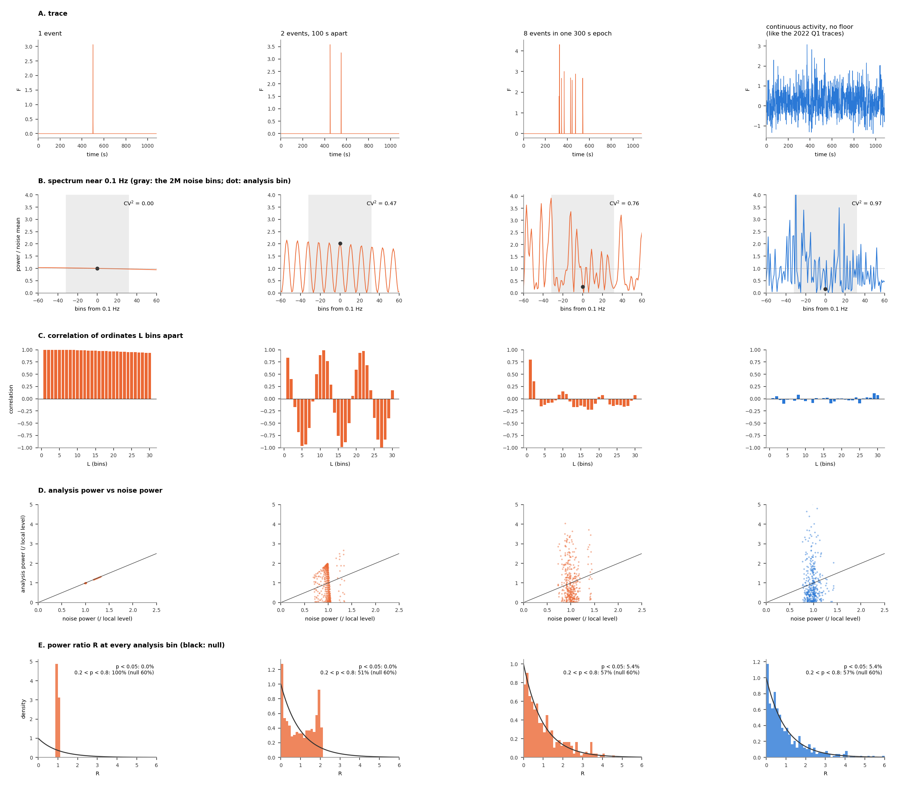
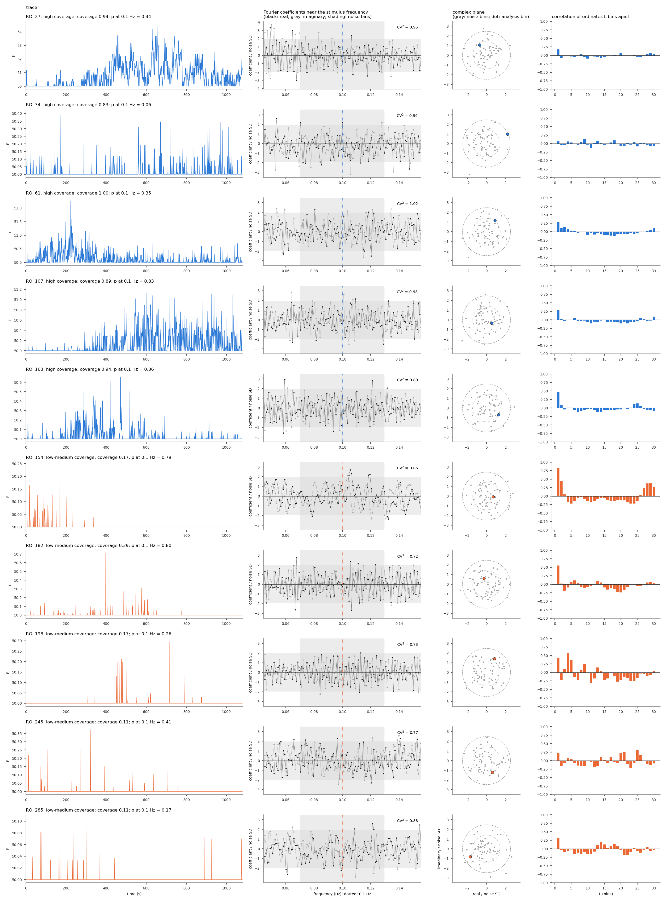
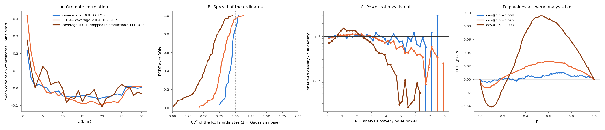

# From a trace with few events to p-values in the middle of the range

**Date:** 2026-10-03. **Script:** `docs/guard_band_null/ripples.py` (about 1 min).
**Background:** `docs/nfc_finite_sample_bias.md` (section "Slow variation and floor-clipped
traces"), `docs/guard_band_null.md` and `docs/dispersion_matched_null.md`.

**The problem.** In the floor-clipped zebrafish recordings (0.1 Hz and 0.3 Hz), the p-values
are too often in the middle of the range at every analysis frequency, including frequencies where
nothing was presented. This document follows a trace through each step of the calculation, to
show where that comes from: the trace, its spectrum, the correlation between neighbouring
frequency bins, the power at the analysis bin against the power of its noise bins, and the
resulting p-values.

## Terms

| term | meaning |
|---|---|
| ordinate | the power at one frequency bin, I_k = \|Y_k\|², where Y is the trace's Fourier transform |
| analysis bin | the bin being tested (the stimulus bin, or any other bin when checking calibration) |
| noise bins | the M bins on each side of the analysis bin; their mean power is the noise estimate |
| power ratio R | analysis-bin power / mean noise-bin power. NFC² / 2 = R |
| null of R | for Gaussian noise, R follows F(2, 4M), close to an exponential: usually below 1, sometimes far above. p = P(F(2, 4M) > R) is then uniform. R = 1 gives p ≈ 0.37 |
| CV² | variance / mean² of a trace's ordinates, each divided by the local spectrum level. 1 for Gaussian noise |
| coverage | share of 60 s windows in which the ROI is active (`pipeline/roi_coverage.py`); production keeps coverage ≥ 0.1 |

## 1. Synthetic traces: what a few events do to the spectrum

**The question.** What does the spectrum of a trace with only a few events look like, and how
does that change the power ratio R?



<sub>**Figure 1. Synthetic traces followed through each step.** Columns: one event; two events 100 s apart; eight events within one 300 s stretch; continuous activity with no floor (like the 2022 Q1 traces). The first three use the GCaMP model of `slow_variation_sim.py` (2 s decay) with the baseline clipped, so nothing but the events rises above the floor. 1080 frames at 1 s and M = 32, as in the 0.1 Hz zebrafish recordings. *A:* trace. *B:* Fourier coefficients within ±60 bins of 0.1 Hz, real part (black) and imaginary part (gray) on one axis, the same format as the "Fourier spectrum" page of the ephys diagnostics but for one trace. Each coefficient is divided by σ̂, the noise SD estimated from the analysis bin's noise bins (light shading), so under the null each part is N(0, 1) (darker band: ±1.96) and the magnitude at the analysis bin (dotted line) is its NFC. *C:* the same noise-bin coefficients (gray) and the analysis-bin coefficient (dot) in the complex plane. Dotted circle: radius √2, the typical magnitude under the null; dashed circle: the magnitude needed for p = 0.05. *D:* correlation between ordinates (powers) L bins apart, over the whole spectrum above 0.05 Hz. *E:* at every analysis bin above 0.05 Hz, the analysis-bin power against the mean power of its noise bins, both divided by the local spectrum level (a 201-bin running mean). Points on the diagonal have R = 1. *F:* histogram of R over the same bins; black: its null, F(2, 4M). The text gives the share of p < 0.05 (null 5%) and of 0.2 < p < 0.8 (null 60%).</sub>

In B the real and imaginary parts flip sign from bin to bin. That is only the phase of the
events turning with frequency (an event at time t turns its coefficient by 2π·t/1080 s per
bin). The informative part is how far the coefficients reach, which C shows directly.

- **One event (column 1).** A single transient's coefficient has the same magnitude at every
  frequency; only its phase turns. In B the coefficients never leave ±√2, and in C every
  noise bin, and the analysis bin, sits on the circle of radius √2 (CV² = 0.00). Neighbouring
  powers are almost perfectly correlated (D). In E every bin sits at analysis power = noise
  power, so **R ≈ 1 at every frequency** and every p-value is about 0.37 (F). The p-values
  are never small and never close to 1.
- **Two events Δ = 100 s apart (column 2).** The two transients' coefficients add, and as
  their relative phase turns they alternately reinforce and cancel: the magnitude swings
  between 0 and twice that of one event, one swing every 1/Δ = 0.01 Hz, which is 10.8 bins
  here. In C the coefficients fill a disk but never leave it: no bin, analysis bin included,
  can reach the p = 0.05 circle. The correlation of powers oscillates with the 10.8-bin period
  (D). The noise estimate averages over several swings and stays near the local level (E,
  x ≈ 1). **R can never exceed about 2**, so no p-value is below 0.14 (F: 0% below 0.05).
- **Eight events within 300 s (column 3).** More events give a less regular pattern, and the
  coefficients start to spill past the p = 0.05 circle (C). The correlation now lasts only
  about 3 bins, roughly 1/(300 s) (D). R is close to its null (F). Eight events are already
  far better than two, which is why the problem is concentrated in the ROIs with the fewest
  events.
- **Continuous activity (column 4).** This is what the null assumes: a Gaussian cloud in C,
  no correlation (D), CV² ≈ 1, R following F(2, 4M) (F).

**Over- or underestimated?** Neither, on average. In E the noise estimate (x) stays close to
the local level in every column, because it averages 2M = 64 bins. What changes is the power
at the analysis bin (y). With few events it cannot wander as far from the local level as Gaussian noise does. NFC is
therefore not biased up or down. Its spread is too narrow: it is too rarely very large (too
few small p-values) and too rarely very small (too few p-values near 1), so the p-values
collect in the middle.

## 2. Real traces: five ROIs with high coverage and five with low-to-medium coverage

**The question.** Do real ROIs in a floor-clipped recording look like the synthetic ones, and
does it depend on how active the ROI is?



<sub>**Figure 2. Ten ROIs of `engert_20221001_fish2_magneto_0` (0.1 Hz zebrafish).** Blue: five ROIs drawn at random from the 29 with coverage ≥ 0.8. Orange: five drawn at random from the 102 with 0.1 ≤ coverage < 0.4. All ten pass production's thresholds (P(iscell) > 0.5, npix ≥ 10, inside the fish outline, coverage ≥ 0.1); none was selected on p. Columns are Figure 1's rows A–D: trace; real and imaginary coefficients near 0.1 Hz, divided by σ̂, with CV²; complex plane; correlation of powers. Figure 1's per-bin panels (E, F) are left out: one ROI has only about 420 analysis bins, too few to show a shift of a few percent (see below). Row titles give the ROI's coverage and its p at 0.1 Hz.</sub>

- **Traces.** The high-coverage ROIs (blue) are active through much of the recording. The
  low-coverage ROIs (orange) are flat at 50.0 except for a few small transients, often
  confined to one stretch (ROI 154: only the first 350 s).
- **Coefficients.** In ROI 154 the coefficients drift slowly up and down over several bins
  instead of jumping independently from bin to bin, like Figure 1 column 2. The other
  low-coverage ROIs look much like the high-coverage ones by eye. CV² separates them: 0.72–0.88
  for low coverage, 0.89–1.02 for high coverage.
- **Correlation.** Low-coverage ROIs have lag-1 correlations up to 0.8, and in some it comes
  back at longer lags (ROI 154 at L ≈ 27, ROI 198 every few bins): the swing period of a
  few dominant events. High-coverage ROIs are mostly below 0.3.
- **One ROI is not enough to see the p-values move.** The kept low-coverage ROIs are off by
  about 2.5% of their p-values. With about 420 analysis bins per ROI, the share of p-values in
  any range is uncertain by about ±2.4%, more once the correlation between bins is counted.
  In the tail, R above 4.6 (p < 0.01) is expected about 4 times per ROI and occurs about
  half as often, so 2 against 4. Per ROI, the R histogram therefore looks like the null in
  both groups, and so does the complex-plane cloud. CV² does separate the groups, because it
  summarises the spread of all the bins in one number. The size of the effect is shown
  pooled, in Figure 3.

## 3. Pooled over the recording

**The question.** Pooling every ROI in the recording by coverage, how large is each step's
departure from the null?



<sub>**Figure 3. Every ROI of the same recording, pooled by coverage.** Blue: coverage ≥ 0.8 (29 ROIs). Orange: 0.1 ≤ coverage < 0.4 (102 ROIs, kept in production). Brown: coverage < 0.1 (111 ROIs, dropped in production). *A:* mean correlation of ordinates L bins apart. *B:* ECDF over ROIs of CV². *C:* observed density of R over all analysis bins above 0.05 Hz divided by the null density (1 = calibrated; log scale). *D:* ECDF(p) − p over the same bins; legend: dev@0.5.</sub>

| coverage | ROIs | median CV² | R > 4.6 (p < 0.01), observed / null | 1 < R < 2, observed / null | dev@0.5 over all analysis bins |
|---|---|---|---|---|---|
| ≥ 0.8 | 29 | 0.94 | 0.82 | 1.01 | +0.003 |
| 0.1 to 0.4 (kept) | 102 | 0.79 | 0.46 | 1.09 | **+0.025** |
| < 0.1 (dropped) | 111 | 0.56 | 0.05 | 1.42 | **+0.093** |

- **A–B.** The fewer events a ROI has, the more correlated its ordinates (A) and the
  narrower their spread (B).
- **C.** For the less active ROIs, large R is rarer than the null says and R between 1 and 2
  is too common. R above 4.6 (p < 0.01) occurs at half the null rate in the kept
  low-coverage ROIs and at a twentieth of it in the dropped ones. That is the narrow spread
  of Figure 1E in real data: R too rarely large and, for the dropped ROIs, also too rarely
  near 0 (R < 0.1 at 0.69 of the null rate).
- **D.** The result is the familiar hump in the middle of the p range. It is negligible for
  the high-coverage ROIs. The coverage threshold removes the worst group (+0.093), but the
  ROIs with coverage between 0.1 and 0.4 that production keeps still contribute +0.025.

## What this establishes

- A trace with few events has a spectrum made of the interference ripples of those events.
  Its period in frequency is 1 / (time between events), so neighbouring bins are correlated
  over that many bins.
- The noise estimate is not biased. The power at the analysis bin varies less than the null
  assumes, because it cannot fall far from the local level of a smooth, rippled spectrum. NFC
  is under-dispersed: too rarely large and too rarely small. The p-values pile up in the middle.
- The fewer events a ROI has, the stronger this is. Within one 0.1 Hz recording, the departure goes from
  +0.003 (coverage ≥ 0.8) to +0.025 (coverage 0.1–0.4, kept in production) and +0.093
  (coverage < 0.1, dropped).
- This is why a guard band does not fix it (`docs/guard_band_null.md`, Figure 2): skipping
  correlated bins does not change how far the analysis bin can stray from the local level.
  It is also why the CV² of a ROI's ordinates predicts its miscalibration
  (`docs/dispersion_matched_null.md`, Figure 1B).

## Reproducing

```bash
/c/Users/dan/anaconda3/envs/magneto2/python.exe docs/guard_band_null/ripples.py
```

Writes `docs/guard_band_null/fig_gb_ripples_{toy,real,pooled}.png`. The real-data figures use
one recording (`REC` at the top of the script); the coverage groups are `GOOD_MIN` and
`BAD_RANGE`.
