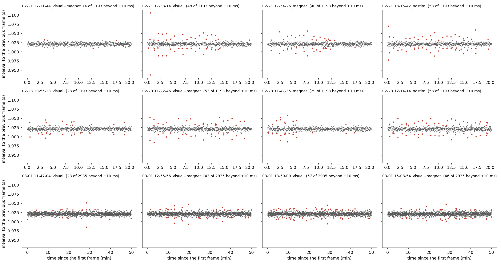
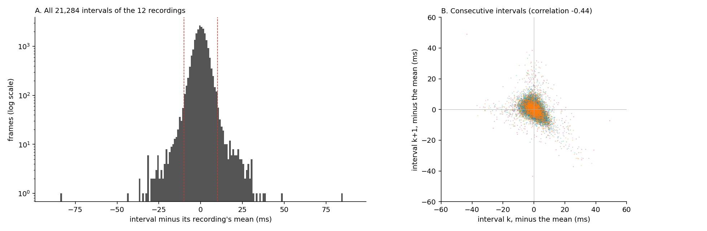
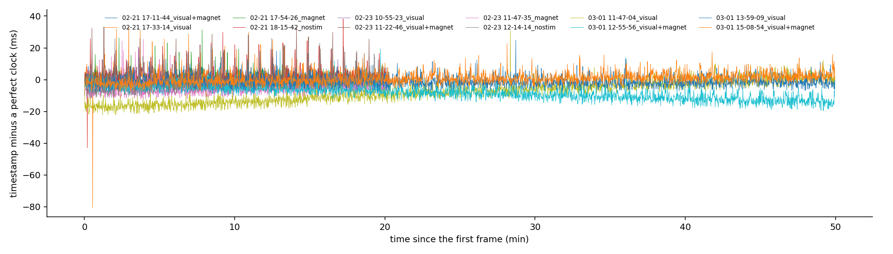
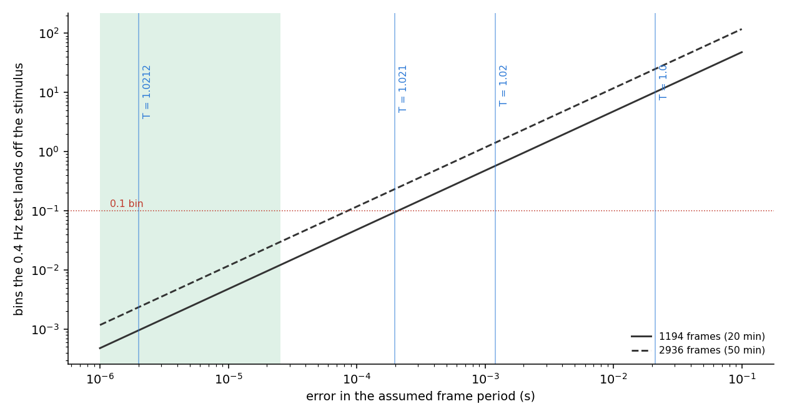

# Frame timing of the 2022 Q1 zebrafish recordings

**Date:** 2026-10-06. **Script:** `docs/frame_timing/frame_timing.py` (reads the NAS once, ~1 min;
`--figures-only` replots from the cache).

**Why this report.** The analysis needs each recording's frame period (`sample_period`) to find the
stimulus frequency in the spectrum. The 2022 Q1 YAMLs used 1.0 s (2022_02_21, 2022_02_23) and
1.02 s (2022_03_01), copied from the legacy `Engert_analysis.py`, which gives no source for
either. The tiffs carry no timing. The original acquisition folders on the NAS do, and this
report reads them.

**Summary.**
- **The frame period is 1.0212 s in all twelve recordings.** The scan waveform played for every
  frame is 510,599 samples long at 500,000 samples/s, so each frame takes 1.021198 s by
  construction. The logged timestamps average 1.02121–1.02122 s.
- **Individual intervals jitter by a few milliseconds** (SD 3–6 ms; 0.3–5% of frames are more than
  10 ms off; the extremes are 0.937 s and 1.106 s). The jitter is in the logging, not in the
  frames: a long interval is followed by a short one, and the timestamps never drift away from
  a perfect clock.
- **That jitter doesn't limit how well the period is known.** Where a frequency lands in the
  spectrum depends on the average period over the whole recording, which the timestamps fix to
  a few microseconds.
- **Four decimal places are needed.** 1.02 puts the 0.4 Hz test 1.4 frequency bins off the
  stimulus in the 50-minute 2022_03_01 recordings, and 0.6 bins off in the 20-minute ones;
  1.0212 puts it 0.002 bins off.

## Terms

| term | meaning |
|---|---|
| interval | time between a frame's timestamp and the previous frame's |
| frame period | the true time per frame; `sample_period` in the YAMLs, `T` in `fit_Fourier` |
| hardware period | scan-waveform length / analog-out rate: how long the scanner takes per frame by design |
| perfect clock | timestamps spaced exactly by the recording's average interval, from its first frame |
| bin | one frequency step of the spectrum, 1 / (frames × frame period): 0.00082 Hz for a 20-min recording, 0.00033 Hz for a 50-min one |

**Data.** Each recording's acquisition folder, e.g.
`\\datanas\family\data_aggregated\Engert\2022_03_01\2022-03-01_15-08-54_visual+magnet\` (read only):
- `rawdata\z_plane0000_trial000_imaging_information.npy`: one row per frame, column 0 = the time
  the frame was logged (s);
- `galvo_waveform.npy`: the scan waveform, 510,599 samples in every recording;
- `experiment_information.txt`: `galvo_scanning_AOrate: 500000` and the trial time (1,220 s for
  the 1,194-frame recordings, 2,999 s for the 2,936-frame ones).

All twelve recordings: 2022_02_21 and 2022_02_23 (visual, visual+magnet, magnet, nostim; 1,194
frames each) and 2022_03_01 (visual ×2, visual+magnet ×2; 2,936 frames each). 21,284 intervals.

## 1. How regular are the frames?

**The question.** For every frame, how long after the previous one was it logged, and how often
does that depart from the average?



<sub>**Figure 1. Every interval, at the time of its frame.** One panel per recording. Grey: within 10 ms of the recording's mean; red: more than 10 ms off. Blue line: the hardware period, 1.021198 s.</sub>

| recording | frames | mean interval (s) | SD (ms) | > 2 ms off | > 5 ms off | > 10 ms off | shortest / longest (s) |
|---|---|---|---|---|---|---|---|
| 02-21 visual+magnet | 1194 | 1.021220 | 3.3 | 53% | 12% | 0.3% | 1.010 / 1.033 |
| 02-21 visual | 1194 | 1.021220 | 6.1 | 53% | 18% | 4.0% | 0.937 / 1.106 |
| 02-21 magnet | 1194 | 1.021219 | 4.7 | 55% | 17% | 3.4% | 0.990 / 1.057 |
| 02-21 nostim | 1194 | 1.021216 | 5.2 | 51% | 16% | 4.4% | 0.978 / 1.070 |
| 02-23 visual | 1194 | 1.021220 | 4.1 | 54% | 15% | 2.3% | 0.997 / 1.046 |
| 02-23 visual+magnet | 1194 | 1.021220 | 5.2 | 54% | 15% | 4.4% | 0.984 / 1.053 |
| 02-23 magnet | 1194 | 1.021217 | 4.5 | 56% | 17% | 2.4% | 0.986 / 1.059 |
| 02-23 nostim | 1194 | 1.021213 | 5.1 | 55% | 20% | 4.9% | 0.992 / 1.050 |
| 03-01 visual (11:47) | 2936 | 1.021213 | 3.7 | 56% | 15% | 0.8% | 0.985 / 1.052 |
| 03-01 visual+magnet (12:55) | 2936 | 1.021223 | 3.8 | 55% | 16% | 1.5% | 0.993 / 1.048 |
| 03-01 visual (13:59) | 2936 | 1.021219 | 3.9 | 54% | 17% | 1.9% | 0.994 / 1.045 |
| 03-01 visual+magnet (15:08) | 2936 | 1.021218 | 3.8 | 56% | 17% | 1.6% | 1.001 / 1.046 |

- **Every recording has the same average interval, 1.02121–1.02122 s** (Figure 1, table). That is
  0.002% above the hardware period. The difference is probably between the computer's clock and
  the scanner's; it is far too small to matter (section 3).
- **Most intervals are within a few milliseconds:** about half are more than 2 ms off, about one in
  six more than 5 ms, and 0.3–4.9% more than 10 ms. Outliers are scattered through each
  recording, with no runs or steps (Figure 1).
- **The largest deviations,** 0.937 s and 1.106 s, are one pair of consecutive frames 30 s into
  02-21 visual: one frame logged 84 ms late.

## 2. Is the jitter in the frames or in the timestamps?

**The question.** A frame logged late could have been taken late, or taken on time and logged
late. Which is it?



<sub>**Figure 2. A:** all 21,284 intervals minus their recording's mean, log scale; dashed: ±10 ms. **B:** each interval against the next, one colour per recording.</sub>



<sub>**Figure 3. Each recording's timestamps minus a perfect clock** (spaced by the recording's average interval, starting at its first frame).</sub>

- **A long interval is followed by a short one** (Figure 2B; correlation −0.34 to −0.51 per
  recording, −0.44 pooled). If the frames came on a regular clock and only the logging was late
  now and then, the correlation would be −0.5: a late timestamp lengthens one interval and
  shortens the next by the same amount.
- **The timestamps never wander away from a perfect clock** (Figure 3): typically within ±5 ms
  (SD 2.7–6.4 ms per recording), at most 12–81 ms, and the error does not grow over 20 or 50
  minutes. Jitter in the frames themselves would accumulate.
- **So the frames are regular and the jitter is in the logging,** as expected when every frame is
  the same hardware-timed scan waveform. Treating the frames as equally spaced, as the analysis
  does, is right.

## 3. How precisely do we need, and know, the frame period?

**The question.** Do a few milliseconds of jitter mean the period should only be quoted as
1.02, or is 1.0212 justified?



<sub>**Figure 4. How far the 0.4 Hz test lands from the stimulus, against the error in the assumed frame period** (log axes). Solid: a 1,194-frame recording; dashed: 2,936 frames. Blue lines: the error of each value we have used or might use, against the hardware period. Green: how far the twelve measured averages lie from the hardware period (up to 25 µs). Red: 0.1 bin.</sub>

- **What matters is the average period, not single intervals.** A frequency f lands
  f × frames × (period error) bins from where the analysis looks. Jitter that averages out over
  the recording doesn't move it.
- **The average is known to a few microseconds.** From the first and last timestamps it has an
  uncertainty of 1–5 µs, and the twelve recordings agree within 10 µs. They lie up to 25 µs from the hardware period (Figure 4, green band), still under 0.03 bin.
  The hardware period, 1.021198 s, is exact by design.
- **The required precision is set by the recording length and the frequency.** To land within
  0.1 bin of 0.4 Hz the period must be right to 0.0002 s (20 min) or 0.00009 s (50 min), i.e. to
  the fourth decimal place:

  | assumed period | error | 0.4 Hz test, 20-min recording | 0.4 Hz test, 50-min recording |
  |---|---|---|---|
  | 1.0 | 0.021 s | 10 bins off | 25 bins off |
  | 1.02 | 0.0012 s | 0.6 bins off | 1.4 bins off |
  | 1.021 | 0.0002 s | 0.1 bins off | 0.24 bins off |
  | **1.0212** | **0.000002 s** | **0.001 bins off** | **0.002 bins off** |

- **So 1.0212 is justified, and needed.** (It has five significant figures, four decimal places.)
  Rounding to 1.02 would leave 2022_03_01's 0.4 Hz test more than a bin off the stimulus.

## 4. What the corrected period changes

**The question.** With `sample_period: 1.0212` in all twelve 2022 Q1 YAMLs (set 2026-10-06, then
analysis, aggregate and Figs 1–4 re-run), does the 0.4 Hz magnetic test of these recordings give
a different answer?

| recording (Fig 2A, 0.4 Hz) | old period | suspects / 95% bound, old period | suspects / bound at 1.0212 s |
|---|---|---|---|
| 02-21 magnet | 1.0 | 17 / 22 | 13 / 22 |
| 02-21 visual+magnet | 1.0 | 11 / 22 | 14 / 22 |
| 02-23 magnet | 1.0 | 9 / 19 | 14 / 19 |
| 02-23 visual+magnet | 1.0 | 16 / 19 | 12 / 19 |
| 03-01 visual+magnet (12:55) | 1.02 | **23 / 21** | 18 / 21 |
| 03-01 visual+magnet (15:08) | 1.02 | **46 / 21** | **24 / 21** |

<sub>Suspects: ROIs with p < 0.01 at 0.4 Hz. Bound: the 95th percentile of their count under the null; bold = above it, i.e. flagged in Fig 2A.</sub>

- **The 2022_02_21 and 2022_02_23 tests now look at the stimulus frequency.** At 1.0 s they were
  10 bins off it. They stay unflagged.
- **2022_03_01's visual+magnet counts drop:** 23 → 18 (12:55, no longer flagged) and 46 → 24
  (15:08, still just above its bound). At 1.02 s their test was 1.4 bins off the stimulus, so
  most of the 46 were ROIs with power at a neighbouring frequency.
- **Fig 2A:** 5 of 104 magnetic recordings are flagged at the stimulus frequency, against 6
  before. The visual rows in Fig 2B (1/60 Hz) are unchanged.

## What this establishes

| | finding |
|---|---|
| **Established** | The 2022 Q1 frame period is 1.0212 s: 1.021198 s by the scan waveform, 1.02121–1.02122 s by the timestamps, the same in all twelve recordings. |
| **Established** | Single intervals jitter by a few ms, but the jitter is in the logging; the frames are regularly spaced and the average period is known to microseconds. |
| **Established** | `sample_period` needs four decimals here: 1.0 put the 0.4 Hz test 10–25 bins off, 1.02 puts it 0.6–1.4 bins off, 1.0212 puts it within 0.002 bins. |
| **Established** | At 1.0212 s, none of the 2022_02_21/02_23 magnetic recordings is flagged, and 2022_03_01's 15:08 visual+magnet recording has 24 suspects against a bound of 21 (46 at 1.02 s). |
| **Not covered** | The 0.3 Hz and 0.1 Hz zebrafish and medaka (another setup, no timestamp file). Their grating harmonics put them at 0.998–1.002 s, consistent with the 1.0 s used. |

## Reproducing

```bash
python docs/frame_timing/frame_timing.py                  # reads the NAS acquisition folders (read only)
python docs/frame_timing/frame_timing.py --figures-only
```
