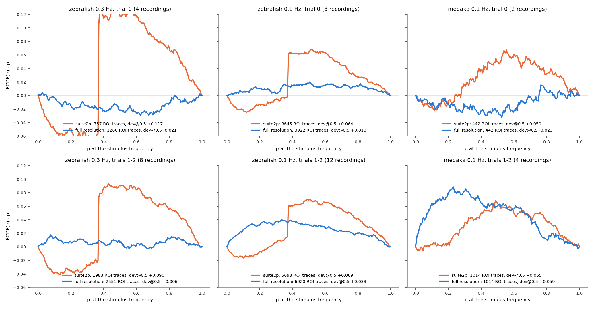
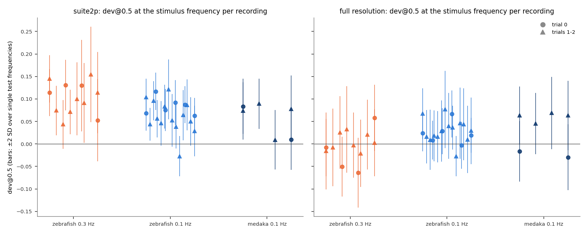
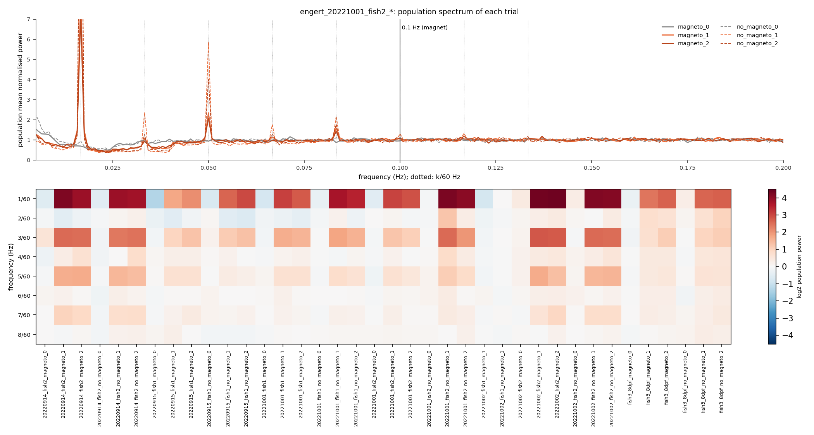

# What the full-resolution traces change

**Date:** 2026-10-05. **Branch:** `fullres-imaging-traces`. **Script:**
`docs/full_resolution_rerun/rerun_summary.py` (~5 min; `--figures-only` replots). Background:
[`cv2.md`](cv2.md) (why suite2p's traces were floored, and the test-frequency calibration) and
[`coverage_full_resolution.md`](coverage_full_resolution.md) (the coverage threshold).

**What changed in the pipeline.**
- **Processing re-extracts every imaging ROI's trace from the raw tiff** (`pipeline/ophys_extraction.py`). It uses suite2p's registration shifts and ROI weights, but not suite2p's uint16 halving and int16 truncation.
- **An exact-match check guards it.** The same code with those two steps must reproduce suite2p's `F.npy`, and it did for all 54 recordings.
- **Both traces are stored in each NWB file;** analysis uses the full-resolution one.
- **Trial frames come from suite2p's own file list.** This fixes a 60-frame offset in the 0.3 Hz fish's trials 1 and 2.
- **The coverage threshold is off.**

Everything was re-run: processing, analysis, aggregate, and Figs 1–3.

**Summary.**
- **Where nothing was presented, the bump is gone** (0.1 Hz +0.035 → +0.004; [`cv2.md`](cv2.md), Figure 7).
- **More neurons:** the magnetic pool gains 3,173 neurons, because no coverage threshold is needed.
- **At the stimulus frequency, most of the excess goes too:**
  - 0.3 Hz zebrafish: +0.09–0.12 → −0.02 to +0.01;
  - medaka trial 0: +0.05 → −0.02.
- **What remains is a real stimulus-locked signal, and it is visual.** It sits in the 0.1 Hz zebrafish and medaka recordings, and it is the same in magneto and no_magneto trials.
- **The 30 s on / 30 s off visual grating runs in trials 1 and 2 of every 0.3 Hz, 0.1 Hz and medaka session, but not in trial 0.** Its odd harmonics of 1/60 Hz are unmistakable in the population spectrum. 0.1 Hz is its 6th harmonic.

## Terms

| term | meaning |
|---|---|
| suite2p / full resolution | the two traces stored for every ROI: suite2p's `F.npy`, and the re-extraction without suite2p's lossy steps |
| trial 0, trials 1–2 | `magneto_0`/`no_magneto_0` vs `_1`, `_2`. In `20221002_fish1` the only real trial is named `_1`; it behaves like trial 0 here and is grouped with it |
| dev@0.5 | share of p ≤ 0.5, minus 0.5; 0 for uniform p |
| test frequencies | frequencies where nothing was presented (every 3rd bin from 0.05 Hz, away from the stimulus) |
| population power | each ROI's periodogram divided by its 51-bin running mean, averaged over the recording's ROIs, divided by its median over 0.03–0.45 Hz. 1 = nothing shared; a peak = a component shared by many ROIs |

**Population:** production ROIs on the full-resolution traces (P(iscell) > 0.5, npix ≥ 10, inside the fish outline, flatline removal). Every 0.3 Hz and 0.1 Hz zebrafish and medaka recording, magneto and no_magneto alike; `20221002_fish1`'s duplicated trials are left out. Both traces of the same ROIs are tested at the stimulus frequency with production's null.

## 1. Neurons kept

**The question.** How many neurons does the re-run keep in the Fig 2C magnetic pool?

| unique neurons, Fig 2C magnetic pool | before (suite2p, coverage ≥ 0.1) | after (full resolution) |
|---|---|---|
| zebrafish 0.3 Hz | 508 | 1,901 |
| zebrafish 0.1 Hz | 4,131 | 5,880 |
| medaka 0.1 Hz | 797 | 830 |
| zebrafish 0.4 Hz (2022 Q1) | 5,887 | 5,885 |

- **The 0.3 Hz pool almost quadruples and the 0.1 Hz pool grows 42%.** The coverage threshold
  had removed 68% and 35% of their ROIs. The full-resolution traces don't need it.

## 2. At the stimulus frequency

**The question.** With the floor gone, is the excess of p-values at the stimulus frequency gone
too?



<sub>**Figure 1. p at the stimulus frequency, suite2p (orange) vs full resolution (blue), same ROIs.** ECDF(p) − p, pooled over the recordings of each set. *Top:* trial 0. *Bottom:* trials 1–2. Legends give ROI traces and dev@0.5.</sub>

| dev@0.5 at the stimulus frequency, suite2p → full resolution | trial 0 | trials 1–2 |
|---|---|---|
| zebrafish 0.3 Hz | +0.117 → **−0.021** | +0.090 → **+0.006** |
| zebrafish 0.1 Hz | +0.064 → **+0.018** | +0.069 → **+0.033** |
| medaka 0.1 Hz | +0.050 → **−0.023** | +0.065 → **+0.059** |



<sub>**Figure 2. dev@0.5 at the stimulus frequency per recording**, suite2p (left) and full resolution (right). Bars: ±2 SD of the same recording's dev@0.5 at single test frequencies, i.e. how much one frequency scatters with no stimulus. Circles: trial 0; triangles: trials 1–2.</sub>

- **The mid-range bump disappears** (Figure 1). The suite2p curves have the step and hump of
  floored traces; none of the blue curves do.
- **0.3 Hz zebrafish and medaka trial 0 become calibrated** (Figure 1, top left and right). In
  Figure 2 every one of those recordings lies within its own single-frequency scatter, and they
  scatter around 0.
- **What remains has a different shape** (Figure 1, bottom middle and right): too many *small*
  p-values. That is the signature of a real stimulus-locked component, not of a broken null.
  It is in the 0.1 Hz zebrafish (+0.033) and medaka (+0.059) trials 1–2, and more weakly in the
  0.1 Hz trial 0 (+0.018).
- **It is not magnetic.** It is as large in no_magneto trials as in magneto trials (medaka
  no_magneto_1/2: +0.069, +0.063; magneto_1/2: +0.063, +0.045).

## 3. A visual stimulus in trials 1 and 2

**The question.** What do trials 1–2 have that trial 0 lacks?



<sub>**Figure 3. Population spectra.** *Top:* one 0.1 Hz fish (`20221001_fish2`), each of its six trials; dotted lines at k/60 Hz; black: 0.1 Hz. *Bottom:* population power (log2) at k/60 Hz, k = 1–8, for every recording; red = shared power above the background.</sub>

- **Trials 1 and 2 carry a strong shared component at 1/60 Hz and its odd harmonics** (3/60,
  5/60, 7/60 Hz; Figure 3). That is the spectrum of a square wave with a 60 s period: the
  30 s on / 30 s off visual grating. Trial 0 has none of it.
- **The pattern holds in every session** (Figure 3, bottom):
  - 0.3 Hz zebrafish, 0.1 Hz zebrafish and medaka alike;
  - magneto and no_magneto alike;
  - population power at 1/60 Hz is 3–21 times the background in trials 1–2 and about 1 in trial 0;
  - `20221002_fish1`'s only real trial (`_1`) has none.
- **This contradicts two assumptions in the project notes.** The 0.1 Hz zebrafish were
  described as having no visual stimulus, and the 0.3 Hz zebrafish as having it in every trial.
  The data say trial 0 has no visual stimulus in all of them. That is the convention medaka's
  positive-control rule already assumes, and that the old `magpyneto/utils.py` comment states.
- **0.1 Hz is the 6th harmonic of 1/60 Hz.** A square wave has no even harmonics, but neural
  responses to its on and off transitions do. In medaka trials 1–2 the population power at
  0.1 Hz is 1.19–1.29 times the background, against 0.89–0.99 in trial 0; in the 0.1 Hz
  zebrafish it is 1.02–1.30 vs 0.95–1.15. This is the likeliest source of the remaining
  stimulus-frequency excess in section 2.

## What this establishes

| | finding |
|---|---|
| **Established** | With full-resolution traces, imaging p-values are calibrated where nothing was presented, with every ROI kept: the magnetic pool gains 3,173 neurons. |
| **Established** | At the stimulus frequency the floor-related bump is gone. 0.3 Hz zebrafish and the medaka trial 0 are calibrated. |
| **Established** | Trials 1–2 of every 0.3 Hz, 0.1 Hz and medaka session contain the 60 s visual grating; trial 0 does not. |
| **Likely** | The remaining stimulus-frequency excess in 0.1 Hz zebrafish and medaka trials 1–2 is a visual response at 0.1 Hz, the grating's 6th harmonic. It is equal in magneto and no_magneto trials. |
| **Done** | Trials with the grating are treated as visual experiments (Fig 2B), and they stay in the magnetic pool (Fig 2A). The 0.3 Hz trial-0 visual-frequency rows are gone, because those trials had no grating. The 0.1 Hz zebrafish trials 1–2 now also get a 1/60 Hz fit (`analysis.visual_f`), magneto and no_magneto alike, but not `20221002_fish1`, whose real trial has no grating. Fig 2B goes from 100 to 108 recordings. In the new rows, 49–86% of ROIs have p < 0.05 at 1/60 Hz. |
| **Open** | How to treat the 0.1 Hz magnetic rows of trials 1–2. 0.1 Hz is the grating's 6th harmonic, so a visual response there looks like a magnetic one. Five of the seven magnetic recordings that Fig 2A flags with excess suspects are such trials. |

## Reproducing

```bash
python pipeline/processing.py --all --filter engert --workers 12   # needs the raw tiffs on the NAS
python pipeline/processing.py --all --filter medaka --workers 6
python pipeline/analysis.py --all --filter engert --workers 24
python pipeline/analysis.py --all --filter medaka --workers 24
python pipeline/aggregate.py
python docs/full_resolution_rerun/rerun_summary.py
```
