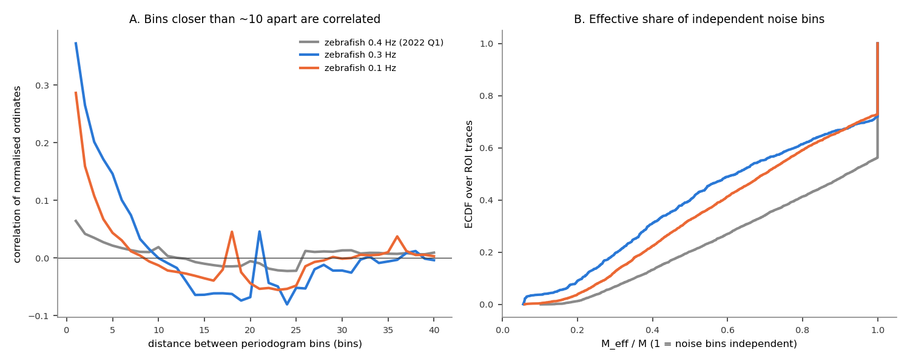
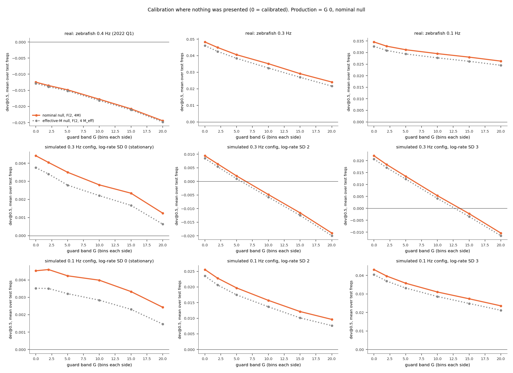
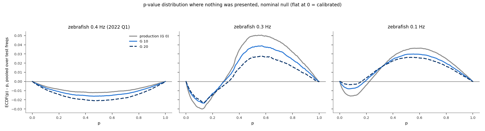
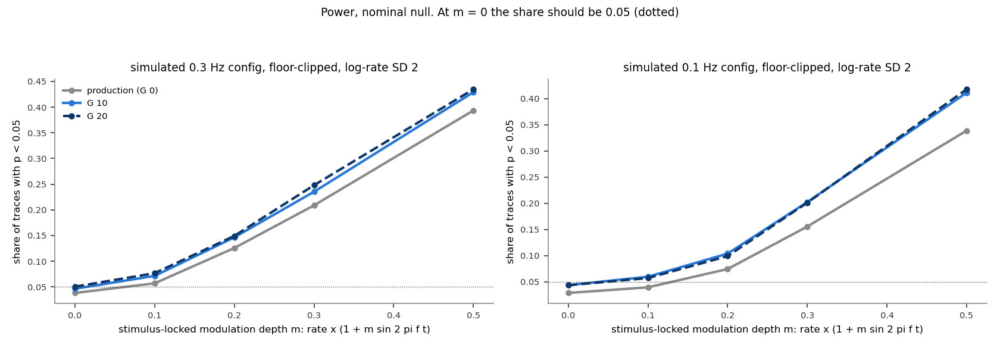
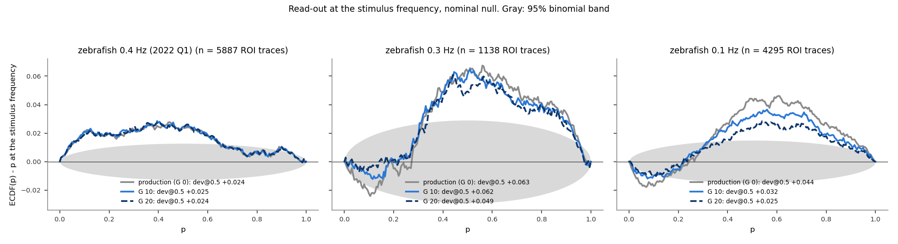

# A guard band around the analysis frequency (Q_ignore): does it fix the imaging null?

**Date:** 2026-10-03. **Branch:** `guard-band-null`. **Script:** `docs/guard_band_null/guard_band.py`
(~10 min; `--figures-only` replots). Zebrafish only: the 0.3 Hz and 0.1 Hz sets of recordings,
where the null is miscalibrated, and the 2022 Q1 0.4 Hz set, where it is not, as a control.
Background: [`nfc_finite_sample_bias.md`](nfc_finite_sample_bias.md), sections "Slow variation
and floor-clipped traces" and "Excluding ROIs with long dead time".

## Summary

- **The guard band alone does not fix the null.** Skipping G = 20 bins on each side cuts the
  excess where nothing was presented by about half in the 0.3 Hz recordings (+0.048 → +0.024)
  and by a quarter in the 0.1 Hz recordings (+0.035 → +0.026). It also pushes the calibrated
  2022 Q1 recordings below zero (−0.013 → −0.025), because the noise bins move away from the
  analysis bin and start to see the spectrum's curvature (Figure 2).
- **Correcting for correlated noise bins (effective M) changes almost nothing** (Figure 2,
  gray dotted line). With M = 32–57 noise bins per side, even M_eff ≈ 0.65 M leaves the null
  practically unchanged.
- **The ROI property that predicts miscalibration is the spread of its periodogram, not
  correlation between bins.** If a trace's Fourier coefficients were Gaussian, its
  periodogram values would be exponentially distributed, with CV² = 1. In the floor-clipped
  recordings many ROIs have CV² well below 1, and those are the miscalibrated ones: the ROIs
  in the lowest quarter of CV² sit at +0.10 to +0.15, the highest quarter at 0 (Figure 1C).
  Low CV² means the trace's power comes from a handful of events.
- **A null matched to each ROI's own spread nearly removes the excess at p = 0.5** (0.1 Hz:
  +0.035 → +0.008; 0.3 Hz: +0.048 → −0.019), and recovers 25–30% more detections of a
  simulated stimulus-locked response (Figure 4). But it overshoots: the hump in the middle of
  the p range turns into the opposite S-shape, with a few too many small p-values and a pile
  near p = 1 (Figure 3). It is the right direction, not yet a finished fix.
- **At the stimulus frequency**, the dispersion-matched null brings the 0.3 Hz recordings from
  +0.063 to +0.004 and the 0.1 Hz recordings from +0.044 to +0.013 (Figure 5).

## Terms

| term | meaning |
|---|---|
| ordinate | one value of a trace's periodogram: the power \|Y_k\|² at frequency bin k |
| analysis bin | the bin NFC is computed at (the stimulus bin, or a test frequency) |
| noise bins, M | the bins whose mean power is NFC's noise estimate: M on each side of the analysis bin. Production uses the M bins right next to it |
| guard band G (Q_ignore) | the number of bins skipped on each side before the noise bins start. G = 0 is production. Noise bins: f0 − G − M … f0 − G − 1 and f0 + G + 1 … f0 + G + M |
| test frequencies | analysis bins where nothing was presented (every 3rd bin from 0.05 Hz up, skipping any whose widest window, G = 20, would reach the stimulus). Calibration is judged there |
| dev@0.5 | ECDF(0.5) − 0.5: the share of p-values below 0.5, minus the 0.5 expected. 0 = calibrated. Here computed per test frequency and averaged over test frequencies |
| CV² | variance / mean² of a ROI's ordinates, each divided by the mean of its 51 neighbours (so the spectrum's overall shape does not count as spread), over its whole spectrum away from the stimulus. 1 for Gaussian noise |

The population is today's production population before the coverage threshold (P(iscell) >
0.5, npix ≥ 10, inside the fish outline, flatline removal), because the point is to keep as
many neurons as possible: 4,295 ROI traces (0.1 Hz, 10 recordings), 1,138 (0.3 Hz, 6) and
5,887 (2022 Q1, 6). Every condition uses the same test frequencies. Each ROI contributes one
p-value per test frequency (98–266 test frequencies per recording).

## Three nulls

All three are exact F distributions; at integer M the first agrees with production's
eps-corrected Rayleigh null to within 0.005 in p.

| null | assumes | NFC²/2 ~ |
|---|---|---|
| nominal (production) | 2M independent exponential ordinates | F(2, 4M) |
| effective M | 2M exponential ordinates, correlated as measured in this ROI's own spectrum, worth 2M_eff independent ones: M_eff = M / VIF, VIF = 1 + 2 Σ_L (1 − L/M) ρ_L | F(2, 4M_eff) |
| dispersion-matched | ordinates Gamma-distributed with shape k = 1/CV², this ROI's own spread | F(2k, 4Mk) |

Simulated traces, where the null is true by construction, are the floor-clipped GCaMP model of
Figure 18 in the background report (Poisson events, 2 s decay, noise, a floor), with the event
rate modulated slowly (τ = 100 s) at log-rate SD 0 (stationary), 2 or 3; 4,000 traces per
condition, in the 0.3 Hz and 0.1 Hz recordings' frame counts and Q_frac.

## 1. How wide is the correlation a guard band would have to skip?

**The question.** A guard band only helps if the analysis bin and its noise bins are
correlated, and only out to a certain distance. How far apart must two bins be before they are
independent?



<sub>**Figure 1. What goes wrong in the floor-clipped traces.** *A:* correlation between a ROI's normalised ordinates L bins apart (mean over ROIs), measured over its whole spectrum away from the stimulus. *B:* distribution over ROI traces of the spread of their ordinates, CV² (dotted: 1, Gaussian noise). *C:* each set of recordings' ROIs grouped into ten equal-sized groups by CV²; y is the group's mean dev@0.5 over the test frequencies under the production null.</sub>

- **Neighbouring bins are correlated out to about 8–10 bins** in the floor-clipped recordings
  (Figure 1A): lag-1 correlation 0.37 (0.3 Hz) and 0.29 (0.1 Hz), 0.06 in 2022 Q1. That sets
  the guard band: G ≈ 10 should cut the analysis bin loose from its noise bins.
- **The correlation reduces the effective number of noise bins only modestly:** median M_eff
  is 35 of M = 57 (0.3 Hz) and 23 of 32 (0.1 Hz); 2022 Q1 is unchanged at 72.

## 2. Does the guard band restore calibration?

**The question.** If correlation between the analysis bin and its noise bins were the cause,
p-values at the test frequencies should become uniform once G is past the correlation width.



<sub>**Figure 2. Calibration where nothing was presented, vs guard band.** dev@0.5 averaged over test frequencies, for G = 0–20 bins, under the nominal null (orange), the effective-M null (gray dotted) and the dispersion-matched null (blue dashed). *Top row:* real recordings. *Middle and bottom rows:* simulated floor-clipped traces in the 0.3 Hz and 0.1 Hz configurations, stationary (left) and slowly modulated (log-rate SD 2, 3). G = 0 under the nominal null is production. For reference, white noise gives about ±0.003.</sub>

| dev@0.5 at test frequencies | G = 0 (production) | G = 10 | G = 20 |
|---|---|---|---|
| 0.3 Hz zebrafish, nominal null | +0.048 | +0.035 | +0.024 |
| 0.1 Hz zebrafish, nominal null | +0.035 | +0.030 | +0.026 |
| 2022 Q1 zebrafish, nominal null | −0.013 | −0.018 | −0.025 |

- **The excess shrinks with G but does not go away** (Figure 2, top row, orange). Most of the
  drop happens beyond G = 10, past the correlation width of Figure 1A, so it is not the
  correlation being cut.
- **The guard band costs calibration where there was none to fix.** 2022 Q1 drifts further
  below zero as G grows, and the stationary simulation drifts down too (middle and bottom
  left). Moving the noise bins away from the analysis bin lets the spectrum's curvature bias
  the noise estimate. Part of the drop in the floor-clipped recordings is probably this same
  downward drift, not a fix.
- **The effective-M correction does nothing useful** (gray dotted, on top of orange
  everywhere). Adding it to the dispersion-matched null changes dev@0.5 by ≤ 0.002 (not
  plotted).

## 3. What does predict a ROI's miscalibration?

**The question.** If not correlation between bins, which property of a trace makes its
p-values pile up in the middle?

- **The spread of its ordinates** (Figure 1C). The miscalibration rises steadily as CV² falls
  below 1:

  | dev@0.5 by quarter of CV² (median CV² in brackets) | lowest | 2nd | 3rd | highest |
  |---|---|---|---|---|
  | 0.3 Hz zebrafish | +0.145 (0.31) | +0.040 (0.61) | +0.017 (0.76) | −0.004 (0.95) |
  | 0.1 Hz zebrafish | +0.099 (0.51) | +0.031 (0.75) | +0.010 (0.88) | +0.000 (1.07) |
  | 2022 Q1 zebrafish | −0.002 (0.89) | −0.006 (0.96) | −0.017 (1.02) | −0.024 (1.17) |

  The relation runs both ways: in 2022 Q1, ROIs with CV² above 1 are miscalibrated in the
  opposite direction.
- **Low CV² is common in the floor-clipped recordings** (Figure 1B): 27% of 0.3 Hz ROIs and
  11% of 0.1 Hz ROIs have CV² < 0.5, against none in 2022 Q1. Median CV² is 0.69, 0.82 and
  0.99.
- **Why low CV² means a trace with few events.** NFC's null assumes each Fourier coefficient is
  a sum of many small, independent contributions, hence Gaussian, so the ordinates are
  exponential (CV² = 1). A floor-clipped trace is zero between events, so each coefficient is
  a sum over the events only. With K events of similar size, CV² ≈ 1 − 1/K: a single event
  gives the same power at every frequency (CV² = 0), so NFC ≈ 1 everywhere and its p-value is
  always middling. CV² = 0.3–0.5 corresponds to roughly 1.5–2 effective events. This is the
  imaging counterpart of the ephys finite-spike-count bias in the background report, and it
  explains why the excess sits at every frequency (its Figure 11) and in the most sparse,
  bursty ROIs (its Figure 16).

## 4. A null matched to each ROI's spread

**The question.** If the ordinates of a ROI are Gamma-distributed with shape k = 1/CV²
instead of exponential, the exact null of NFC becomes F(2k, 4Mk). Does using each ROI's own k
restore calibration?



<sub>**Figure 3. The whole p-value distribution where nothing was presented.** ECDF(p) − p, pooled over all test frequencies and ROIs (flat at 0 = calibrated). Gray: production (G = 0, nominal null). Orange: G = 10, nominal null. Blue: G = 0, dispersion-matched null. Navy dashed: G = 10, dispersion-matched null.</sub>

- **At p = 0.5 it nearly does** (Figure 2, blue dashed): 0.1 Hz +0.035 → +0.008, 0.3 Hz
  +0.048 → −0.019, and 2022 Q1 improves too (−0.013 → −0.007).
- **But the shape is wrong in the other direction** (Figure 3, blue). Production's hump (too
  many p-values around 0.5, too few near 0 and 1) becomes an S: slightly too many p-values
  below 0.2 (up to +0.02) and too many right at 1. The pile at 1 comes from the ROIs with the
  lowest CV², where k is large and the Gamma model makes the null very narrow.
- **It overshoots in simulation too**, by −0.01 to −0.03 at p = 0.5 (Figure 2, middle and
  bottom rows). The Gamma shape is an approximation: the distribution of a sum of a few
  phasors is not Gamma.
- **Combining it with a guard band does not help** (navy dashed): the S gets slightly larger.

## 5. What does each version cost in power?

**The question.** A correction that calibrates by making every p-value larger would also hide
real responses. How often does each version detect a stimulus-locked response that is known
to be there?



<sub>**Figure 4. Detection of a simulated stimulus-locked response.** Simulated floor-clipped traces (log-rate SD 2) whose event rate is multiplied by 1 + m sin(2πft) at the configuration's stimulus frequency. y: share of traces with p < 0.05. At m = 0 there is no response and the share should be 0.05 (dotted). Lines as in Figure 3.</sub>

| share with p < 0.05 | m = 0 (no response) | m = 0.3 |
|---|---|---|
| 0.1 Hz config: production | 0.028 | 0.156 |
| 0.1 Hz config: G = 0, dispersion-matched | 0.042 | 0.202 |
| 0.3 Hz config: production | 0.038 | 0.209 |
| 0.3 Hz config: G = 0, dispersion-matched | 0.059 | 0.253 |

- **Production is conservative in the tail.** With no response it calls only 2.8–3.8% of
  traces significant at 0.05, because few-event traces rarely produce small p-values.
- **The dispersion-matched null brings the false-positive rate to about 0.05 and detects
  25–30% more responses** at every modulation depth. The guard band adds a few percent more
  detections, along with false positives above 0.05 (0.060–0.069 at G = 10).

## 6. At the stimulus frequency

**The question (read-out only).** What happens to the real recordings' p-values at the
stimulus frequency under the dispersion-matched null?



<sub>**Figure 5. p-value distributions at the stimulus frequency.** ECDF(p) − p for every ROI trace, production null (gray) and G = 0 dispersion-matched null (blue). Legends give dev@0.5. Gray band: 95% binomial band.</sub>

- **0.3 Hz and 0.1 Hz zebrafish:** the excess largely goes (+0.063 → +0.004 and +0.044 →
  +0.013), with the same S-shape as at the test frequencies. Nothing stimulus-specific stands
  out.
- **2022 Q1:** the excess stays (+0.024 → +0.033). Its stimulus bin is already known to carry a
  local stimulus-locked component in `20220301` (background report, Figure 12), which a
  different null would not remove.

## What this establishes

| | finding |
|---|---|
| **Established** | A guard band of up to 20 bins reduces the excess by a quarter to a half but does not calibrate the floor-clipped recordings, and it biases calibrated recordings downward (spectral curvature). |
| **Established** | Correlation between noise bins (effective M) is not the problem: correcting for it changes p-values negligibly. |
| **Established** | A ROI's miscalibration is predicted by the spread of its periodogram ordinates (CV²), in both directions: CV² < 1 (few-event, floor-clipped traces) piles p-values in the middle; CV² > 1 does the opposite. |
| **Promising** | A null matched to each ROI's CV² removes most of the excess at p = 0.5, restores the false-positive rate to about 0.05 and gains 25–30% power, but overshoots into an S-shape. |
| **Open** | A better model of the ordinate distribution for few-event traces than Gamma(k), so the matched null is exact rather than approximate; a CV²-based selection rule as an alternative to the coverage threshold (ROIs with CV² ≥ 0.85 are calibrated under the production null: 43% of 0.1 Hz ROIs, 24% of 0.3 Hz). |

**Recommendation.** Do not adopt Q_ignore as it stands. If a guard band is ever used, the
visual-frequency fits should keep Q_ignore = 0, as requested. The productive direction is a
null that accounts for each ROI's ordinate spread. The next step is to replace the Gamma
approximation with the exact distribution implied by the measured spread, or to calibrate k
against the test frequencies, and re-check Figures 2–5.

## Reproducing

```bash
python docs/guard_band_null/guard_band.py                  # ~10 min, writes results_gb_*.csv and fig_gb_*.png
python docs/guard_band_null/guard_band.py --figures-only   # replot from the CSVs
```
