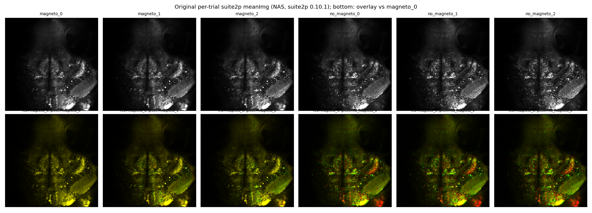
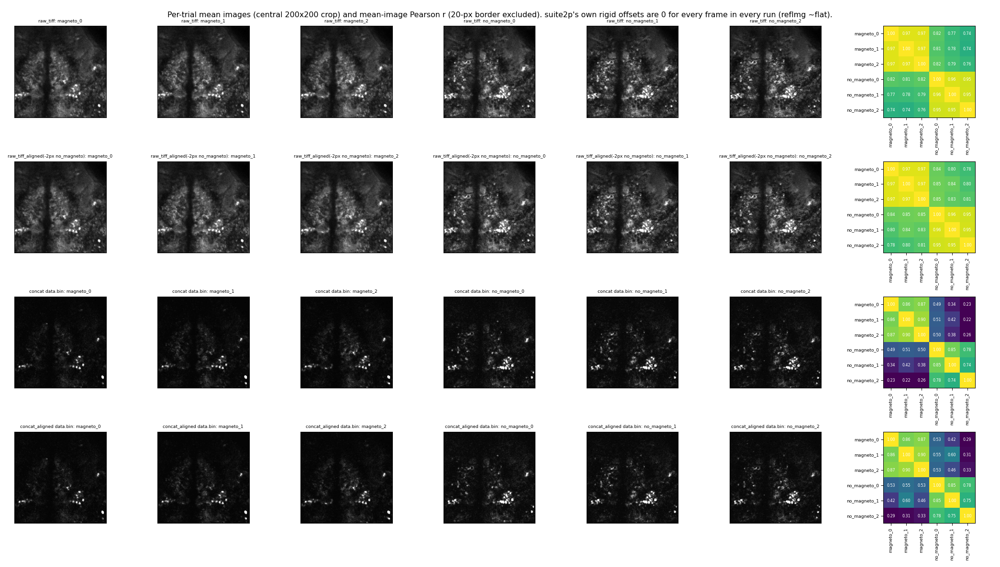
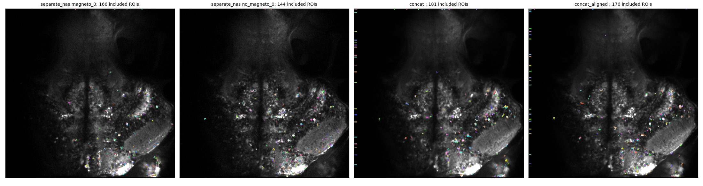
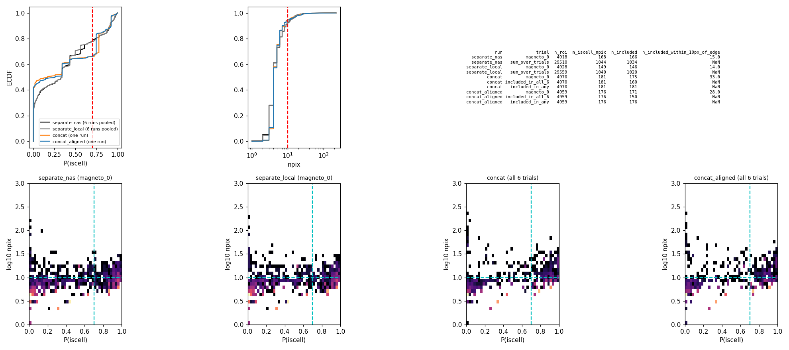
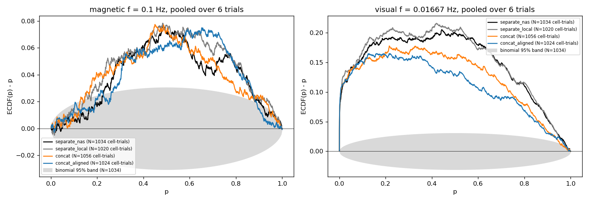
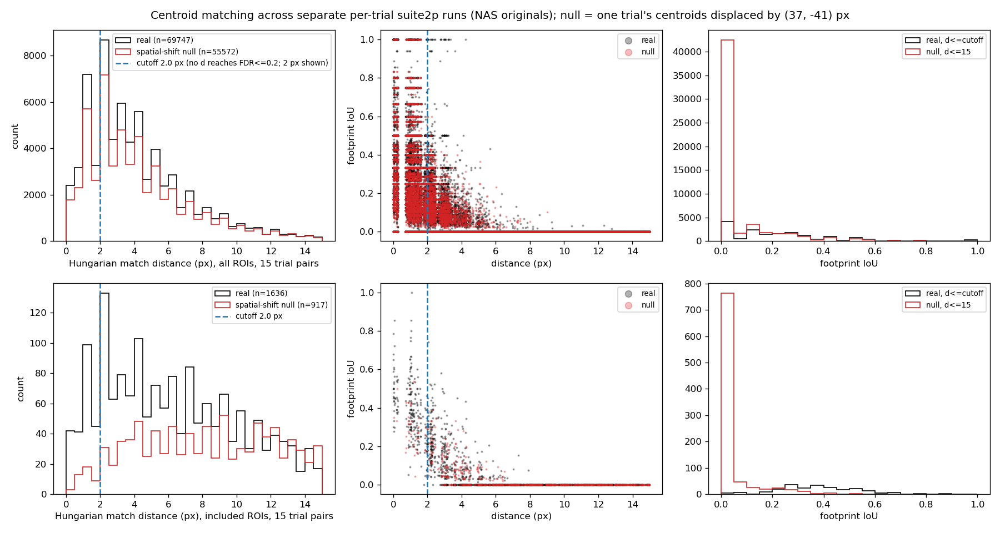
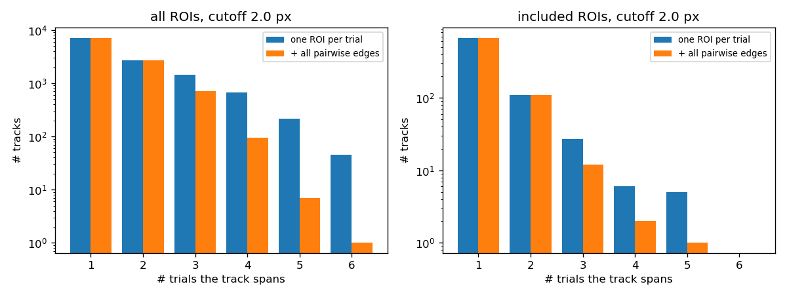

# Medaka cross-trial ROI identity: concatenated suite2p vs centroid matching

*Investigation, 2026-10-01. Nothing in the production pipeline, YAMLs, `data/*.nwb` or
`data/manuscript/*` was changed. The NAS was only read from. Code, CSVs and figures are in
[`docs/medaka_concat_suite2p/`](medaka_concat_suite2p/). Large intermediates (tiff copies,
suite2p `data.bin`/`F.npy`, about 16 GB) are in the untracked scratch directory
`C:/Users/dan/medaka_suite2p_scratch/`.*

## Question

The medaka dataset is one fish (`fish_1`, 20230106) with six trials:
`fish3_8dpf_{magneto,no_magneto}_{0,1,2}`. Each trial has its own suite2p run, so ROI *k* in
one trial is unrelated to ROI *k* in another. The pipeline's neuron key `(species, ID, date, id)`
therefore merges unrelated cells across trials. Can we get real cross-trial ROI identity?

## Data inventory ([`01_inspect_trials.py`](medaka_concat_suite2p/01_inspect_trials.py), [`trial_inventory.csv`](medaka_concat_suite2p/trial_inventory.csv))

- **The raw tiffs are present and readable.** There are 6 ImageJ tiffs (`<trial>/<trial>.tif`),
  each 1080 frames × 477 × 477 uint16 (about 490 MB). All six share the same field of view and plane
  (see [`fig_meanimg_nas.png`](medaka_concat_suite2p/fig_meanimg_nas.png)).
- **Existing outputs.** Each trial directory has `suite2p/plane0/{ops,stat,iscell,F,Fneu,spks,data.bin}.npy`
  from suite2p 0.10.1 (2023-03-02). Every relevant op is a suite2p **default**, including
  `fs=10, tau=1, diameter=0`, nonrigid, and sparse_mode. Note that `fs=10` even though the YAMLs use a
  1 s frame period.
- **The data are photon-starved.** In magneto_0, 93.6 % of pixel-frames are exactly 100 (the offset),
  3.7 % are 101, 1.6 % are 102, and so on ([`raw_pixel_value_distribution.csv`](medaka_concat_suite2p/raw_pixel_value_distribution.csv)).
  suite2p converts uint16 with `//2`, so 100 and 101 both become 50. The single-photon level is
  thrown away in every suite2p run, **including the production ones**.
- **The original registration did nothing useful.** In all 6 runs, `refImg` is about flat (values
  49–53, std 0.025), every frame's rigid offset is 0, `corrXY` is the same constant, and every nonrigid
  block has the same shift (−2.4, −7.6). In effect, every frame was translated by a constant
  (raw-vs-meanImg phase correlation gives (2.2, 7.8) px). Single frames have too few photons to
  register. The fish is presumably immobilised, so within-trial motion is probably small, but it
  is not corrected.
- **The ROI count is set by a cap.** All runs have about 4,900 ROIs because sparsery stops at
  `250 × max_iterations = 5000` candidates, while the detection score is still well above threshold
  (score about 6.4 at 4,000 ROIs vs threshold 5.0 for separate runs; about 19.8 for concat).
  Most ROIs are tiny: median npix is 4.
- **There is an inter-trial shift between blocks.** Phase correlation of the mean images shows no
  shift within the magneto block or within the no_magneto block (|d| < 0.1 px; mean-image r = 0.96–0.97).
  The no_magneto block is shifted by **about −1.9 px in y** (−0.15 to −0.25 px in x) relative to the
  magneto block, and between-block r is only 0.74–0.82. Correcting the 2 px shift raises
  between-block r only to 0.78–0.85
  ([`registration_meanimg_corr.csv`](medaka_concat_suite2p/registration_meanimg_corr.csv)). So most of
  the between-block difference is **not** an xy translation. It looks like a small change of plane
  (z) or a change in which cells are bright between the two blocks.






## Task A: suite2p over the concatenated trials

[`02_run_suite2p.py`](medaka_concat_suite2p/02_run_suite2p.py) uses the `suite2p` conda env
(suite2p 0.14.4, CPU). suite2p is not installed in magneto2 and nothing was installed there.

- **Ops.** I started from 0.14.4 defaults and pinned every scientific op to the original `ops.npy`
  ([`suite2p_ops_used.csv`](medaka_concat_suite2p/suite2p_ops_used.csv)). The only deliberate change
  is `use_builtin_classifier=True`, because the original classifier cannot be recovered
  (`classifier_path` was unset, meaning "the user classifier on that machine, if any").
- **Concatenation order.** I used the fixed order magneto_0,1,2 then no_magneto_0,1,2, 1080 frames
  each, giving frame ranges 0–1080, …, 5400–6480 ([`concat_frame_ranges.csv`](medaka_concat_suite2p/concat_frame_ranges.csv)).
- **Runs:**
  - **`concat`**: the original ops over the six raw tiffs. suite2p registration was again a no-op,
    so the 2 px block jump stays in the movie.
  - **`concat_aligned`**: the same, but the no_magneto tiffs were first shifted by an integer −2 px
    in y (from raw mean-image phase correlation, [`concat_aligned_shifts.csv`](medaka_concat_suite2p/concat_aligned_shifts.csv)).
  - **`separate_local`**: a control. The six per-trial runs redone with the same suite2p version and
    classifier, so version and classifier differences don't confound the comparison.

Runtime: about 2.2 min per concatenated run and about 35 s per separate run.

### ROI counts ([`roi_counts.csv`](medaka_concat_suite2p/roi_counts.csv))

Inclusion rule is the production rule: `p_iscell > 0.7`, `npix > 10`, then `remove_flatlines`.

| run | total ROIs | iscell & npix | included per trial | cross-trial identity |
|---|---|---|---|---|
| separate_nas (production) | 4859–4957 per trial (29,510 total) | 145–216 per trial | 144–213 (sum 1034) | none |
| separate_local (0.14.4) | 4869–4958 per trial | 143–227 | 140–223 (sum 1020) | none |
| concat | 4970 | 181 | 175–178 | 181 in ≥1 trial, **160 in all 6** |
| concat_aligned | 4959 | 176 | 168–173 | 176 in ≥1 trial, **150 in all 6** |

- **Edge artifacts.** In the concatenated runs, about 30–37 of the included ROIs (about 20 %) sit
  within 10 px of the frame border. Most are streaks along the left edge, which is the border left
  by the constant registration shift ([`fig_roi_footprints.png`](medaka_concat_suite2p/fig_roi_footprints.png)).
  The separate runs have 5–20 such ROIs. Without them, concat has about 140 real interior cells
  across all six trials, compared with about 140–195 interior cells per trial in the separate runs.
- **Classifier and size distributions.** The P(iscell) and npix ECDFs and the joint histograms are
  similar ([`fig_roi_ecdfs.png`](medaka_concat_suite2p/fig_roi_ecdfs.png)). The concatenated runs have
  more ROIs near P(iscell) = 0 and a jump at about 0.75.
- **Flatline removal is per trial.** It runs on each trial's slice of the concat F, so 21–26 concat
  ROIs drop out in one or more trials.






### Fourier p-values ([`fourier_pvalue_summary.csv`](medaka_concat_suite2p/fourier_pvalue_summary.csv), [`fig_pvalue_ecdf.png`](medaka_concat_suite2p/fig_pvalue_ecdf.png))

I sliced the concat F back into trials and ran the production fit: `fit_Fourier` + `corrected_pvalues`,
T = 1, with f = 0.1 Hz / Q_frac = 0.15 and 1/60 Hz / Q_frac = 0.50.

- **Magnetic 0.1 Hz.** p < 0.05 in 4.9 % (separate_nas), 5.0 % (separate_local), 5.6 % (concat) and
  5.6 % (concat_aligned) of cell-trials. All four ECDF(p) − p curves share the same mid-p bump,
  about +0.07 at p ≈ 0.5, outside the binomial band. That bump is a property of the data and fit,
  not of the segmentation.
- **Visual 1/60 Hz.** p < 0.05 in 25.5–27.2 % of cell-trials in the `_1`/`_2` trials, compared with
  1.7–3.2 % in the `_0` trials, for every segmentation and **in both blocks**. Pooled excess is
  slightly smaller with the concatenated segmentations (18.1–18.7 % vs 18.8–19.1 %), consistent with
  separate runs picking cells that were active in that particular trial.
- **Side finding.** This is direct support for the `_0`-has-no-visual-stimulus convention. It holds
  for `no_magneto_1/2` too, not only `magneto_1/2`.




**Conclusion for A:** concatenating does not change the population-level p-value picture. It does
give about 150–160 ROIs (about 140 excluding edge artifacts) with one shared footprint and a trace in every trial.

## Task B: centroid matching of the existing separate runs ([`04_centroid_matching.py`](medaka_concat_suite2p/04_centroid_matching.py))

**Method:**
1. Estimate pairwise rigid shifts from the original `meanImg` by phase correlation (search limited to ±20 px).
2. Shift `stat["med"]` into a common frame.
3. For each of the 15 trial pairs, run a Hungarian assignment (`linear_sum_assignment`) on centroid
   distance within 15 px, then apply a cutoff.
4. Compute footprint IoU for every match.
5. Null: the same procedure with one trial's centroids displaced by (37, −41) px. This keeps ROI
   density but removes true correspondence.
6. Cutoff: the largest distance where the cumulative null/real match count stays ≤ 0.2 (an
   estimated FDR of 20 %).

I used a cumulative rule because `med` is integer-pixel, so distances are quantised and per-bin
ratios are noisy.

**Results** ([`match_cutoffs.csv`](medaka_concat_suite2p/match_cutoffs.csv), [`fig_match_distance_iou.png`](medaka_concat_suite2p/fig_match_distance_iou.png), [`match_pairs_summary.csv`](medaka_concat_suite2p/match_pairs_summary.csv), [`match_tracks_summary.csv`](medaka_concat_suite2p/match_tracks_summary.csv), [`fig_match_tracks.png`](medaka_concat_suite2p/fig_match_tracks.png)):

- **All ROIs (about 4,900 per trial): matching is at chance level.** The null finds 74–79 % as many
  matches as the real data at every cutoff from 0.5 to 8 px, so no cutoff reaches FDR ≤ 0.2. The ROIs
  are too small and too dense (median npix 4; spacing about 7 px), and each run's capped top-5000 is a
  different subset.
- **Included ROIs: there is a real signal, but it is small.**
  - **Cutoff.** I chose **2.0 px** (FDR 0.19; at 0.5 px FDR is 0.07; beyond 3 px it climbs to 0.22–0.40).
    Matches inside the cutoff have median IoU 0.375, compared with 0 for the null.
  - **Pairwise matches.** Per trial pair, only **10–27 of 144–213 included ROIs (6.5–19 %)** find an
    included partner: median 17 per pair. Within-block pairs do best (no_magneto_0–1: 27, 19 %);
    across-block pairs reach 6.5–10 %.
  - **Partners that fail inclusion.** About 50–80 included ROIs per pair do have *some* suite2p ROI
    within 2 px in the other trial, but mostly one that fails inclusion there. Per-trial classifier
    and inclusion decisions are themselves not reproducible across trials.
  - **Tracks across trials.** Among included ROIs, **no** cell is tracked across all 6 trials. 5
    tracks span 5 trials (1 fully pairwise-consistent), 6 span 4 trials, 27 span 3, and 110 span 2.
    3-of-3 within-block triangles: 3 for magneto and 7 for no_magneto. With all ROIs at the same
    cutoff there are 45 six-trial tracks (1 fully consistent) and 1,177 conflicting components, but
    that graph is mostly chance matches.






### Validation against the concatenated segmentation

Each separate-run ROI was mapped to its maximum-overlap concat ROI, after an empirical
separate-to-concat shift: about 0 for magneto and about −2.05 px y for no_magneto in `concat_aligned`.
Results are in [`concat_validation_summary.csv`](medaka_concat_suite2p/concat_validation_summary.csv).

- **The two segmentations mostly disagree on footprints.** Only 26–37 % of included separate ROIs
  (21–25 % of all ROIs) have a concat counterpart with IoU ≥ 0.3. The median best IoU is 0.0–0.15.
- **Agreement against `concat_aligned`, IoU ≥ 0.3 mapping:**
  - **Precision.** Where both ROIs of a centroid match can be mapped, the two segmentations agree for
    included ROIs (103/114 = **90 %**) and for all ROIs (79 %).
  - **Recall.** Centroid matching finds only **64 %** (included) / 60 % (all) of the pairs the shared
    segmentation implies, even within this small mappable subset.
  - **IoU ≥ 0.5 mapping.** Precision is 92 % and recall 79 % for included ROIs, but on only 37 pairs.
  - **Against the unaligned `concat`.** Agreement is worse (included precision 77 %, recall 46 %).
    The 2 px block shift matters at this ROI scale.

## What didn't work / caveats

- **suite2p registration.** It cannot work at this photon count, in either the original or the new
  runs. The block shift had to be corrected outside suite2p, with an integer pre-shift. A proper fix
  would register on temporally binned frames (e.g. `smooth_sigma_time`, or a custom refImg from the
  trial mean). I did not try this because frames within each block are already consistent.
- **Residual between-block difference.** After xy alignment the blocks still differ (r about 0.8 vs
  0.96 within a block). No rigid alignment can fix a plane change, so cross-block identity is shaky
  for any method.
- **Ops not changed.** I kept every original op for comparability, including `fs=10` (true rate
  1 Hz), the 5000-ROI cap, and the `//2` uint16 conversion. Each of these probably hurts
  segmentation quality. Raising `max_iterations`, setting `fs=1`, and avoiding the `//2` loss (for
  example, subtracting the 100 offset before ingest) are obvious next experiments. I did not run them.
- **Not ground truth.** The concatenated segmentation is a different segmentation, not ground truth.
  The "validation" measures agreement only.
- **Edge ROIs.** The concat runs' border-streak ROIs (about 20 % of included ROIs) would need an
  edge exclusion before any production use.

## Recommendation

**Concatenated suite2p, with rigid pre-alignment of the no_magneto block, is the only one of the
two approaches that gives usable cross-trial identity. Centroid matching of the existing runs should
not be used.**

- **Why not centroid matching.** It links at most about 10–19 % of included cells between any two
  trials and none across all six. It is at chance level for the full ROI population. Its links agree
  with the shared segmentation only about 64 % of the time in recall.
- **What concatenation gives.** About 150 included ROIs (about 140 excluding border artifacts) with
  one footprint and traces in all six trials. The population p-value behaviour is essentially the
  same as with the production per-trial segmentations.
- **If medaka is moved onto it:**
  - (a) Exclude border ROIs.
  - (b) Treat magneto vs no_magneto cross-block identity with caution, given the residual
    non-rigid/z difference.
  - (c) Consider the cheap ops fixes above, which would change ROI sets again.
- **Fallback.** If none of this is adopted, the honest option is **neither**: treat medaka trials as
  independent ROI sets and stop keying medaka neurons by `(species, ID, date, id)` across trials.
  Deciding how medaka neurons are counted is out of scope here and was not changed.

## Reproduce

```bash
cd docs/medaka_concat_suite2p
python 01_inspect_trials.py                      # magneto2, NAS read, ~1 min
C:/Users/dan/anaconda3/envs/suite2p/python.exe 02_run_suite2p.py   # suite2p env, NAS read, ~10 min total
python 03_compare_runs.py                        # magneto2, NAS read, ~5 min
python 04_centroid_matching.py                   # magneto2, NAS read, ~3 min
```

Scratch location can be overridden with `MEDAKA_S2P_SCRATCH`.
