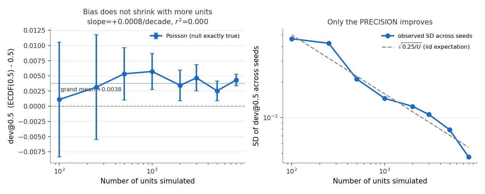
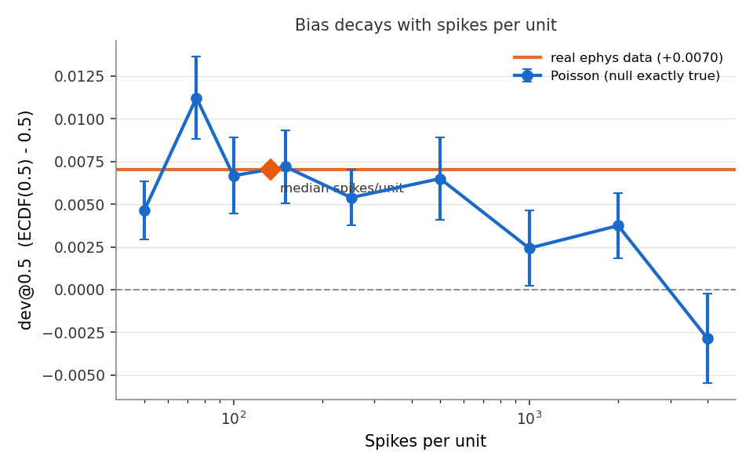
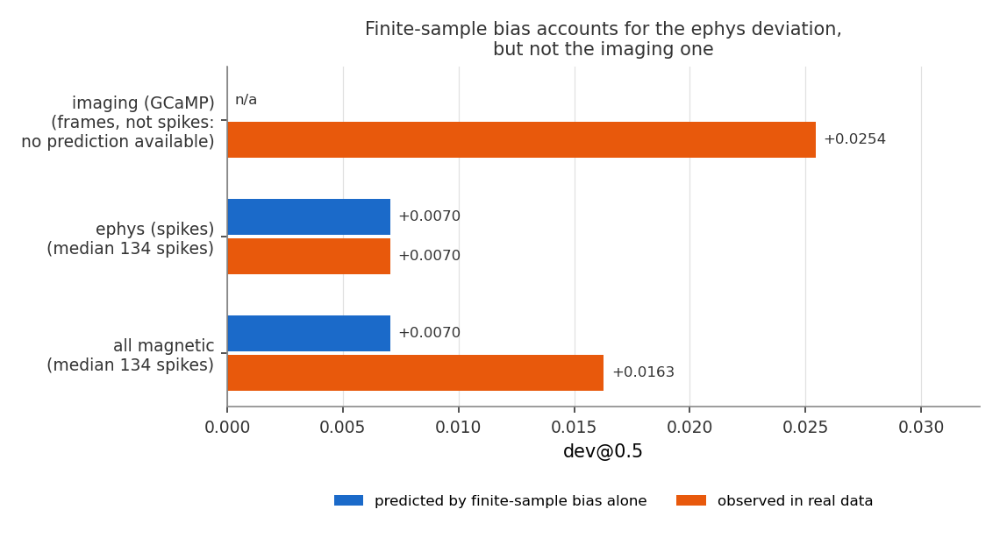

# Finite-sample bias in the NFC null

**Date:** 2026-09-25
**Scope:** Diagnostic investigation. No production pipeline code or configuration was
changed. Everything below is reproduced by `docs/nfc_finite_sample_bias/simulate.py`.
**Related:** [`fig1_mag_noise_floor_correction.md`](fig1_mag_noise_floor_correction.md),
which found the *opposite-signed* effect in a single recording — see
[Reconciling with the noise-floor report](#reconciling-with-the-noise-floor-report).

## Summary

Fig2 panel C plots the deviation of the pooled magnetic p-value ECDF from uniform. It
is not flat: it sits near zero through the small-p region, rises to **+0.016 at p = 0.5**,
and peaks around **+0.021 at p ≈ 0.6**. Something makes NFC run slightly high in the bulk.

The cause is that **the Rayleigh null is asymptotic and real recordings are not.**
`|c(f)| / σ̂` converges to Rayleigh as spike count grows; at the ~134 spikes/unit typical
of this dataset it has not converged, and its finite-sample sampling distribution sits
slightly away from the origin. Simulating homogeneous Poisson spike trains — for which
the null is *exactly* true by construction — reproduces the ephys deviation essentially
exactly.

**The p < 0.01 suspect threshold is unaffected** (`P(p<0.01)` = 0.0093–0.0110 across every
simulated condition). This is a bulk effect. The magnetic null result does not depend on it.

Three things are established, one is ruled out, and one remains open:

| | finding |
|---|---|
| **Established** | The bias is real and positive under a perfectly-valid null |
| **Established** | It **decreases with spikes per unit** (slope −0.0045/decade, p = 0.0002) |
| **Established** | It does **not** decrease with number of units (slope +0.0008/decade, r² = 0.0004, p = 0.77) |
| **Ruled out** | The eps correction, σ̂ scale error, spectral leakage, stimulus artifact |
| **Open** | The imaging (GCaMP) deviation is ~3.6× larger than ephys and is *not* explained by this |

## The statistic

For a set of units, take their p-values, form the empirical CDF, and record its
deviation from uniform at the midpoint:

```
dev@0.5 = ECDF(0.5) − 0.5
```

Zero if p is exactly Uniform(0,1). Positive means an excess of small p-values in the
bulk — NFC running higher than the null predicts. This is the same quantity Fig2 C/D
plots as a curve, sampled at one point so it can be regressed.

## What was ruled out, and how

Each of these was tested and failed. They are recorded because each is a plausible first
guess.

**The eps correction.** eps models *uncertainty* in σ̂ as a multiplicative lognormal
smear. Removing it entirely leaves +0.0195 of the +0.0210 peak — it accounts for ~7% —
and *increasing* it makes the deviation worse monotonically (+0.0195 → +0.0279 as the
scale factor goes 0 → 3). No value of eps flattens the curve.

**A σ̂ scale error.** A biased σ̂ rescales NFC, which moves the whole distribution
including the tail. `P(p<0.01)` is already nominal at 0.0098, so any scale correction
large enough to fix the middle pushes the tail off nominal:

| model | dev@0.5 | P(p<0.01) |
|---|---|---|
| observed | +0.0150 | **0.0098** |
| σ̂ scaled ×1.02 | +0.0297 | 0.0121 |
| σ̂ scaled ×1.04 | +0.0432 | 0.0141 |
| σ̂ scaled ×1.06 | +0.0561 | 0.0158 |

**Spectral leakage / a stimulus artifact.** Ruled out by two observations. The second
harmonic shows the same deviation as the first (+0.0216 vs +0.0210) despite being a
different frequency with an independently computed null; and the `nostim` zebrafish
recordings — **no magnet at all** — show it too (dev@0.5 = +0.0169, n = 1453).

**Non-monotone in frequency**, which also argues against anything leakage-like: 0.3 Hz
gives +0.0655 but 0.4 Hz gives +0.0105, and 4 Hz gives +0.0651.

## Does the bias depend on the number of units?

No. This was the sharpest open question, since the three-point pilot looked like it
might trend.



Poisson trains, 150 spikes each, 24 seeds per point:

| units | dev@0.5 mean | SD across seeds | SEM |
|---|---|---|---|
| 100 | +0.0011 | 0.0462 | 0.0094 |
| 250 | +0.0031 | 0.0424 | 0.0087 |
| 500 | +0.0053 | 0.0212 | 0.0043 |
| 1000 | +0.0057 | 0.0145 | 0.0030 |
| 2000 | +0.0034 | 0.0124 | 0.0025 |
| 3000 | +0.0047 | 0.0106 | 0.0022 |
| 5000 | +0.0025 | 0.0079 | 0.0016 |
| 8000 | +0.0043 | 0.0046 | 0.0010 |

Regressing every seed-level observation on log₁₀(units):

> slope = **+0.0008 per decade**, 95% CI [−0.0048, +0.0065], **r² = 0.0004**, p = 0.77

Flat. The grand mean is **+0.0038** and it does not move across an 80× range of unit counts.

**What does change is the precision.** The SD across seeds falls 9.96× from 100 to 8000
units, against √80 = 8.94 expected for an iid estimator — almost exactly the √U law (right
panel). More units do not reduce the bias; they measure it more precisely.

That is the conceptually important point. The bias lives inside *each unit's own*
`c(f_s)`. There is no cross-unit averaging anywhere in NFC — each unit's value comes from
its own spike train alone — so pooling more units cannot cancel it. It is also why the
effect is visible at all: at N = 9553 the sampling noise is small enough for a +0.016
offset to stand out, where at N = 200 it would be invisible.

## Does it depend on spikes per unit?

Yes.



Poisson trains, 4000 units, 12 seeds per point:

| spikes/unit | dev@0.5 | SEM | P(p<0.01) |
|---|---|---|---|
| 50 | +0.0046 | 0.0017 | 0.0099 |
| 75 | +0.0112 | 0.0024 | 0.0093 |
| 100 | +0.0067 | 0.0022 | 0.0095 |
| 150 | +0.0072 | 0.0022 | 0.0105 |
| 250 | +0.0054 | 0.0016 | 0.0107 |
| 500 | +0.0065 | 0.0024 | 0.0110 |
| 1000 | +0.0024 | 0.0022 | 0.0099 |
| 2000 | +0.0038 | 0.0019 | 0.0108 |
| 4000 | **−0.0028** | 0.0026 | 0.0099 |

> slope = **−0.0045 per decade**, 95% CI [−0.0068, −0.0022], r² = 0.122, **p = 0.0002**

The trend is real but noisy point-to-point — the 50-spike value sits below the 75-spike
one, which is sampling scatter at SEM ≈ 0.002, not structure. By ~1000 spikes the bias is
within noise of zero; by 4000 it has crossed slightly negative.

Note the `P(p<0.01)` column: **0.0093–0.0110 throughout.** The suspect threshold is
untouched at every spike count.

## How much of the real deviation does this explain?



| population | n units | median spikes | observed dev@0.5 | predicted by finite-sample bias |
|---|---|---|---|---|
| all magnetic | 9553 | 134 | +0.0163 | +0.0070 |
| **ephys (spikes)** | 4716 | 134 | **+0.0070** | **+0.0070** |
| imaging (GCaMP) | 4837 | — | +0.0254 | not available |

**For ephys, finite-sample bias accounts for the deviation exactly** — +0.0070 observed
against +0.0070 predicted by interpolating the Poisson sweep at 134 spikes. The agreement
to four decimals is fortuitous given SEM ≈ 0.002 on the prediction, but the match is not
in doubt.

**For imaging it does not.** GCaMP units have frames, not spikes, so the spike-count sweep
cannot furnish a prediction for them at all; their +0.0254 is 3.6× the ephys value and
drags the pooled figure to +0.0163. The pooled number is therefore imaging-dominated and
should not be read as a property of the dataset as a whole.

The leading hypothesis for the imaging residual — **untested** — is that GCaMP traces are
sparse large transients, so their effective sample size is far below their frame count,
and their Fourier coefficients are correspondingly non-Gaussian. The decisive test is
phase randomization: preserve each trace's power spectrum exactly while Gaussianizing it
and destroying transient structure, then recompute NFC. If the deviation vanishes it is
non-Gaussianity; if it survives, the power spectrum alone is responsible. That requires
the NWB traces rather than the parquet and has not been done.

## Reconciling with the noise-floor report

[`fig1_mag_noise_floor_correction.md`](fig1_mag_noise_floor_correction.md) (2026-08-19)
examined one pigeon recording and found a **negative** ECDF deviation, which it traced to
a convex local noise floor making σ̂ too large. It explicitly ruled out a finite-sample
explanation.

Both results stand. They are opposite-signed mechanisms that coexist in every recording:

| mechanism | effect on σ̂ / NFC | sign of deviation |
|---|---|---|
| Convex local noise floor | σ̂ over-estimated → NFC down | **negative** |
| Finite spike count | Rayleigh asymptote not reached → NFC up | **positive** |

Which one dominates a given recording depends on its spike counts and its local spectral
curvature. That predicts scatter around a positive mean, which is what the per-recording
measurement shows: of 30 magnetic recordings with ≥60 units, **70% are positive**, mean
+0.028, SD 0.050, range −0.063 to +0.148. Neither mechanism alone predicts both signs.

This also explains why the earlier report ruled out finite-sample effects and was right to:
finite-sample bias is strictly positive and cannot produce that recording's negative deviation.

## On the Rice interpretation

An earlier framing in this investigation fitted a Rice distribution — a Rayleigh with a
noncentrality ν — and found ν ≈ 0.3 flattens the mid-range while leaving both tails
nominal. That fit is correct as *description*: the observed NFC distribution does have
less mass near zero than Rayleigh, which is exactly what a noncentrality produces.

It should **not** be read as evidence of a physical additive component in `c`. The
finite-sample sampling distribution of `|c|/σ̂` is itself slightly displaced from the
origin, and a Rice fit absorbs that displacement into ν whether or not anything was
physically added. ν ≈ 0.3 is best read as a compact summary of the finite-sample bias,
not as a signal.

## Implications

1. **The magnetic null result is unaffected.** The bias is confined to the bulk;
   `P(p<0.01)` is nominal in the real data (0.0092) and across every simulated condition.
2. **Do not claim the pooled p-value distribution is exactly uniform.** It is not, for a
   reason that has nothing to do with magnetic fields, and a reviewer plotting the pooled
   ECDF would find it.
3. **More neurons will not fix it.** Longer recordings (more spikes per unit) will.
4. **The pooled Fig2 C number is imaging-dominated.** Quoting ephys and imaging separately
   is more honest than quoting +0.0163.

## Reproducing

```bash
python docs/nfc_finite_sample_bias/simulate.py                  # full sweeps, ~10 min
python docs/nfc_finite_sample_bias/simulate.py --figures-only   # replot from saved CSVs
```

`docs/nfc_finite_sample_bias/` contains the script, the three figures embedded above, and
`results_units.csv` / `results_spikes.csv` / `results_real.csv` holding every seed-level
observation behind the tables.

The script reimplements `statistics.fourier_analysis`'s NFC computation in vectorised form
(the production version loops in Python over both units and frequencies, far too slow for
a sweep this size). `_selftest()` asserts the two agree to **1e-10** before any sweep runs,
so the speed-up cannot silently change the result.

### Incidental finding

`ff_alt` takes Q bins on *each* side of the stimulus bin, so **2Q** coefficients enter σ̂.
That confirms `get_epsilon(Q) = 1/(2√(2Q))` is correct — it is `1/(2√M)` with `M = 2Q` the
number of averaged coefficients. A √2 discrepancy suspected earlier in this investigation
was this off-by-one-side confusion, not a bug.

### Parameters

`FREQ = 3.0 Hz`, `T = 300 s`, `SR = 30000`, `Q = 27` (the pigeon magnetic recording's own
value). Spike times are drawn uniformly on [0, T), which is a homogeneous Poisson process
conditioned on spike count.
