# Finite-sample bias in the NFC null

**Date:** 2026-09-25
**Scope:** Diagnostic investigation. No production pipeline code or configuration was
changed. Everything below is reproduced by `docs/nfc_finite_sample_bias/simulate.py`.
**Related:** [`fig1_mag_noise_floor_correction.md`](fig1_mag_noise_floor_correction.md),
which found the *opposite-signed* effect in a single recording — see
[Reconciling with the noise-floor report](#reconciling-with-the-noise-floor-report).
**Figures:** numbered Figure 1–23 in this report. "Fig 2C" always means the manuscript figure.

## Summary

Fig2 panel C plots the deviation of the pooled magnetic p-value ECDF from uniform. It
is not flat: it sits near zero through the small-p region, rises to **+0.016 at p = 0.5**,
and peaks around **+0.021 at p ≈ 0.6**. Something makes NFC run slightly high in the bulk.

The cause is that **the Rayleigh null is asymptotic and real recordings are not.**
`|c(f)| / σ̂` converges to Rayleigh as spike count grows; at the ~134 spikes/unit typical
of this dataset it has not converged, and its finite-sample sampling distribution sits
slightly away from the origin. Simulating homogeneous Poisson spike trains — for which
the null is *exactly* true by construction — reproduces the ephys deviation essentially
exactly.

**The p < 0.01 suspect threshold is unaffected** (`P(p<0.01)` = 0.0086–0.0110 across every
simulated condition at ≥ 18 spikes/unit; at 10 spikes it drops to a conservative 0.0074,
but no real unit has fewer than 51). This is a bulk effect. The magnetic null result does not depend on it.

Three things are established, one is ruled out, and one remains open:

| | finding |
|---|---|
| **Established** | The bias is real and positive under a perfectly-valid null |
| **Established** | It **decreases with spikes per unit** (slope −0.0045/decade, p = 0.0002) |
| **Established** | It does **not** decrease with number of units (slope +0.0008/decade, r² = 0.0004, p = 0.77) |
| **Ruled out** | The eps correction, σ̂ scale error, spectral leakage, stimulus artifact |
| **Established** | The imaging (GCaMP) deviation is a *different* effect. In the 0.1 Hz and 0.3 Hz zebrafish recordings and the medaka recordings it comes from photon-starved, floor-clipped traces whose activity arrives in slow epochs; see [Slow variation and floor-clipped traces](#slow-variation-and-floor-clipped-traces-imaging). (The earlier "two opposing terms" decomposition was a surrogate artifact.) |

## The statistic

For a set of units, take their p-values, form the empirical CDF, and record its
deviation from uniform at the midpoint:

```
dev@0.5 = ECDF(0.5) − 0.5
```

Zero if p is exactly Uniform(0,1). Positive means an excess of small p-values in the
bulk — NFC running higher than the null predicts. This is the same quantity Fig2 C/D
plots as a curve, sampled at one point so it can be regressed.

## What was ruled out, and how

Each of these was tested and failed. They are recorded because each is a plausible first
guess.

**The eps correction.** eps models *uncertainty* in σ̂ as a multiplicative lognormal
smear. Removing it entirely leaves +0.0195 of the +0.0210 peak — it accounts for ~7% —
and *increasing* it makes the deviation worse monotonically (+0.0195 → +0.0279 as the
scale factor goes 0 → 3). No value of eps flattens the curve.

**A σ̂ scale error.** A biased σ̂ rescales NFC, which moves the whole distribution
including the tail. `P(p<0.01)` is already nominal at 0.0098, so any scale correction
large enough to fix the middle pushes the tail off nominal:

| model | dev@0.5 | P(p<0.01) |
|---|---|---|
| observed | +0.0150 | **0.0098** |
| σ̂ scaled ×1.02 | +0.0297 | 0.0121 |
| σ̂ scaled ×1.04 | +0.0432 | 0.0141 |
| σ̂ scaled ×1.06 | +0.0561 | 0.0158 |

**Spectral leakage / a stimulus artifact.** Ruled out by two observations. The second
harmonic shows the same deviation as the first (+0.0216 vs +0.0210) despite being a
different frequency with an independently computed null; and the `nostim` zebrafish
recordings — **no magnet at all** — show it too (dev@0.5 = +0.0169, n = 1453).

**Non-monotone in frequency**, which also argues against anything leakage-like: 0.3 Hz
gives +0.0655 but 0.4 Hz gives +0.0105, and 4 Hz gives +0.0651.

## Does the bias depend on the number of units?

No. This was the sharpest open question, since the three-point pilot looked like it
might trend.

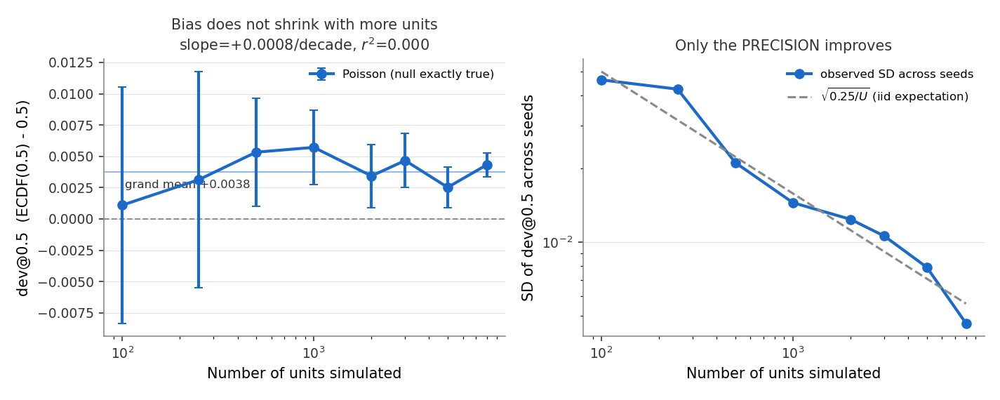

<sub>**Figure 1. Finite-sample bias does not shrink with the number of units.** Homogeneous Poisson trains (150 spikes each, so the null is exactly true), 24 seeds per point. *Left:* dev@0.5 = ECDF(0.5) − 0.5 against the number of units simulated; mean ± SEM across seeds. The light horizontal line is the grand mean (+0.0038). *Right:* SD of dev@0.5 across seeds (blue) against the iid binomial expectation √(0.25/U) (dashed). Only the precision improves with more units.</sub>

Poisson trains, 150 spikes each, 24 seeds per point:

| units | dev@0.5 mean | SD across seeds | SEM |
|---|---|---|---|
| 100 | +0.0011 | 0.0462 | 0.0094 |
| 250 | +0.0031 | 0.0424 | 0.0087 |
| 500 | +0.0053 | 0.0212 | 0.0043 |
| 1000 | +0.0057 | 0.0145 | 0.0030 |
| 2000 | +0.0034 | 0.0124 | 0.0025 |
| 3000 | +0.0047 | 0.0106 | 0.0022 |
| 5000 | +0.0025 | 0.0079 | 0.0016 |
| 8000 | +0.0043 | 0.0046 | 0.0010 |

Regressing every seed-level observation on log₁₀(units):

> slope = **+0.0008 per decade**, 95% CI [−0.0048, +0.0065], **r² = 0.0004**, p = 0.77

Flat. The grand mean is **+0.0038** and it does not move across an 80× range of unit counts.

**What does change is the precision.** The SD across seeds falls 9.96× from 100 to 8000
units, against √80 = 8.94 expected for an iid estimator — almost exactly the √U law (right
panel). More units do not reduce the bias; they measure it more precisely.

That is the conceptually important point. The bias lives inside *each unit's own*
`c(f_s)`. There is no cross-unit averaging anywhere in NFC — each unit's value comes from
its own spike train alone — so pooling more units cannot cancel it. It is also why the
effect is visible at all: at N = 9553 the sampling noise is small enough for a +0.016
offset to stand out, where at N = 200 it would be invisible.

## Does it depend on spikes per unit?

Yes.

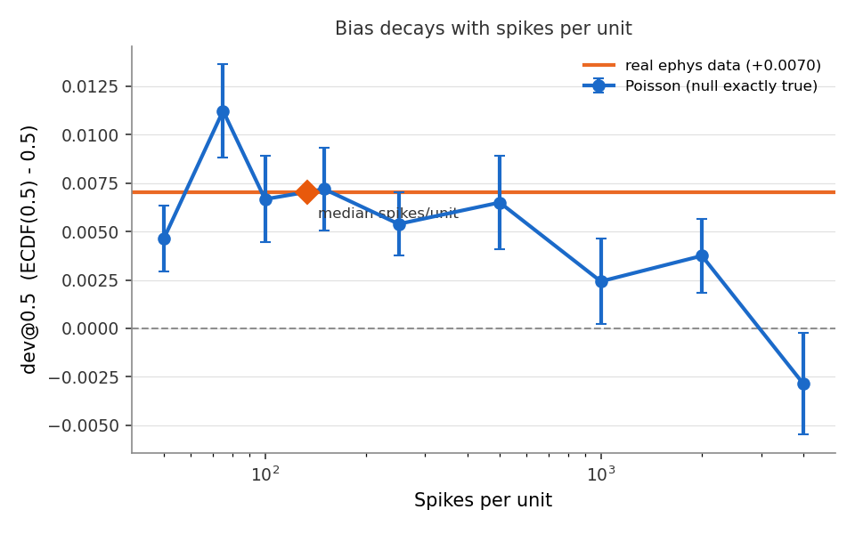

<sub>**Figure 2. Finite-sample bias decays with spikes per unit.** dev@0.5 for Poisson null populations at 50–4000 spikes/unit (4000 units, 12 seeds per point; mean ± SEM). Orange line: the real ephys magnetic population (+0.0070). Diamond: its median spike count (134).</sub>

Poisson trains, 4000 units, 12 seeds per point:

| spikes/unit | dev@0.5 | SEM | P(p<0.01) |
|---|---|---|---|
| 50 | +0.0046 | 0.0017 | 0.0099 |
| 75 | +0.0112 | 0.0024 | 0.0093 |
| 100 | +0.0067 | 0.0022 | 0.0095 |
| 150 | +0.0072 | 0.0022 | 0.0105 |
| 250 | +0.0054 | 0.0016 | 0.0107 |
| 500 | +0.0065 | 0.0024 | 0.0110 |
| 1000 | +0.0024 | 0.0022 | 0.0099 |
| 2000 | +0.0038 | 0.0019 | 0.0108 |
| 4000 | **−0.0028** | 0.0026 | 0.0099 |

> slope = **−0.0045 per decade**, 95% CI [−0.0068, −0.0022], r² = 0.122, **p = 0.0002**

The trend is real but noisy point-to-point — the 50-spike value sits below the 75-spike
one, which is sampling scatter at SEM ≈ 0.002, not structure. By ~1000 spikes the bias is
within noise of zero; by 4000 it has crossed slightly negative.

Note the `P(p<0.01)` column: **0.0093–0.0110 throughout.** The suspect threshold is
untouched at every spike count.

**What a sweep point means.** Every unit at a given point has *exactly* that many spikes.
Each point is a population where every unit has the same spike count, not a draw from a
spread of spike counts. How the real spike-count distribution combines these points is
covered [below](#which-regime-do-the-real-units-sit-in).

### The whole ECDF-deviation curve, per spike count

dev@0.5 is one point on a curve. Here is the full `ECDF(p) − p` for every sweep point
overlaid (seed-averaged, 12 × 4000 units per curve), with the real ephys curve dashed:

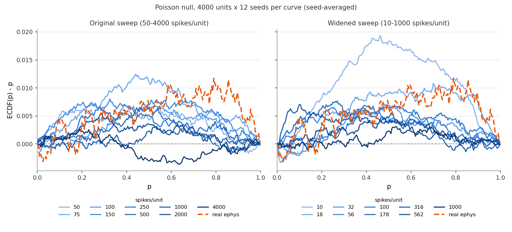

<sub>**Figure 3. Whole ECDF-deviation curves per spike count.** ECDF(p) − p for the Poisson null, seed-averaged over 12 × 4000 units, with one line per spike count (lighter = fewer spikes). *Left:* original sweep, 50–4000 spikes/unit. *Right:* widened sweep, 10–1000. Dashed orange: the real ephys magnetic population.</sub>

- The simulated curves are small positive humps that go back to zero at both ends, and
  they get flatter as spike count rises. The 4000-spike curve dips slightly negative,
  matching its dev@0.5.
- **The real ephys curve does not have the simulated shape.** The Poisson curves peak at
  p ≈ 0.2–0.55. The real curve is still rising at p ≈ 0.8 (peak +0.0117 at p = 0.79),
  where every simulated curve at a realistic spike count (≥ 50) has dropped back to
  ≲ +0.005. It also sits slightly negative for p < 0.05, which no simulated curve does.
  So finite-sample bias matches the real **dev@0.5** (next section), but not the **shape**
  of the real curve above p ≈ 0.6. Something else is contributing to that upper-bulk
  excess. It is a bulk effect with no bearing on the p < 0.01 threshold, but "accounts
  exactly" below applies to the p = 0.5 point, not the whole curve.

### Widened range: 10–1000 spikes/unit, same budget

Same budget as the original sweep (9 spike counts × 12 seeds × 4000 units), log-spaced
over 10–1000 instead of 50–4000:

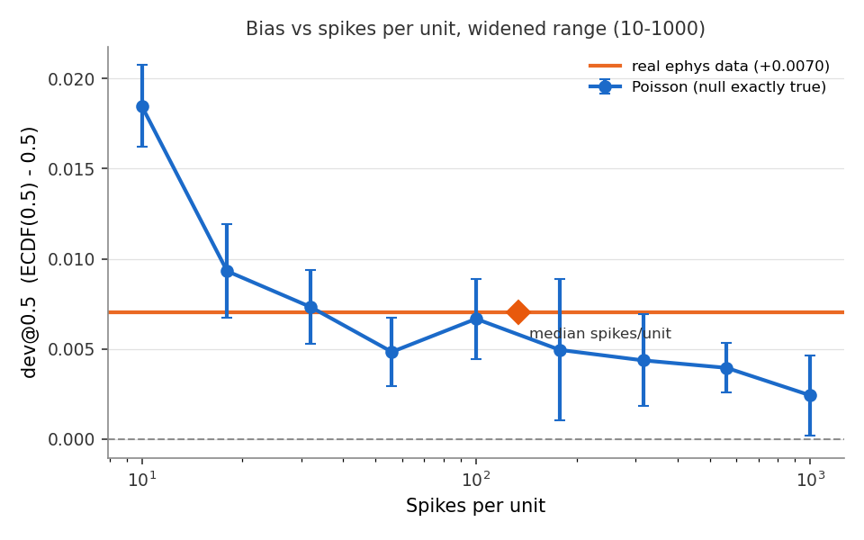

<sub>**Figure 4. Widened spike-count sweep.** As Figure 2, over 10–1000 spikes/unit (geometric spacing), with the same total simulation budget.</sub>

| spikes/unit | dev@0.5 | SEM | P(p<0.01) |
|---|---|---|---|
| 10 | **+0.0185** | 0.0023 | **0.0074** |
| 18 | +0.0093 | 0.0026 | 0.0086 |
| 32 | +0.0073 | 0.0021 | 0.0091 |
| 56 | +0.0048 | 0.0019 | 0.0099 |
| 100 | +0.0067 | 0.0022 | 0.0095 |
| 178 | +0.0049 | 0.0039 | 0.0102 |
| 316 | +0.0044 | 0.0025 | 0.0101 |
| 562 | +0.0040 | 0.0014 | 0.0100 |
| 1000 | +0.0024 | 0.0022 | 0.0099 |

> slope = **−0.0058 per decade**, 95% CI [−0.0083, −0.0033], r² = 0.160, **p = 1.7e-05**

The 100- and 1000-spike points match the original sweep bit-for-bit (same seeds), as they
should. Going lower makes the decay clearer: dev@0.5 roughly doubles from 18 to 10 spikes.
At 10 spikes the tail also starts to go wrong, *conservatively*: P(p<0.01) = 0.0074, so
the test under-calls there. Neither matters for this dataset, because **no real ephys unit
has fewer than 51 spikes** (see below). The 10–50 half of this sweep describes a regime
that inclusion filtering has already removed.

### Which regime do the real units sit in?

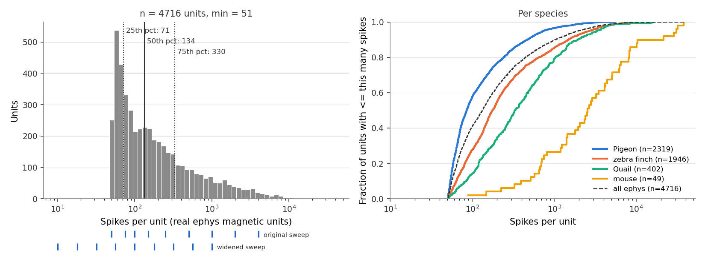

<sub>**Figure 5. Empirical spikes per unit in the real ephys magnetic units.** *Left:* histogram over 4716 units (log x; minimum 51 spikes). The 25th/50th/75th percentiles are marked. Ticks below the axis mark the spike counts simulated in the original and widened sweeps (Figures 2 and 4). *Right:* ECDF per species (n in the legend); dashed = all ephys.</sub>

Real magnetic ephys units (the same 4716-unit population as `results_real.csv`; per-unit
counts in `results_real_spk_counts.csv`):

| spikes/unit | share of units |
|---|---|
| < 50 | 0% (hard floor at 51) |
| 50–100 | **40.7%** |
| 100–1000 | **48.9%** |
| 1000–4000 | 8.5% |
| ≥ 4000 | 1.8% |

Quartiles: 71 / 134 / 330. The distribution is piled against the ~50-spike floor with a
long right tail, so **the low-firing end dominates**. About 90% of units sit below 1000
spikes, where the sweep still shows a clearly positive bias, and only ~10% are in the
≳ 1000 range where it has decayed to noise. By species, pigeon is the lowest-firing (median
86), then zebra finch (176), quail (332), and mouse far above the rest (median 2546, but
only 49 units).

Since the ECDF of a pooled population is the unit-weighted average of its parts' ECDFs,
the right prediction weights dev@0.5(N) by the real N distribution rather than evaluating
it at the median. Doing that (both sweeps pooled, counts outside the sweep range clamped
to its end points) gives **+0.0059**, against +0.0070 observed. That is within about half
an SEM of the median-based +0.0070, so the conclusion below stands, but the four-decimal
agreement there is partly a matter of which summary is used.

#### Pigeon, by brain area

Pigeon is the lowest-firing species and contributes about half the ephys units (2319 of
4716), so it is split out here by brain area:

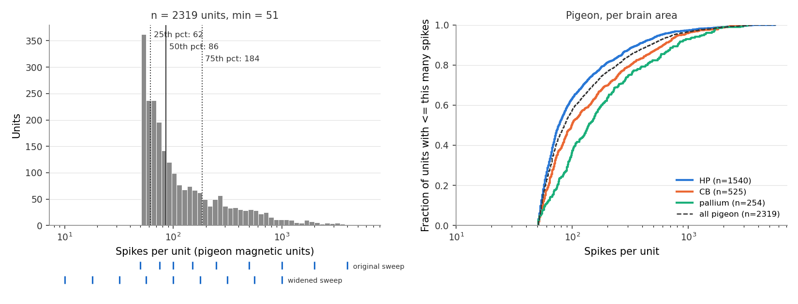

<sub>**Figure 6. Pigeon spikes per unit, by brain area.** As Figure 5, pigeon only (2319 units). *Right:* ECDF per area (HP, CB, pallium); dashed = all pigeon.</sub>

| area | units | quartiles | 50–100 | 100–1000 | ≥ 1000 | mixture-predicted dev@0.5 |
|---|---|---|---|---|---|---|
| all pigeon | 2319 | 62 / 86 / 184 | 57.3% | 39.2% | 3.5% | +0.0065 |
| HP | 1540 | 60 / 77 / 150 | **63.1%** | 34.2% | 2.7% | +0.0066 |
| CB | 525 | 66 / 99 / 247 | 50.3% | 45.5% | 4.2% | +0.0064 |
| pallium | 254 | 83 / 138 / 308 | 36.2% | 56.7% | 7.1% | +0.0061 |

- **HP drives pigeon's low spike counts.** It is two-thirds of pigeon units, and nearly
  two-thirds of its units sit in the 50–100 bin. Pallium looks like the dataset as a whole
  (median 138 vs 134). CB is in between.
- **Area and bird are confounded.** HP units come from W1R and W25R. CB and pallium both
  come from Pk12L. This split can't tell a brain-area effect from a bird or session effect.
- **The areas' spike-count differences barely change the predicted bias.** Mixture
  predictions span only +0.0061 to +0.0066, a spread of 0.0005, well under the sweep's
  SEM of about 0.002. The simulated bias is nearly flat across 50–1000 spikes and only
  drops clearly beyond that. So pigeon (and HP in particular) pulls the dataset's
  *spike-count* distribution down, but it pushes the predicted finite-sample bias *up*
  only slightly (+0.0065 for pigeon vs +0.0059 for all ephys). That is the direction you'd
  expect, since fewer spikes means more bias, and the size is negligible.

## How much of the real deviation does this explain?

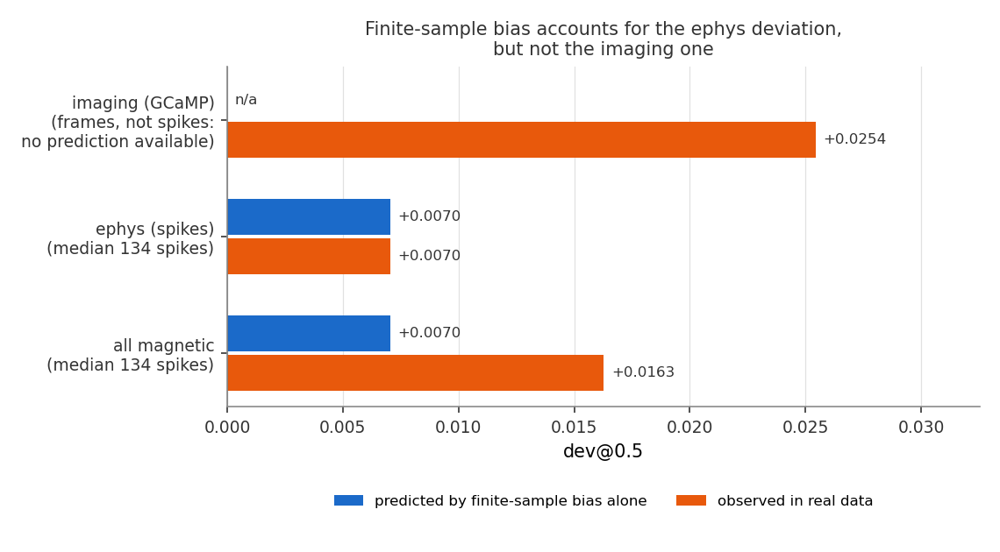

<sub>**Figure 7. Observed vs predicted dev@0.5.** Orange: observed in the real magnetic population (all, ephys only, imaging only). Blue: predicted by finite-sample bias alone, interpolating the Poisson sweep (Figure 2) at the median spike count of 134. Imaging has frames, not spikes, so it has no prediction.</sub>

| population | n units | median spikes | observed dev@0.5 | predicted by finite-sample bias |
|---|---|---|---|---|
| all magnetic | 9553 | 134 | +0.0163 | +0.0070 |
| **ephys (spikes)** | 4716 | 134 | **+0.0070** | **+0.0070** |
| imaging (GCaMP) | 4837 | — | +0.0254 | not available |

**For ephys, finite-sample bias accounts for the deviation exactly** — +0.0070 observed
against +0.0070 predicted by interpolating the Poisson sweep at 134 spikes. The agreement
to four decimals is fortuitous given SEM ≈ 0.002 on the prediction, but the match is not
in doubt. (Weighting by the full spike-count distribution instead of the median gives
+0.0059, still a match within noise. This holds at p = 0.5 only: the curve overlay in Figure 3
shows the real curve's excess at p ≈ 0.6–0.9 is *not* reproduced.)

**For imaging it does not.** GCaMP units have frames, not spikes, so the spike-count sweep
cannot furnish a prediction for them at all; their +0.0254 is 3.6× the ephys value and
drags the pooled figure to +0.0163. The pooled number is therefore imaging-dominated and
should not be read as a property of the dataset as a whole.

The imaging deviation has a different cause, worked out in the next section.

## Why imaging is different

Run `imaging_surrogates.py`. It replaces the real GCaMP traces with surrogates that each
preserve one specific property, so whichever surrogate reproduces the deviation identifies
what is responsible. The recordings are **exactly** the 24 zebrafish recordings that make
up the imaging half of the Fig2 C population (derived from `get_poscontrols_negresults`,
not hand-picked).

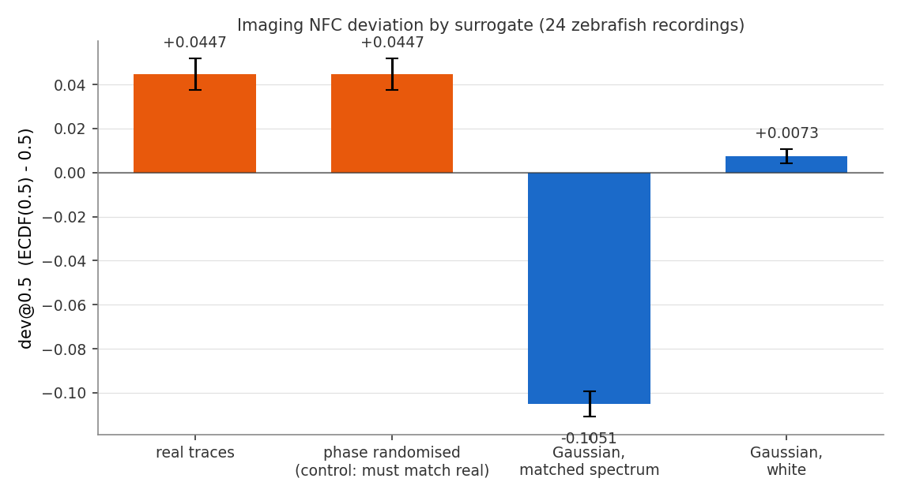

<sub>**Figure 8. Imaging surrogate ladder (superseded; see Figure 9).** dev@0.5 for the 24 zebrafish imaging recordings in the Fig 2C pool: real traces and three surrogates. Bars are the mean across recordings ± SEM. The "Gaussian, matched spectrum" bar is an artifact of that surrogate (Figure 9).</sub>

| surrogate | what it preserves | dev@0.5 |
|---|---|---|
| real traces | everything | **+0.0447** |
| phase randomised | FFT magnitudes exactly | +0.0447 |
| Gaussian, matched spectrum | expected power spectrum only | **−0.1051** |
| Gaussian, white | nothing (pure finite-N floor) | +0.0073 |

**The phase-randomised column is a control that must do nothing, and doesn't.** It matches
`real` to **3.7e-07**. `compute_NFC` is built purely from coefficient *magnitudes*, so a
surrogate that preserves them exactly cannot change NFC — which is also why the naive
"phase randomization test" is not the right experiment here, despite being the obvious one
to reach for.

> **Correction (2026-10-01): the decomposition below is wrong.** The `gaussian_psd`
> surrogate multiplies each ROI's *realised* periodogram by a fresh exponential draw, so
> every ordinate becomes a product of two exponentials. Applied to pure white noise it gives
> dev@0.5 = **−0.127** (Figure 9), so the −0.112 "spectral shape"
> term and the +0.150 "non-Gaussianity" term are artifacts of the surrogate. A
> smooth-spectrum Gaussian surrogate, which does not have this problem, puts the spectral-shape term at about
> zero. What actually drives the imaging deviation is in
> [Slow variation and floor-clipped traces](#slow-variation-and-floor-clipped-traces-imaging).
> The text below is kept as the original record.

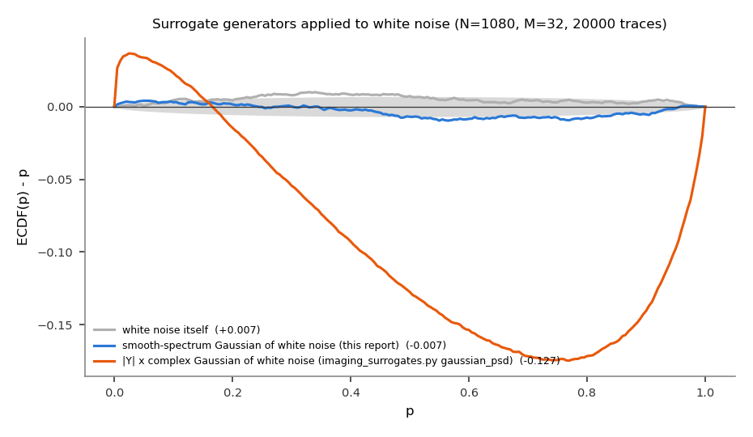

<sub>**Figure 9. Surrogate generators applied to white noise.** ECDF(p) − p for 20,000 white-noise traces (N = 1080 frames, M = 32), shown as is (gray), after the smooth-spectrum Gaussian surrogate used in this report (blue), and after the old `gaussian_psd` surrogate of Figure 8 (orange). A valid surrogate should leave white noise at the white-noise floor, and the old one does not. Legend values are dev@0.5. Gray band: 95% binomial band.</sub>

Reading the ladder as a decomposition:

| term | contribution |
|---|---|
| finite-N floor (white → baseline) | **+0.007** |
| spectral shape (white → matched spectrum) | **−0.112** |
| non-Gaussianity (matched spectrum → real) | **+0.150** |
| net | +0.045 |

So imaging is **two large opposing effects that nearly cancel**, not one small residual:

- The GCaMP power spectrum decays steeply across the off-frequency window, so σ̂ is badly
  over-estimated and a *Gaussian* process with that spectrum would sit at **−0.105**. This
  is the same convex-noise-floor mechanism
  [`fig1_mag_noise_floor_correction.md`](fig1_mag_noise_floor_correction.md) found in
  ephys, roughly 20× larger.
- Real traces are not Gaussian — they are sparse, large transients — and that pushes
  **+0.150** the other way, overwhelming the spectral term and landing at +0.045.

Non-Gaussianity dominates, which was the hypothesis; but it is much larger than the net
deviation suggests, because the spectral term hides most of it. The per-frequency sets of recordings
agree: 0.1 Hz +0.0456, 0.3 Hz +0.0646, 0.4 Hz +0.0228 (real), against −0.1061 / −0.0856 /
−0.1227 for the matched-spectrum surrogate.

### Cross-check against the production path

The harness is independent of the parquet, so the two must be reconciled before any of
this is trusted:

| | dev@0.5 |
|---|---|
| surrogate harness, cell-count-weighted over 24 recs | **+0.0350** |
| parquet imaging population, pooled, no dedup | **+0.0357** |
| parquet imaging population, pooled + deduped | +0.0254 |

They agree to 0.0007 on the like-for-like comparison. The +0.0254 quoted in the table
above is the *deduped* figure — dropping repeat observations of the same neuron lowers it —
and the harness additionally excludes medaka's 3 recordings (578 of 11,329 imaging rows),
whose `rec` names are tif basenames rather than experiment names.

## Slow variation and floor-clipped traces (imaging)

**Date:** 2026-10-01. **Scripts:** `slow_variation.py` (real traces) and `slow_variation_sim.py`
(simulation).

**The problem.** For the magnetic stimulus we expect no response, so the p-values should be
uniform. In the imaging recordings they are not: there are too many in the middle of the
range (dev@0.5 > 0, the table below). Either something responds, or the null distribution
the p-values are computed against is wrong for these traces. This section works out which,
and why.

**The hypothesis.** The advisor's hypothesis was that slow fluctuations, in firing rate or in
noise level, make the traces nonstationary. NFC divides the on-frequency coefficient by σ̂, estimated from 2M
neighbouring bins, and the null assumes those 2M+1 periodogram ordinates are independent.
A slow change in a trace's amplitude scales a whole band of ordinates by a common factor.
Neighbouring ordinates then move together, and σ̂ has fewer effective degrees of freedom than
the null assumes. The tests below follow the order the advisor suggested: look at the data,
take the slow variation out, put it into noise that doesn't have it, then simulate it.

**Population.** These are the imaging recordings of the Fig 2C magnetic pool, at production
thresholds, run through the production `fit_Fourier` / `corrected_pvalues`. The recomputed
p-values match the parquet to 1e-6 on all 10,565 rows. There are two deliberate differences
from Fig 2C:
- `20221002_fish1` magneto_2/_3 are dropped, because they are byte-identical copies of
  magneto_1.
- There is no neuron dedup, because the question is about traces.

**Four sets of recordings.** The recordings fall into four sets, each made with the same
animal line and stimulus protocol in one block of experiment days. The report refers to each
set by name ("the 0.1 Hz zebrafish recordings"); "the four sets of recordings" means all of
them:

| set of recordings | experiment days | animals | recordings analysed | stimulus |
|---|---|---|---|---|
| zebrafish 0.4 Hz (2022 Q1) | 2022-02-21, 02-23, 03-01 | 3 sessions | 6 (`magnet`, `visualmagnet`, `visualmagnet_a/_b`) | 0.4 Hz continuous sine (in `visualmagnet`, with a 1/60 Hz visual grating) |
| zebrafish 0.3 Hz | 2022-09-14, 09-15 | 2 fish | 6 (3 trials per fish) | 0.3 Hz sine, with a 1/60 Hz visual grating running throughout |
| zebrafish 0.1 Hz | 2022-10-01, 10-02 | 4 fish | 10 (3 trials per fish, one fish's duplicates dropped) | 2 Hz sine gated 5 s on / 5 s off (0.1 Hz), no visual stimulus |
| medaka 0.1 Hz | 2023-01-06 | 1 fish | 3 trials | 0.1 Hz magnetic |

A *recording* is one trial's movie (one tiff), analysed on its own. Recordings are never
concatenated for the p-values. In the 0.3 Hz and 0.1 Hz zebrafish recordings a fish's trials share one suite2p
segmentation; each medaka trial has its own. All four sets of recordings are pooled in Fig 2C.

**"Miscalibrated"** means a set of recordings' p-values are not uniform where no response is expected:
the null distribution the p-values are computed against does not match those traces. It has
nothing to do with the P(iscell) or npix inclusion thresholds; the threshold grid
(`docs/zebrafish_pvalue_excess/`) showed that changing them does not fix it. The deviation
for each set of recordings:


| set of recordings | ROI traces | binomial SE of dev@0.5 | dev@0.5 at the stimulus f |
|---|---|---|---|
| zebrafish 0.4 Hz (2022 Q1) | 5602 | 0.007 | +0.022 |
| zebrafish 0.3 Hz | 857 | 0.017 | **+0.058** |
| zebrafish 0.1 Hz | 3528 | 0.008 | **+0.043** |
| medaka 0.1 Hz | 578 | 0.021 | **+0.088** |

### 1. Raw traces: the recordings with the excess are floor-clipped

**The question.** Before testing any mechanism, look at what the traces actually are. If slow
variation is the culprit, it should be visible by eye. And if some sets of recordings show the excess
and others do not, the traces should look different between them.

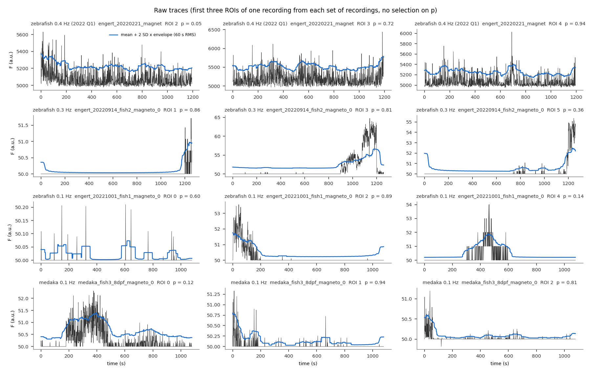

<sub>**Figure 10. Raw traces.** The first three ROIs (no selection on p) of one recording from each set of recordings (rows). Black: F. Blue: mean + 2 SD × the 60 s RMS envelope that "envelope-normalised" divides out. Panel titles give each ROI's p-value at the stimulus frequency.</sub>

Figure 10 shows the first three ROIs of one recording from each set of recordings, with no selection on p. The 2022
Q1 traces look like ordinary fluorescence: baseline about 5000, continuous noise, transients
on top. The other three sets of recordings do not. The median ROI trace sits at **exactly 50.0** for
91–98% of its frames, and has only 10–30 distinct values in the whole recording. What is
left is a few transients, often confined to one stretch of the recording: ROI 4 of
`20221001_fish1` is active only from 300 to 600 s, and the 0.3 Hz ROIs only in the last few
hundred seconds. These look like photon-starved movies, with the baseline clipped at an
offset of 50. That matches the medaka worktree's finding that those movies are
photon-starved.

| set of recordings | median fraction of frames at the trace minimum | ROIs with > 50% of frames at the minimum | median envelope CV (60 s) | median excess kurtosis |
|---|---|---|---|---|
| zebrafish 0.4 Hz | 0.001 | 0% | 0.37 | 1.7 |
| zebrafish 0.3 Hz | 0.98 | 99% | 2.36 | 81 |
| zebrafish 0.1 Hz | 0.94 | 89% | 1.67 | 53 |
| medaka 0.1 Hz | 0.91 | 91% | 1.50 | 61 |

Per recording, with links to each recording's 5-page analysis diagnostics PDF (page 5 is the
P(iscell) × npix joint histogram).

| set of recordings | recording (diagnostics PDF) | ROI traces | median fraction of frames at the trace minimum | dev@0.5 |
|---|---|---|---|---|
| zebrafish 0.3 Hz | [`engert_20220914_fish2_magneto_0`](../figs/analysis/engert_20220914_fish2_magneto_0_analysis_diagnostics.pdf) | 150 | 0.98 | +0.040 |
| zebrafish 0.3 Hz | [`engert_20220914_fish2_magneto_1`](../figs/analysis/engert_20220914_fish2_magneto_1_analysis_diagnostics.pdf) | 223 | 0.97 | +0.128 |
| zebrafish 0.3 Hz | [`engert_20220914_fish2_magneto_2`](../figs/analysis/engert_20220914_fish2_magneto_2_analysis_diagnostics.pdf) | 240 | 0.98 | +0.008 |
| zebrafish 0.3 Hz | [`engert_20220915_fish1_magneto_0`](../figs/analysis/engert_20220915_fish1_magneto_0_analysis_diagnostics.pdf) | 57 | 0.99 | +0.061 |
| zebrafish 0.3 Hz | [`engert_20220915_fish1_magneto_1`](../figs/analysis/engert_20220915_fish1_magneto_1_analysis_diagnostics.pdf) | 92 | 0.99 | +0.043 |
| zebrafish 0.3 Hz | [`engert_20220915_fish1_magneto_2`](../figs/analysis/engert_20220915_fish1_magneto_2_analysis_diagnostics.pdf) | 95 | 0.98 | +0.058 |
| zebrafish 0.1 Hz | [`engert_20221001_fish1_magneto_0`](../figs/analysis/engert_20221001_fish1_magneto_0_analysis_diagnostics.pdf) | 378 | 0.98 | +0.016 |
| zebrafish 0.1 Hz | [`engert_20221001_fish1_magneto_1`](../figs/analysis/engert_20221001_fish1_magneto_1_analysis_diagnostics.pdf) | 424 | 0.95 | +0.080 |
| zebrafish 0.1 Hz | [`engert_20221001_fish1_magneto_2`](../figs/analysis/engert_20221001_fish1_magneto_2_analysis_diagnostics.pdf) | 418 | 0.96 | -0.002 |
| zebrafish 0.1 Hz | [`engert_20221001_fish2_magneto_0`](../figs/analysis/engert_20221001_fish2_magneto_0_analysis_diagnostics.pdf) | 250 | 0.97 | +0.060 |
| zebrafish 0.1 Hz | [`engert_20221001_fish2_magneto_1`](../figs/analysis/engert_20221001_fish2_magneto_1_analysis_diagnostics.pdf) | 275 | 0.95 | +0.027 |
| zebrafish 0.1 Hz | [`engert_20221001_fish2_magneto_2`](../figs/analysis/engert_20221001_fish2_magneto_2_analysis_diagnostics.pdf) | 259 | 0.95 | +0.068 |
| zebrafish 0.1 Hz | [`engert_20221002_fish1_magneto_1`](../figs/analysis/engert_20221002_fish1_magneto_1_analysis_diagnostics.pdf) | 382 | 0.28 | +0.031 |
| zebrafish 0.1 Hz | [`engert_20221002_fish2_magneto_0`](../figs/analysis/engert_20221002_fish2_magneto_0_analysis_diagnostics.pdf) | 345 | 0.97 | +0.048 |
| zebrafish 0.1 Hz | [`engert_20221002_fish2_magneto_1`](../figs/analysis/engert_20221002_fish2_magneto_1_analysis_diagnostics.pdf) | 404 | 0.89 | +0.052 |
| zebrafish 0.1 Hz | [`engert_20221002_fish2_magneto_2`](../figs/analysis/engert_20221002_fish2_magneto_2_analysis_diagnostics.pdf) | 393 | 0.91 | +0.062 |
| medaka 0.1 Hz | [`medaka_fish3_8dpf_magneto_0`](../figs/analysis/medaka_fish3_8dpf_magneto_0_analysis_diagnostics.pdf) | 166 | 0.91 | +0.090 |
| medaka 0.1 Hz | [`medaka_fish3_8dpf_magneto_1`](../figs/analysis/medaka_fish3_8dpf_magneto_1_analysis_diagnostics.pdf) | 199 | 0.91 | +0.088 |
| medaka 0.1 Hz | [`medaka_fish3_8dpf_magneto_2`](../figs/analysis/medaka_fish3_8dpf_magneto_2_analysis_diagnostics.pdf) | 213 | 0.90 | +0.087 |

`engert_20221002_fish1_magneto_1` is the one less-clipped recording (median 0.28) and has one
of the smaller deviations. For contrast, a 2022 Q1 recording is
[`engert_20220221_magnet`](../figs/analysis/engert_20220221_magnet_analysis_diagnostics.pdf).
The PDFs live in `figs/analysis/`, which is gitignored, so these links work in a local
checkout after `pipeline/analysis.py` has been run, but not on GitHub.

So the split already found between sets of recordings in the threshold grid (Q1's sham-frequency p-values uniform, 0.1/0.3 Hz not)
is the same as the split between ordinary traces and floor-clipped ones.

### 2. Is the excess tied to the stimulus frequency? No

**The question.** Is the excess something the stimulus does, or something the traces do? A
response, or a stimulus artifact, would push p-values down only at the stimulus frequency. A
problem with the null itself would show up at *any* frequency we choose to analyse, including
ones where nothing was presented. So the test is to repeat the whole p-value calculation at
many analysis frequencies and see whether the stimulus frequency stands out.

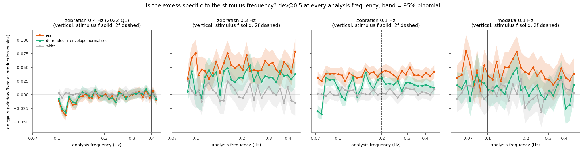

<sub>**Figure 11. dev@0.5 across analysis frequencies.** Columns: the four sets of recordings. Each point pools every ROI trace in that set at one analysis frequency (log-spaced bins), with the window fixed at each recording's production M bins. Orange: real traces. Green: detrended and envelope-normalised. Gray: white noise of the same shape. Shading: 95% binomial band. Vertical lines: stimulus f (solid) and 2f (dashed).</sub>

Figure 11 recomputes dev@0.5 at about 50 analysis frequencies from 0.07 Hz to Nyquist.
The window width is held at each recording's production M bins, so only the spectral
neighbourhood changes. In the three floor-clipped sets of recordings the real-trace curve (orange) sits
at **+0.04 to +0.05 at every frequency**. Averaged over the whole scan it is +0.051 (0.3 Hz),
+0.037 (0.1 Hz) and +0.040 (medaka); white noise gives +0.004. Nothing at 0.1, 0.3 or 0.2 Hz
stands out. The excess is a property of the traces at every frequency, not something the
stimulus does.

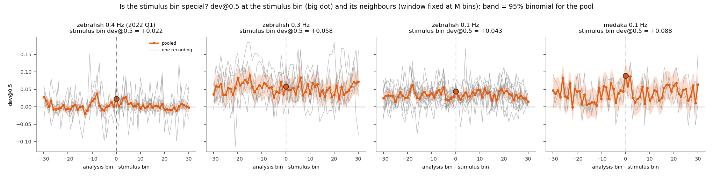

<sub>**Figure 12. The stimulus bin vs its neighbours.** dev@0.5 at the stimulus bin (offset 0, large dot) and at every bin within ±30 bins of it, with the window fixed at M bins. Gray: individual recordings. Orange: all recordings in the set pooled, with its 95% binomial band.</sub>

Figure 12 does the same check bin by bin, within ±30 bins of the stimulus:
- **Zebrafish 0.1 Hz and 0.3 Hz:** the stimulus bin is an ordinary member of a flat band.
- **Medaka:** the stimulus bin is one of the two highest of the 61 points, +0.088
  against roughly +0.04 for the rest of the band. That is about 2 SE above the band, which
  the maximum of 61 noisy points can easily reach, so it is not evidence of a response.
- **2022 Q1 (0.4 Hz):** these recordings are different. It sits at about 0 everywhere *except* in a
  bump from about −10 to +3 bins around the stimulus. Its +0.022 at the stimulus bin comes
  from `20220301_visualmagnet_a/_b` (+0.027 and +0.066) and is local to the stimulus. That
  is a stimulus-locked component (a response, a coil artifact, or a harmonic of the 1/60 Hz
  visual grating: 0.4 Hz is its 24th harmonic), not a null-model problem. It is flagged
  here and not pursued.

### 3. Neighbouring ordinates move together, and the slow envelope is why

**The question.** Does the null's key assumption hold? NFC compares the power at the stimulus
frequency with the average power in 2M neighbouring frequency bins (σ̂). The null distribution
assumes those 2M+1 values ("ordinates" of the periodogram) are statistically independent, so
that σ̂ averages 2M independent numbers. If a trace's overall activity level drifts slowly up
and down, every bin in the window rises and falls together. Neighbouring ordinates are then
correlated, σ̂ is an average of fewer effectively independent numbers than the null assumes,
and the NFC distribution is no longer the one we compare it against. The test is to measure
that correlation directly.

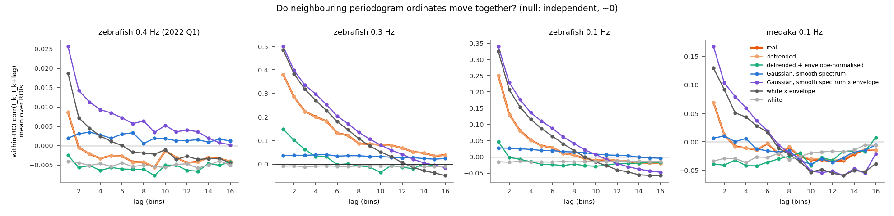

<sub>**Figure 13. Coupling between neighbouring periodogram ordinates.** Within-ROI Pearson correlation of window ordinates I_k and I_k+lag, averaged over ROIs (each recording weighted by its ROI count), for real traces and each surrogate. Under the null the ordinates are independent and the curve is ≈ 0 at every lag, as it is for white noise (light gray).</sub>

Figure 13 takes each ROI's 2M+1 periodogram ordinates in the analysis window and correlates
ordinate k with ordinate k+lag. Independent ordinates, which the null assumes, give about 0
at every lag; the white-noise line shows that baseline.

| lag-1 ordinate correlation | 0.4 Hz | 0.3 Hz | 0.1 Hz | medaka |
|---|---|---|---|---|
| real | 0.009 | **0.380** | **0.250** | **0.069** |
| detrended (cubic) | 0.009 | 0.380 | 0.250 | 0.069 |
| detrended + envelope-normalised | −0.003 | 0.148 | 0.047 | −0.039 |
| white noise × the ROI's own envelope | 0.019 | 0.485 | 0.325 | 0.129 |
| white | −0.004 | −0.009 | −0.015 | −0.034 |

- **Q1 shows no coupling.** In the floor-clipped recordings neighbouring ordinates are strongly
  correlated, and the correlation decays over about 8–10 bins.
- **The cause is multiplicative, not additive.** Detrending, which removes bleaching, drift
  and the end-point jump (the only route by which purely additive slow variation reaches the
  window), changes nothing.
- **The 60 s envelope accounts for the coupling.** Dividing each trace by its own 60 s RMS
  envelope removes most of it. Multiplying white noise by that same envelope recreates it,
  slightly overshooting.

### 4. Taking slow variation out, and putting it in

**The idea.** Section 3 shows that slow variation and the broken independence go together, but
not that slow variation *causes* the p-value excess. Surrogates test causation from both
directions:

- **Take it out.** Remove the slow variation from the real traces and recompute the
  p-values. If slow variation causes the excess, the excess should shrink or vanish.
- **Put it in.** Take noise that is well-behaved by construction (stationary, so its
  ordinates are independent and its p-values are uniform) and add the real traces' slow
  variation to it. If slow variation causes the excess, the excess should appear.

"Slow variation" comes in two kinds, removed in two steps (the envelope is drawn on the traces in
Figure 10):

| kind | example | how it is removed | how it is added back |
|---|---|---|---|
| **additive** | baseline drift, bleaching | **detrend:** subtract a per-trace cubic fit | — (detrending turned out to change nothing, so there was nothing to add back) |
| **multiplicative** | the trace's amplitude or activity level changing over minutes | **envelope-normalise:** divide the trace by its own 60 s running RMS, the "envelope" (blue in Figure 10) | multiply stationary noise by that ROI's envelope |

The stationary noise comes in two flavours: plain white noise, and Gaussian noise with the
ROI's own (smoothed) power spectrum. The second checks that any effect isn't simply due to
the spectrum's shape.

**How to read Figure 14.** Each line is ECDF(p) − p for one version of the traces. A
perfectly calibrated null gives a flat line at 0, inside the gray band. The real traces
(thick orange) bulge upward in the middle. If "take it out" works, the green line drops
toward 0. If "put it in" works, the noise-times-envelope lines rise away from 0.

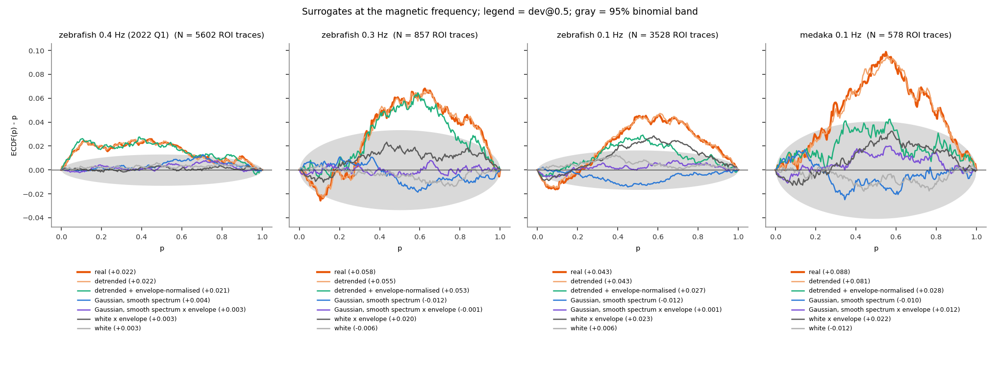

<sub>**Figure 14. Surrogates at the stimulus frequency.** ECDF(p) − p for each set of recordings, for the real traces, the same traces with slow variation removed (detrended; detrended + envelope-normalised), and stationary noise with and without each ROI's own envelope imposed. Stochastic surrogates are averaged over 3 draws. Legend: dev@0.5. Gray: 95% binomial band.</sub>

| dev@0.5 at the stimulus f | 0.4 Hz | 0.3 Hz | 0.1 Hz | medaka |
|---|---|---|---|---|
| real | +0.023 | +0.058 | +0.043 | +0.088 |
| detrended | +0.022 | +0.055 | +0.043 | +0.081 |
| detrended + envelope-normalised | +0.021 | +0.053 | **+0.027** | **+0.028** |
| Gaussian, smooth spectrum | +0.004 | −0.012 | −0.012 | −0.010 |
| Gaussian, smooth spectrum × envelope | +0.003 | −0.001 | +0.001 | +0.012 |
| white × envelope | +0.003 | +0.020 | +0.023 | +0.022 |
| white | +0.003 | −0.006 | +0.006 | −0.012 |

- **Spectral shape is not the cause.** A stationary Gaussian with each ROI's smoothed
  spectrum sits at about −0.01. On white noise the same generator gives −0.007, so the
  spectral-shape effect is essentially zero, not the −0.11 the earlier surrogate claimed.
  The raw window periodograms agree: across all four sets of recordings the median normalised
  ordinate is flat from −M to +M (Figure 15).

  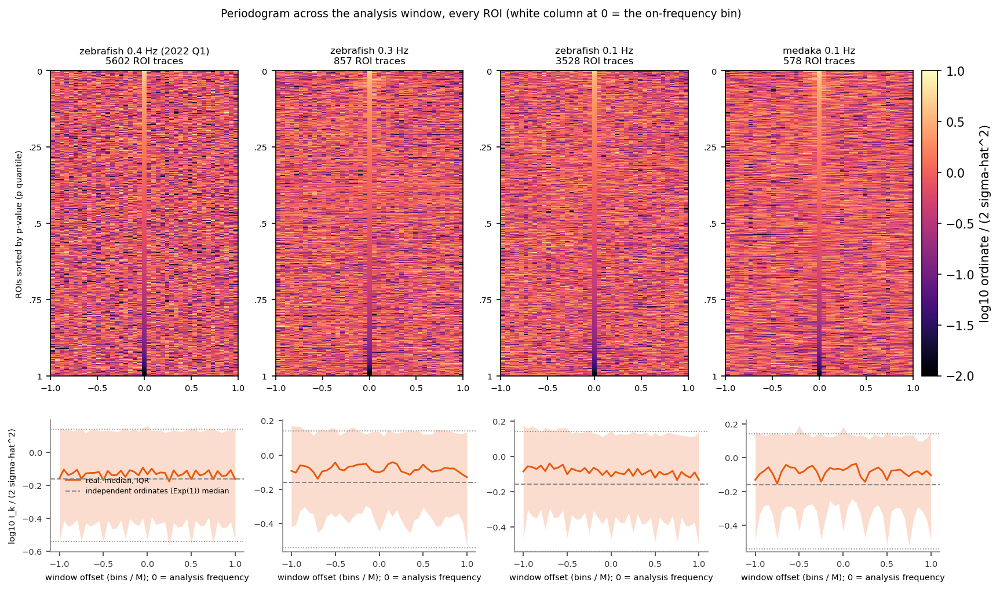

  <sub>**Figure 15. Every ROI's periodogram across the analysis window.** *Top:* each row is one ROI trace's window periodogram (ordinate / 2σ̂², log colour scale). x is the bin offset divided by M (0 = the analysis frequency), and rows are sorted by p (smallest at the top). *Bottom:* median (line) and IQR (shading) across ROIs. Dashed and dotted lines: median and IQR of independent Exp(1) ordinates.</sub>

- **Taking the envelope out removes part of the excess:**
  - two thirds in medaka (+0.088 → +0.028);
  - a third at 0.1 Hz (+0.043 → +0.027);
  - almost nothing at 0.3 Hz (+0.058 → +0.053), where the envelope-normalised traces
    still have a lag-1 coupling of 0.15.

  In the frequency scan, envelope normalisation (green) roughly halves the excess at every
  frequency.
- **Putting the envelope into noise adds about +0.02.** Imposing each ROI's envelope on white
  noise gives +0.020 to +0.023 in the floor-clipped recordings and nothing in the 2022 Q1 recordings. That is
  roughly half the real excess, from the envelope alone.

The envelope is therefore a real contributor, but it is not all of it. A 60 s RMS envelope
cannot follow activity that switches on and off within a few seconds against a clipped
baseline, and whatever it misses survives the division.

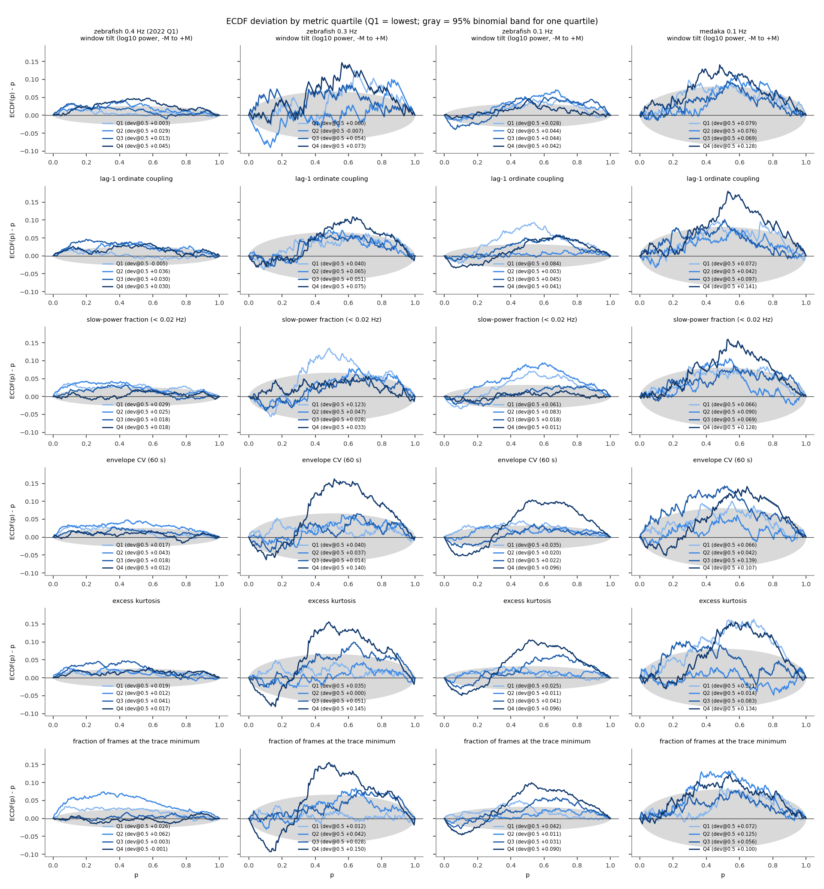

<sub>**Figure 16. ECDF deviation by quartile of each per-ROI metric.** Rows: window tilt; lag-1 ordinate coupling; slow-power fraction (< 0.02 Hz); envelope CV (60 s); excess kurtosis; fraction of frames at the trace minimum. Columns: the four sets of recordings. Within each set, ROI traces are ranked by that row's metric and split into four equal-sized groups; each line is the ECDF deviation of one group's p-values. Q1 (lightest) is the lowest quartile. Legend: dev@0.5 per quartile. Gray: 95% binomial band for one quartile. The metrics are defined in the table below.</sub>


Per-ROI metrics in Figures 16–17, all computed on the same N frames that `fit_Fourier` analyses:

| metric | definition | what it is meant to catch |
|---|---|---|
| window tilt | slope of a straight-line fit of log10 periodogram power against bin offset across the 2M off-frequency bins, with offset scaled so −M → −1 and +M → +1. Units are log10 power per half-window, positive if power rises toward higher frequency | a sloped noise floor across the window (a pure linear tilt leaves σ̂ unbiased on average; curvature would not) |
| lag-1 ordinate coupling | Pearson correlation, across the window, of each ordinate with its neighbour (I_k vs I_k+1) | the dependence between neighbouring ordinates shown in Figure 13, per ROI |
| slow-power fraction | power below 0.02 Hz divided by total power (DC excluded) | how much of the trace is slow variation |
| envelope CV (60 s) | coefficient of variation over time of the squared 60 s RMS envelope of the trace, high-passed at 0.02 Hz | slow modulation of the trace's amplitude |
| excess kurtosis | kurtosis − 3 of the high-passed trace | sparse, transient-dominated traces |
| fraction of frames at the trace minimum | share of frames equal to the trace's own minimum | floor clipping (Figure 10) |

Per ROI (Figure 16), the excess concentrates in the most nonstationary and most clipped traces. Within
the 0.3 Hz zebrafish recordings the top quartile of envelope CV, kurtosis or floor fraction sits at
+0.14 to +0.15, while the other quartiles sit at 0 to +0.05. The 0.1 Hz zebrafish recordings are similar
(+0.09 to +0.10 in the top quartile).

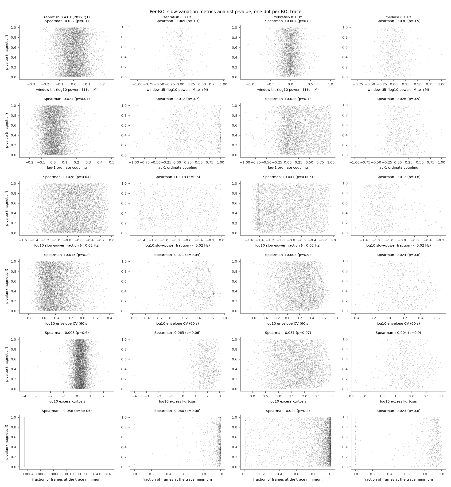

<sub>**Figure 17. Per-ROI metrics against p-value.** Same metrics and layout as Figure 16, one dot per ROI trace. Panel titles give Spearman ρ.</sub>

In the one-dot-per-ROI scatters (Figure 17), no metric correlates monotonically with p, which is what a
pile-up in the *middle* of the p range predicts. The ECDF curves show that shape directly:
a dip below zero near p ≈ 0.1 and a peak near p ≈ 0.6. NFC is under-dispersed, with too few
small p-values *and* too few near 1, not inflated.

### 5. Simulation: which kind of slow variation does this?

**The question.** Sections 3–4 point at slow amplitude variation, but in the real data that is
mixed up with everything else about these traces, in particular the floor clipping found in
section 1. Simulation separates them. Synthetic GCaMP traces are generated with no
stimulus-locked component at all, so the null is true by construction. One ingredient is
switched on at a time: the advisor's slowly varying firing rate, slowly varying noise level,
additive drift, floor clipping, and clipping combined with slow rate changes. Whichever
ingredient reproduces the real excess, its shape and its bin coupling is the mechanism.

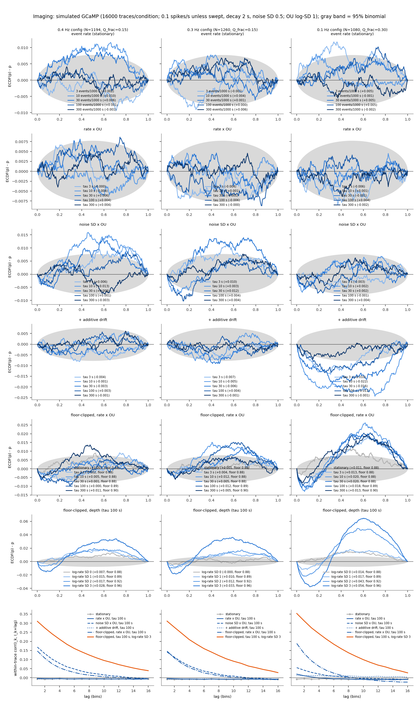

<sub>**Figure 18. Simulated imaging traces under each kind of slow variation.** Columns: the f, frame count and Q_frac of the three zebrafish sets of recordings. Rows 1–6 show ECDF(p) − p for: a stationary event-rate sweep; rate × OU; noise SD × OU; additive OU drift; floor-clipped with rate × OU; and floor-clipped with the log-rate SD swept at τ = 100 s. Legends give the swept parameter, dev@0.5 and, for clipped traces, the fraction of frames at the floor. 16,000 traces per condition. Gray: 95% binomial band. Bottom row: neighbouring-ordinate coupling, as in Figure 13.</sub>

**Setup (Figure 18).** The simulated traces are synthetic GCaMP:
- Poisson events at 0.1/s, 2 s decay, Gaussian noise;
- 16,000 traces per condition, so the binomial SE is 0.004;
- the f, frame count and Q_frac of each zebrafish set of recordings.

Every condition is a valid null, because nothing is locked to the analysis frequency.

| condition | 0.4 Hz config | 0.3 Hz config | 0.1 Hz config | lag-1 coupling |
|---|---|---|---|---|
| stationary, 3–300 events/trace | −0.001 to +0.010 | −0.001 to +0.006 | −0.002 to +0.005 | ≈ 0 |
| **rate × OU (advisor's model)**, τ 3–300 s, log-rate SD 1 | −0.004 to +0.006 | −0.006 to +0.001 | −0.006 to +0.004 | ≤ 0.02 |
| noise SD × OU, τ 3–300 s | −0.003 to +0.013 | +0.003 to +0.012 | −0.003 to +0.004 | up to 0.17 |
| + large additive OU drift | −0.004 to +0.003 | −0.007 to +0.004 | **−0.023 to −0.001** | ≤ 0.05 |
| floor-clipped (88% of frames at floor), stationary | +0.007 | +0.001 | +0.011 | ≈ 0 |
| floor-clipped, rate × OU, τ 3–300 s, SD 1 | −0.002 to +0.011 | +0.004 to +0.012 | +0.013 to +0.020 | up to 0.19 |
| **floor-clipped, τ 100 s, log-rate SD 2** | +0.017 | +0.012 | **+0.043** | 0.31–0.36 |
| **floor-clipped, τ 100 s, log-rate SD 3** | +0.028 | +0.033 | **+0.054** | 0.31–0.35 |

- **The advisor's model alone does nothing to imaging.** A slowly rate-modulated Poisson
  process with the events visible above continuous noise stays within ±0.006 at every
  timescale. The rate changes, but a trace with continuous noise keeps the periodogram's
  ordinates nearly independent (coupling ≤ 0.02).
- **Additive drift does nothing, or pushes the other way.** This matches the detrending
  result.
- **Noise-level modulation couples the ordinates but barely moves the ECDF.** Coupling
  reaches 0.17, yet dev@0.5 stays at or below +0.013.
- **Clipping plus deep slow modulation reproduces the data.** With a floor, the trace is
  silent outside the epochs, and the epochs carry all the power.
  - At log-rate SD 2–3 (activity confined to epochs), the simulated 0.1 Hz config gives
    **+0.043 to +0.054**, against **+0.043** real.
  - The lag-1 coupling of 0.31–0.36 matches the real 0.25–0.38.
  - The curve has the real one's shape: a dip near p = 0.1 and a peak near 0.6.
  - The depth is not a free fit. Simulated envelope CV is 2.1–2.4 and kurtosis 55–97 at
    SD 2–3, against real 1.5–2.4 and 52–81.

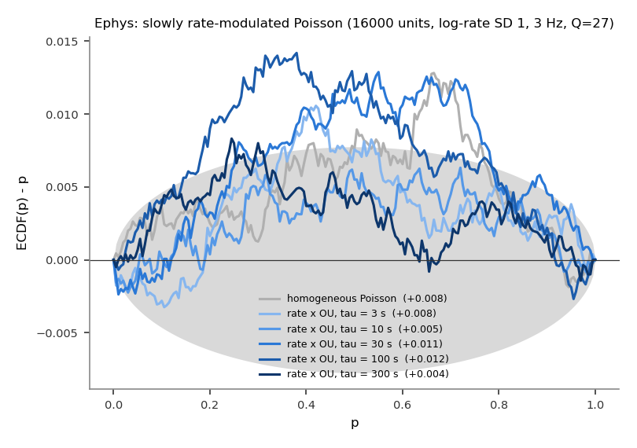

<sub>**Figure 19. Simulated ephys with slow rate modulation (the advisor's test).** ECDF(p) − p for 16,000 Poisson units (3 Hz, T = 300 s, Q = 27, ≈ 134 spikes/unit), either homogeneous (gray) or with OU log-rate modulation (SD 1) at τ = 3–300 s. Legend: dev@0.5. Gray band: 95% binomial band.</sub>

**Ephys** (Figure 19; the advisor's literal test, in `simulate.py`'s 3 Hz / T = 300 s / Q = 27 setup,
about 134 spikes per unit, 16,000 units):

| | homogeneous Poisson | τ = 3 s | τ = 10 s | τ = 30 s | τ = 100 s | τ = 300 s |
|---|---|---|---|---|---|---|
| dev@0.5 | +0.0076 | +0.0076 | +0.0055 | +0.0108 | +0.0116 | +0.0040 |

Slow rate modulation adds at most +0.004 over the finite-sample baseline at τ = 30–100 s,
which is about one SE. The ephys conclusion above therefore stands: finite-sample bias alone
accounts for the ephys deviation.

### What this establishes

| | finding |
|---|---|
| **Established** | The 0.1/0.3 Hz zebrafish and medaka traces are floor-clipped (median 91–98% of frames at exactly 50.0), with activity in slow epochs. The calibrated 2022 Q1 recordings are not clipped. |
| **Established** | Their excess is the same at every analysis frequency (+0.04 to +0.05), so it is a property of the traces, not of the stimulus. |
| **Established** | Neighbouring periodogram ordinates are correlated (lag-1 up to 0.38), which breaks the null's independence assumption. A 60 s amplitude envelope accounts for most of the correlation. |
| **Established** | Simulated floor-clipped traces with deep slow rate modulation reproduce the magnitude, the shape and the coupling. Neither clipping alone nor slow modulation alone does. |
| **Ruled out** | Spectral shape across the window; additive drift or bleaching; slow rate modulation of unclipped traces (the advisor's model as stated); slow modulation as an ephys mechanism. |
| **Open** | The 2022 Q1 recordings' +0.022 is local to the stimulus bin in `20220301`: a stimulus-locked component. |
| **Open** | Envelope normalisation recovers only part of the excess. A null that respects the coupling (for example, σ̂ from a block bootstrap over time, or an effective-dof correction from the measured coupling) has not been tried. |

**Implication for Fig 2C.** For these recordings the imaging excess is a null-model
violation caused by data quality, not a hint of a magnetic response. It sits at every
frequency, with the stimulus bin in the middle of the pack. The traces fail the
independence assumption that the Rayleigh/eps-corrected null rests on.

## Excluding ROIs with long dead time (imaging)

**Date:** 2026-10-01. **Script:** `activity_coverage.py`.

**The question.** Figure 10 shows that many ROIs in the floor-clipped recordings are not
usable cells. Some fire a handful of times in the whole recording. Others are "on" for a few
minutes and sit at the floor for the rest. The previous section found that this kind of trace
is what breaks the null. Can such ROIs be removed by a rule that is reliable (it keeps the
traces that look like cells) and rational (its threshold is chosen from the data, not
guessed)? And does removing them restore calibration?

**What is measured.** Per ROI trace, on the frames `fit_Fourier` analyses:

| quantity | definition |
|---|---|
| floor | the trace's most common value, if it holds ≥ 20% of frames. Below that the trace counts as unclipped (no floor). The minimum is not used, because a single outlier frame below the floor (the bottom-right medaka trace in Figure 10 has one) would make every floor frame count as active. |
| active frame | a frame above the floor. Every frame of an unclipped trace is active. |
| active fraction | share of frames that are active |
| coverage | share of 60 s windows that contain ≥ 3 active frames: is the ROI "on" throughout the recording, or only part of it? |

Neither quantity uses stimulus timing or the power at any frequency. Excluding ROIs on them
therefore cannot create or remove a stimulus-locked response. The threshold is judged on
**sham frequencies**: 16–21 log-spaced analysis frequencies per recording, from about 0.06 Hz
up to just below Nyquist, skipping the stimulus window (the stimulus bin ± M bins), where
nothing was presented. The window width stays at the production M bins. Each recording's
range is in the Figure 23 legend. Their p-values should be uniform. The
stimulus frequency is only read off afterwards.

### Distributions: how active are the ROIs?

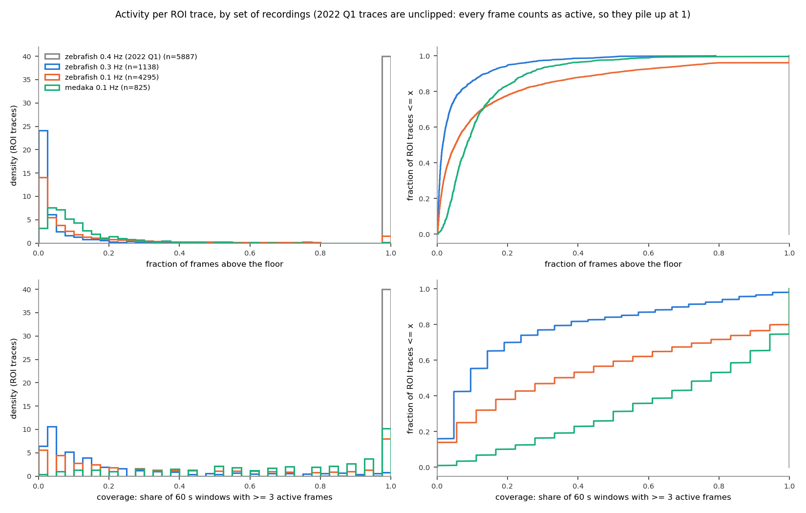

<sub>**Figure 20. Activity per ROI trace, by set of recordings.** *Top:* fraction of frames above the floor. *Bottom:* coverage, the share of 60 s windows with ≥ 3 active frames. *Left:* histograms (density). *Right:* ECDFs. The 2022 Q1 traces are unclipped, so every frame counts as active and they all sit at 1 (gray spike). n (ROI traces) in the legend.</sub>

- **Active fraction is low everywhere in the clipped recordings.** The median trace is above
  the floor in only 2% (0.3 Hz), 6% (0.1 Hz) and 8% (medaka) of frames. This measures how
  sparse the activity is, not whether it is spread over the recording, so it separates dead
  ROIs from live ones poorly. Coverage is the more useful quantity.
- **Coverage is spread out, with a lump at the low end and a spike at 1.**
  - 0.3 Hz zebrafish: mostly low (median 0.10; only 3% of traces have full coverage).
  - 0.1 Hz zebrafish: median 0.39, with 22% at full coverage.
  - Medaka: mostly high (median 0.78, 25% at full coverage).
- **There is no clean valley between "dead" and "alive".** The histograms are roughly flat
  between 0.2 and 0.9, so the distributions alone don't dictate a threshold. The calibration
  sweep (Figure 22) has to.
- **A few traces in these recordings are unclipped.** About 4% in the 0.1 Hz zebrafish
  recordings, mostly `engert_20221002_fish1_magneto_1`, whose baseline is about 12,800 (see
  the per-recording table in section 1). They have coverage 1 and pass any threshold.

### Do low-coverage ROIs look like junk, and high-coverage ones like cells?

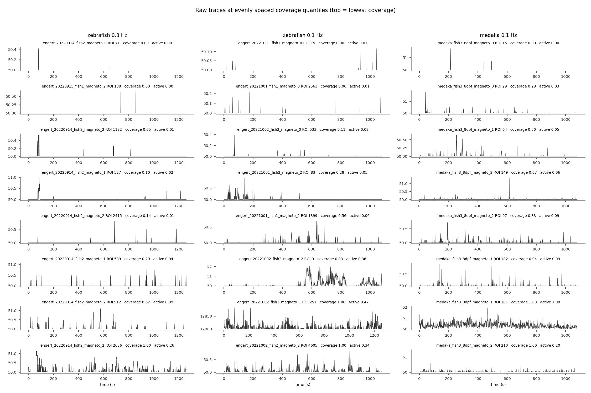

<sub>**Figure 21. Raw traces at evenly spaced coverage quantiles.** For each clipped set of recordings (columns), 8 ROI traces picked at evenly spaced quantiles of coverage, from the lowest (top) to the highest (bottom). There is no selection on p. Titles give the recording, ROI, coverage and active fraction.</sub>

- **Coverage below about 0.15 is junk:** two to a dozen isolated spikes, or one burst and then
  nothing.
- **Around 0.3** the traces fire throughout, but sparsely.
- **From about 0.5 up** they look like cells.

One caveat: ≥ 3 active frames per window is a lenient definition of "on". A trace with a long
quiet stretch can still score well if a few single-frame blips fall in the quiet windows
(`engert_20221002_fish2_magneto_2` ROI 9, coverage 0.83, is mostly silent for its first 500 s).
A stricter per-window criterion would catch it, at the cost of more ROIs.

### Does excluding them restore calibration?

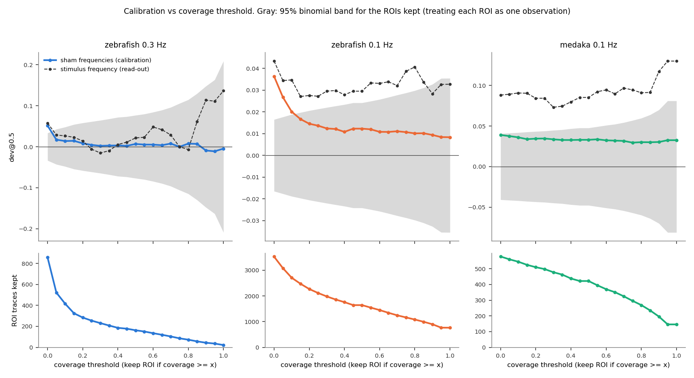

<sub>**Figure 22. Calibration vs coverage threshold.** For each clipped set of recordings (columns), the deviation at p = 0.5 after keeping only ROI traces with coverage ≥ the threshold (x). *Top:* sham frequencies pooled (coloured, the calibration target) and the stimulus frequency (black dashed, read-out only). Gray: 95% binomial band for the number of ROIs kept, treating each ROI as one observation; this is conservative for the sham line, which pools about 20 frequencies per ROI. *Bottom:* ROI traces kept.</sub>

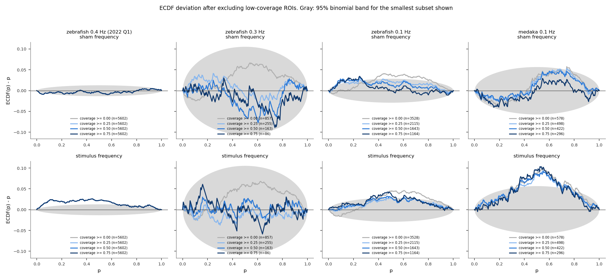

<sub>**Figure 23. Whole ECDF-deviation curves after exclusion.** ECDF(p) − p at coverage thresholds 0, 0.25, 0.5 and 0.75 (light to dark), for each set of recordings (columns). *Top:* sham frequencies pooled: 16–21 per recording, log-spaced, excluding the stimulus window. They span 0.10–0.34 Hz (2022 Q1), 0.09–0.45 Hz (0.3 Hz zebrafish), 0.14–0.47 Hz (0.1 Hz zebrafish) and 0.06–0.48 Hz (medaka). *Bottom:* stimulus frequency. Gray: 95% binomial band for the smallest subset shown.</sub>

| coverage ≥ | 0.3 Hz zebrafish: kept / sham dev / stimulus dev | 0.1 Hz zebrafish: kept / sham / stimulus | medaka: kept / sham / stimulus |
|---|---|---|---|
| 0 (everything) | 857 / +0.051 / +0.058 | 3528 / +0.036 / +0.043 | 578 / +0.039 / +0.088 |
| 0.10 | 416 / +0.014 / +0.026 | 2708 / +0.020 / +0.035 | 545 / +0.036 / +0.091 |
| 0.25 | 255 / +0.005 / −0.006 | 2115 / +0.014 / +0.027 | 498 / +0.035 / +0.084 |
| 0.50 | 163 / +0.007 / +0.021 | 1643 / +0.012 / +0.030 | 422 / +0.033 / +0.085 |
| 0.75 | 86 / 0.000 / 0.000 | 1164 / +0.011 / +0.039 | 296 / +0.030 / +0.095 |

- **Zebrafish: yes.** The sham deviation falls steeply up to a threshold of about 0.2–0.3 and
  then flattens. In the 0.3 Hz recordings it reaches about zero. In the 0.1 Hz recordings it
  drops from +0.036 to about +0.012 and stays there. The sham curves in Figure 23 lose the
  mid-p bulge and sit inside the band.
- **Medaka: no.** Its ROIs mostly have high coverage already, and the sham deviation barely
  moves (+0.039 → +0.030). Whatever miscalibrates medaka is not dead time. The photon-starved,
  coarsely quantised signal (`medaka_concat_suite2p.md`) is the obvious candidate.
- **A rational threshold is where the sham curve flattens: coverage ≥ 0.25 to 0.3.** Higher
  thresholds buy no further calibration, cost many ROIs, and widen the band. At 0.25 the
  rule keeps 255 of 857 ROI traces (0.3 Hz), 2115 of 3528 (0.1 Hz) and 498 of 578
  (medaka). This also agrees with the gallery, where 0.25–0.3 is about where traces stop
  looking like junk.

**The stimulus frequency, once the noise is cleaned up.** In the 0.1 Hz recordings, the
stimulus-frequency deviation stays above the sham deviation at every threshold:
- 0.1 Hz zebrafish: about +0.03 against +0.012.
- Medaka: about +0.085 against +0.033.

Each gap is about 1.5–2 SE (binomial on the ROIs kept), so neither is significant on its own.
But they have the same sign, they come from two species at the same 0.1 Hz frequency, and
medaka's stimulus bin was already one of the two highest in Figure 12. This should be checked
before Fig 2C is finalised, for example with the bin-by-bin view of Figure 12 restricted to
the ROIs kept, and the sham pool as the reference. It is flagged here, not concluded. One confound has to be ruled out first. In the 0.1 Hz
zebrafish recordings every sham frequency lies *above* the stimulus (0.14–0.47 Hz), because
lower bins are skipped to stay clear of the slow band. If calibration worsens toward low
frequencies, a gap would appear without any stimulus-locked component. The near-stimulus
check should therefore compare against bins on both sides of 0.1 Hz.

### What this establishes

| | finding |
|---|---|
| **Established** | Coverage (share of 60 s windows with ≥ 3 frames above the floor) separates junk ROIs from cell-like ones by eye (Figure 21), and it is blind to the stimulus. |
| **Established** | In the 0.3 Hz and 0.1 Hz zebrafish recordings, excluding coverage < 0.25 removes most of the sham-frequency miscalibration (0.3 Hz: +0.051 → +0.005; 0.1 Hz: +0.036 → +0.014). It keeps 30% and 60% of ROI traces respectively. |
| **Established** | It does not fix medaka (+0.039 → +0.035). Medaka's problem is something other than dead time. |
| **Open** | In both sets of 0.1 Hz recordings, the stimulus-frequency deviation stays above the sham deviation after exclusion (gaps of 1.5–2 SE). |
| **Decision needed** | Whether to adopt a coverage criterion in the production engert/medaka inclusion step (next to P(iscell) and npix), and at what threshold. This report recommends 0.25, chosen on sham calibration. |

## Reconciling with the noise-floor report

[`fig1_mag_noise_floor_correction.md`](fig1_mag_noise_floor_correction.md) (2026-08-19)
examined one pigeon recording and found a **negative** ECDF deviation, which it traced to
a convex local noise floor making σ̂ too large. It explicitly ruled out a finite-sample
explanation.

Both results stand. They are opposite-signed mechanisms that coexist in every recording:

| mechanism | effect on σ̂ / NFC | sign of deviation |
|---|---|---|
| Convex local noise floor | σ̂ over-estimated → NFC down | **negative** |
| Finite spike count | Rayleigh asymptote not reached → NFC up | **positive** |

Which one dominates a given recording depends on its spike counts and its local spectral
curvature. That predicts scatter around a positive mean, which is what the per-recording
measurement shows: of 30 magnetic recordings with ≥60 units, **70% are positive**, mean
+0.028, SD 0.050, range −0.063 to +0.148. Neither mechanism alone predicts both signs.

This also explains why the earlier report ruled out finite-sample effects and was right to:
finite-sample bias is strictly positive and cannot produce that recording's negative deviation.

## On the Rice interpretation

An earlier framing in this investigation fitted a Rice distribution — a Rayleigh with a
noncentrality ν — and found ν ≈ 0.3 flattens the mid-range while leaving both tails
nominal. That fit is correct as *description*: the observed NFC distribution does have
less mass near zero than Rayleigh, which is exactly what a noncentrality produces.

It should **not** be read as evidence of a physical additive component in `c`. The
finite-sample sampling distribution of `|c|/σ̂` is itself slightly displaced from the
origin, and a Rice fit absorbs that displacement into ν whether or not anything was
physically added. ν ≈ 0.3 is best read as a compact summary of the finite-sample bias,
not as a signal.

## Implications

1. **The magnetic null result is unaffected.** The bias is confined to the bulk;
   `P(p<0.01)` is nominal in the real data (0.0092) and across every simulated condition.
2. **Do not claim the pooled p-value distribution is exactly uniform.** It is not, for a
   reason that has nothing to do with magnetic fields, and a reviewer plotting the pooled
   ECDF would find it.
3. **More neurons will not fix it.** Longer recordings (more spikes per unit) will.
4. **The pooled Fig2 C number is imaging-dominated.** Quoting ephys and imaging separately
   is more honest than quoting +0.0163 — they have entirely different causes.
5. **The two modalities are not the same phenomenon.** Ephys is finite-sample bias in an
   asymptotic null. In the 0.1/0.3 Hz zebrafish and medaka recordings, imaging is
   floor-clipped traces with slow activity epochs, which correlate neighbouring periodogram
   ordinates and break the null's independence assumption. A single "the null is slightly
   off" sentence covering both would be wrong.

## Reproducing

```bash
# Ephys: finite-sample bias (Poisson simulation)
python docs/nfc_finite_sample_bias/simulate.py                  # full sweeps, ~10 min
python docs/nfc_finite_sample_bias/simulate.py --figures-only   # replot from saved CSVs

# Imaging: surrogate decomposition (reads the engert NWB files)
python docs/nfc_finite_sample_bias/imaging_surrogates.py                 # ~10 min
python docs/nfc_finite_sample_bias/imaging_surrogates.py --figures-only  # replot

# Imaging: slow variation (reads the engert + medaka NWB files)
python docs/nfc_finite_sample_bias/slow_variation.py                     # ~5 min
python docs/nfc_finite_sample_bias/slow_variation.py --figures-only      # replot (needs the local cache)
python docs/nfc_finite_sample_bias/slow_variation_sim.py                 # ~25 min
python docs/nfc_finite_sample_bias/slow_variation_sim.py --figures-only

# Imaging: excluding ROIs with long dead time
python docs/nfc_finite_sample_bias/activity_coverage.py                  # ~5 min
python docs/nfc_finite_sample_bias/activity_coverage.py --figures-only   # replot (needs the local cache)
```

`slow_variation.py` asserts that its recomputed production p-values match the parquet
(max |dp| 1.1e-06 over 10,565 rows), and that its own FFT path reproduces `fit_Fourier`
exactly at the stimulus frequency. It writes `results_slow_variation_{rois,curves,coupling,scan}.csv`,
`results_surrogate_validation.csv` and the `fig_sv_*.png` figures. Its `--figures-only` mode
also needs `slow_variation_cache.npz` (window periodograms and example traces), which is
gitignored and regenerated by a full run. `slow_variation_sim.py` writes
`results_sv_sim_{curves,coupling}.csv` and `fig_sv_sim_*.png`.
`activity_coverage.py` writes `results_activity_{rois,sweep,curves}.csv` and `fig_ac_*.png`.
Its gallery cache `activity_coverage_cache.npz` is gitignored.

`docs/nfc_finite_sample_bias/` contains the scripts, the figures embedded above (Figures 1–23), and
`results_units.csv` / `results_spikes.csv` / `results_spikes_wide.csv` /
`results_curves.csv` / `results_real.csv` / `results_real_spk_counts.csv` /
`results_imaging_surrogates.csv` holding every observation behind the tables.

`imaging_surrogates.py` calls the production `fit_Fourier`, `corrected_pvalues` and
`_load_from_nwb` directly rather than reimplementing them, so there is nothing to
self-test; its correctness check is the phase-randomised control column (which must, and
does, reproduce `real` exactly) plus the cross-check against the parquet above.

The script reimplements `statistics.fourier_analysis`'s NFC computation in vectorised form
(the production version loops in Python over both units and frequencies, far too slow for
a sweep this size). `_selftest()` asserts the two agree to **1e-10** before any sweep runs,
so the speed-up cannot silently change the result.

### Incidental finding

`ff_alt` takes Q bins on *each* side of the stimulus bin, so **2Q** coefficients enter σ̂.
That confirms `get_epsilon(Q) = 1/(2√(2Q))` is correct — it is `1/(2√M)` with `M = 2Q` the
number of averaged coefficients. A √2 discrepancy suspected earlier in this investigation
was this off-by-one-side confusion, not a bug.

### Parameters

`FREQ = 3.0 Hz`, `T = 300 s`, `SR = 30000`, `Q = 27` (the pigeon magnetic recording's own
value). Spike times are drawn uniformly on [0, T), which is a homogeneous Poisson process
conditioned on spike count.
