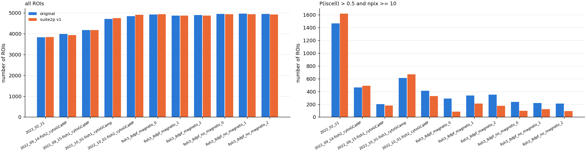
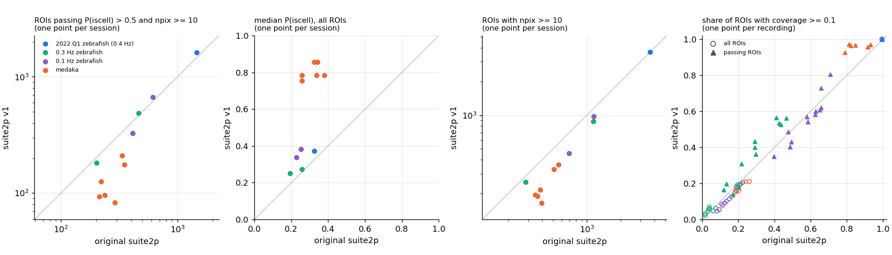
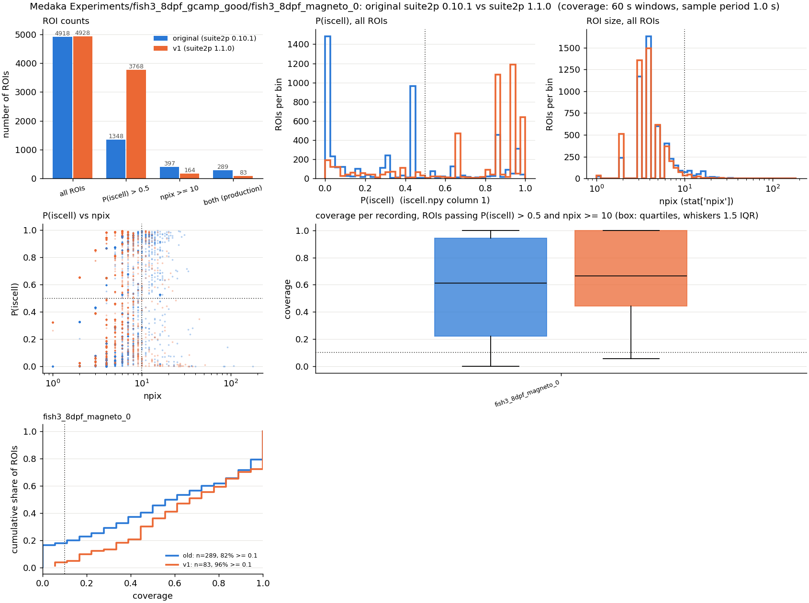
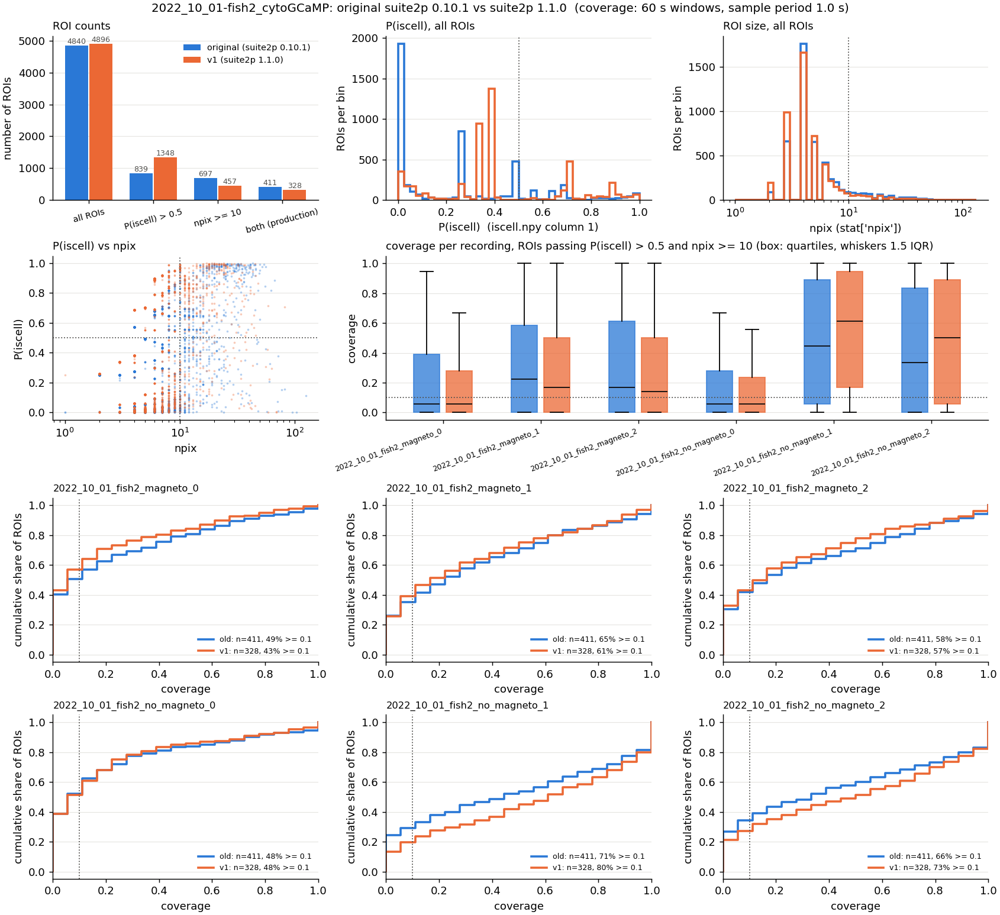

# suite2p v1 against the original suite2p runs: ROIs, P(iscell), ROI size, coverage

**Date:** 2026-10-05. **Branch:** `suite2p-v1-comparison`. **Scripts** (in `docs/suite2p_v1/`, see
[`README_runs.md`](suite2p_v1/README_runs.md)):
- `run_suite2p_v1.py`: re-runs one session with suite2p 1.1.0 on the GPU, settings mapped from the original `ops.npy` (env `suite2p1.0`). Writes only to `C:/Users/dan/suite2p_v1_runs/`.
- `compare_v1.py`: original vs v1, per session and per recording; writes `results/sessions.csv`, `recordings.csv`, `halving.csv` and the per-session figures (env `magneto2`).
- `summarize_v1.py`: the across-session tables below and Figure 2.

**Coverage of this report: 11 of 15 sessions.** Missing, because their v1 runs had not
finished when this was compiled: `2022_02_23` and `2022_03_01` (2022 Q1 zebrafish), and
`2022_10_02-fish1_cytoGCaMP` and `2022_10_02-fish2_cytoGCaMP` (0.1 Hz zebrafish). Rerunning
`compare_v1.py` for them and then `summarize_v1.py` fills them in.

**Summary.**
- **The total number of ROIs is the same** (within 2% in every session). Both versions stop
  near the 5000-ROI cap of sparsery, so this number says little.
- **v1 gives higher P(iscell).** In medaka the median goes from 0.26–0.38 to 0.75–0.85. In the
  0.1 and 0.3 Hz zebrafish it rises a little (0.19–0.26 to 0.25–0.38); in 2022_02_21 from 0.32 to 0.37.
- **v1 makes ROIs slightly smaller** in the floor-clipped recordings: fewer ROIs reach
  npix ≥ 10 (medaka −35 to −59%, 0.1/0.3 Hz zebrafish −11 to −34%). 2022_02_21 is unchanged.
- **The production ROI set changes most in medaka:** 1647 → 785 ROIs pass P(iscell) > 0.5 and
  npix ≥ 10 (−52%, −37 to −71% per trial), because the npix loss outweighs the P(iscell) gain.
  In the 0.1/0.3 Hz zebrafish the passing count moves −20% to +9% per session (−1% overall);
  in 2022_02_21 it rises 11%.
- **Coverage barely moves for all ROIs; among passing ROIs it rises in medaka** (share with
  coverage ≥ 0.1: 0.79–0.93 → 0.93–0.97) and in the 0.3 Hz zebrafish, and falls slightly in
  2022_10_01-fish1.
- **v1 still halves uint16 tiffs, and the floor at 50.0 remains** in every floor-clipped session
  (99.2–99.5% of registered pixels at 50; 88–97% of passing-ROI F samples at exactly 50.0).
  2022_02_21 is halved too, but its raw values (~10 000, 4220 distinct values) lose nothing
  that matters and its traces have no floor.

## Terms and populations

- **Original:** the suite2p output on the NAS that production uses: 0.10.1 for the 0.3 Hz and
  0.1 Hz zebrafish and the medaka trials, 0.14.4 for the 2022 Q1 zebrafish.
- **v1:** suite2p 1.1.0 run on the same tiffs, in the same order, with settings mapped from the
  original `ops.npy` (caveats below).
- **Session:** one suite2p segmentation. A zebrafish session covers several recordings (tiffs)
  that share one set of ROIs; each medaka trial was segmented on its own, so a medaka session is
  one recording.
- **Recording (trial):** one tiff; its frames are a slice of the session's F.
- **P(iscell):** column 1 of `iscell.npy`, the classifier's probability.
- **npix:** `stat["npix"]`, the ROI's number of pixels.
- **Passing ROIs:** the production thresholds P(iscell) > 0.5 and npix ≥ 10 (without the
  outline, flatline and coverage filters that production applies later).
- **Coverage:** the share of a recording's 60 s windows in which the ROI's trace has at least 3
  frames above its floor (`pipeline/roi_coverage.py`). Production keeps ROIs with coverage ≥ 0.1.
- **Floor-clipped:** a trace that sits at its minimum value most of the time; `share_clipped`
  in `recordings.csv` is the share of ROIs whose trace is clipped in this sense.

## Settings mapping caveats

From [`README_runs.md`](suite2p_v1/README_runs.md); the full table is in each run's
`settings_used.json`.
- **`fs` stays at 10 Hz,** the value in the original ops, although the movies run at ~1 frame/s.
  It sets the detection bin size, baseline window and deconvolution; changing it would confound
  the comparison.
- **The classifier is the built-in one** in v1. The original runs used the processing machine's
  user classifier, which ops does not record; on this machine the user classifier is
  byte-identical to the built-in one of 1.1.0 and 0.14.4. If the processing machine's differed,
  part of the P(iscell) change would come from that.
- **`max_iterations` → `sparsery_settings.max_ROIs = 250 × max_iterations` (5000).** Both
  versions hit close to this cap, so compare counts after the thresholds.
- `spatial_taper` (40), `nimg_init`, registration batch size, block size, the high-pass and
  neuropil settings and the baseline settings are carried over. Old settings with no v1
  equivalent (`1Preg`, `spatial_hp_reg`, `pre_smooth`, `spatial_hp`, `frames_include`, `aspect`,
  `pretrained_model`, `spatial_hp_cp`) are dropped; `1Preg` was off in every original run.
- Spatial scale estimation fails in both versions and falls back to 6 px.
- **Runtimes are not comparable.** Several v1 runs shared the GPU with other runs and spilled
  GPU memory to system RAM, which made them up to ~30× slower (e.g. medaka no_magneto_2: 1835 s
  against 17–98 s for the other trials). Uncontended, v1 took 17–135 s per session against
  110–1003 s for the original runs.

## 1. Does v1 find a different number of ROIs?

**The question.** For each session, does v1 detect more or fewer ROIs, before and after the
production thresholds?

**Figure 1. ROI counts per session, original (blue) and suite2p v1 (orange).** *Left:* all ROIs. *Right:* ROIs passing P(iscell) > 0.5 and npix ≥ 10. 11 of 15 sessions (see top).

| session | batch | original | ROIs | P(iscell) > 0.5 | npix ≥ 10 | passing both | change in passing | median P(iscell) | median npix | 90th pct npix |
|---|---|---|---|---|---|---|---|---|---|---|
| 2022_02_21 | 2022 Q1 zebrafish (0.4 Hz) | 0.14.4 | 3821 → 3834 | 1477 → 1624 | 3669 → 3676 | 1464 → 1619 | +11% | 0.32 → 0.37 | 46 → 47 | 96 → 97 |
| 2022_09_14-fish2_cytoGCaMP | 0.3 Hz zebrafish | 0.10.1 | 3981 → 3922 | 705 → 986 | 1145 → 883 | 465 → 488 | +5% | 0.19 → 0.25 | 6 → 5 | 21 → 17 |
| 2022_09_15-fish1_cytoGCaMP | 0.3 Hz zebrafish | 0.10.1 | 4165 → 4168 | 549 → 517 | 286 → 254 | 202 → 182 | −10% | 0.26 → 0.27 | 3 → 2 | 8 → 7 |
| 2022_10_01-fish1_cytoGCamp | 0.1 Hz zebrafish | 0.10.1 | 4705 → 4735 | 1048 → 1579 | 1157 → 975 | 613 → 669 | +9% | 0.23 → 0.34 | 6 → 5 | 17 → 15 |
| 2022_10_01-fish2_cytoGCaMP | 0.1 Hz zebrafish | 0.10.1 | 4840 → 4896 | 839 → 1348 | 697 → 457 | 411 → 328 | −20% | 0.25 → 0.38 | 4 → 4 | 12 → 9 |
| fish3_8dpf_magneto_0 | medaka | 0.10.1 | 4918 → 4928 | 1348 → 3768 | 397 → 164 | 289 → 83 | −71% | 0.32 → 0.85 | 4 → 4 | 8 → 7 |
| fish3_8dpf_magneto_1 | medaka | 0.10.1 | 4859 → 4865 | 1210 → 3363 | 561 → 363 | 336 → 211 | −37% | 0.26 → 0.75 | 4 → 4 | 10 → 8 |
| fish3_8dpf_magneto_2 | medaka | 0.10.1 | 4889 → 4868 | 1217 → 3767 | 511 → 329 | 350 → 176 | −50% | 0.26 → 0.78 | 4 → 4 | 10 → 8 |
| fish3_8dpf_no_magneto_0 | medaka | 0.10.1 | 4941 → 4926 | 1282 → 3784 | 348 → 195 | 238 → 96 | −60% | 0.34 → 0.78 | 4 → 4 | 8 → 7 |
| fish3_8dpf_no_magneto_1 | medaka | 0.10.1 | 4957 → 4929 | 2334 → 3772 | 384 → 215 | 221 → 126 | −43% | 0.38 → 0.78 | 4 → 4 | 8 → 7 |
| fish3_8dpf_no_magneto_2 | medaka | 0.10.1 | 4946 → 4917 | 2260 → 3749 | 364 → 190 | 213 → 93 | −56% | 0.34 → 0.85 | 4 → 4 | 8 → 7 |

Table 1. Per session, original → v1. "Passing both": P(iscell) > 0.5 and npix ≥ 10. Totals of passing ROIs: medaka 1647 → 785 (−52%); 0.1 Hz zebrafish 1024 → 997 (−3%); 0.3 Hz zebrafish 667 → 670 (0%); 2022_02_21 1464 → 1619 (+11%).

- **All ROIs: no difference** (Figure 1, left). Every session changes by less than 2%, and all
  0.1 Hz zebrafish and medaka sessions sit at 4700–4960, just under the 5000 cap.
- **Passing ROIs: medaka loses about half** (Figure 1, right), between 37% and 71% per trial.
  In the zebrafish sessions the change is between −20% and +11% and has no consistent sign.

## 2. Does v1 assign different P(iscell)?

**The question.** Is the distribution of the classifier probability the same in both versions?

**Figure 2. Original (x) against v1 (y), one point per session or recording.** Dotted: no change. Colours: batch. *1st:* ROIs passing P(iscell) > 0.5 and npix ≥ 10 (log axes). *2nd:* median P(iscell) of all ROIs. *3rd:* ROIs with npix ≥ 10 (log axes). *4th:* share of ROIs with coverage ≥ 0.1, per recording, for all ROIs (rings) and passing ROIs (triangles).

- **v1's median P(iscell) is higher in every session** (Figure 2, 2nd panel; Table 1). The
  shift is large in medaka: the median goes from 0.26–0.38 to 0.75–0.85, and 3363–3784 ROIs per
  trial exceed 0.5, against 1210–2334 in the original.
- In the zebrafish sessions the shift is modest: median +0.01 to +0.13; ROIs above 0.5 go up by
  10–61%, except 2022_09_15-fish1 (549 → 517).
- The original medaka distribution has large spikes at 0 and near 0.43 (Figure 3, top middle);
  v1's is concentrated above 0.6, in a few narrow peaks. Both look like the classifier
  responding to a handful of discrete feature values, which is what floor-clipped traces with
  few distinct values produce.

**Figure 3. One medaka trial, fish3_8dpf_magneto_0, original 0.10.1 (blue) vs v1 (orange).** *Top:* ROI counts at each threshold; P(iscell) histogram (dotted: 0.5); npix histogram (log x; dotted: 10). *Middle:* P(iscell) against npix per ROI; coverage of passing ROIs (box: quartiles, whiskers 1.5 IQR; dotted: 0.1). *Bottom:* cumulative distribution of coverage among passing ROIs. The other trials' figures: `suite2p_v1/figs/fish3_8dpf_*.png`.

## 3. Does v1 produce ROIs of a different size?

**The question.** Is the npix distribution the same, and does the npix ≥ 10 threshold keep as
many ROIs?

- **v1's ROIs are slightly smaller in the floor-clipped sessions.** The median npix is unchanged
  or one pixel smaller (2–6 px), but the upper tail shrinks: the 90th percentile drops by 1–4 px
  (Table 1).
- Because the threshold of 10 px sits in that tail, **the count with npix ≥ 10 drops by 35–59%
  in medaka and 11–34% in the 0.1/0.3 Hz zebrafish** (Figure 2, 3rd panel). In medaka this loss
  is larger than the gain from P(iscell), hence the drop in passing ROIs.
- **2022_02_21 is unchanged:** median 46 → 47 px, 3669 → 3676 ROIs with npix ≥ 10. Its ROIs
  are an order of magnitude larger than in the other batches.

**Figure 4. One 0.1 Hz zebrafish session, 2022_10_01-fish2_cytoGCaMP (6 recordings), original 0.10.1 (blue) vs v1 (orange).** Panels as in Figure 3, with one coverage box pair and one cumulative coverage panel per recording. The other sessions: `suite2p_v1/figs/<session>.png`.

## 4. Does v1 change coverage?

**The question.** Per recording, does the share of 60 s windows with ≥ 3 frames above the floor
differ between the versions, for all ROIs and for passing ROIs?

| session | recording | all ROIs: share coverage ≥ 0.1 | passing: n | passing: median coverage | passing: share coverage ≥ 0.1 |
|---|---|---|---|---|---|
| 2022_02_21 | each of visual+magnet, visual, magnet, nostim | 0.99 → 1.00 | 1464 → 1619 | 1.00 → 1.00 | 0.99 → 1.00 |
| 2022_09_14-fish2 | magneto_0 | 0.06 → 0.05 | 465 → 488 | 0.00 → 0.00 | 0.17 → 0.14 |
| 2022_09_14-fish2 | magneto_1 | 0.20 → 0.18 | 465 → 488 | 0.05 → 0.10 | 0.44 → 0.53 |
| 2022_09_14-fish2 | magneto_2 | 0.20 → 0.19 | 465 → 488 | 0.05 → 0.10 | 0.41 → 0.56 |
| 2022_09_14-fish2 | no_magneto_0 | 0.08 → 0.06 | 465 → 488 | 0.00 → 0.00 | 0.20 → 0.18 |
| 2022_09_14-fish2 | no_magneto_1 | 0.19 → 0.18 | 465 → 488 | 0.05 → 0.10 | 0.43 → 0.53 |
| 2022_09_14-fish2 | no_magneto_2 | 0.21 → 0.20 | 465 → 488 | 0.05 → 0.10 | 0.47 → 0.56 |
| 2022_09_15-fish1 | magneto_0 | 0.02 → 0.03 | 202 → 182 | 0.00 → 0.00 | 0.13 → 0.20 |
| 2022_09_15-fish1 | magneto_1 | 0.04 → 0.06 | 202 → 182 | 0.00 → 0.05 | 0.30 → 0.36 |
| 2022_09_15-fish1 | magneto_2 | 0.04 → 0.07 | 202 → 182 | 0.00 → 0.05 | 0.29 → 0.43 |
| 2022_09_15-fish1 | no_magneto_0 | 0.02 → 0.02 | 202 → 182 | 0.00 → 0.00 | 0.12 → 0.16 |
| 2022_09_15-fish1 | no_magneto_1 | 0.03 → 0.04 | 202 → 182 | 0.00 → 0.00 | 0.22 → 0.31 |
| 2022_09_15-fish1 | no_magneto_2 | 0.04 → 0.06 | 202 → 182 | 0.00 → 0.00 | 0.29 → 0.40 |
| 2022_10_01-fish1 | magneto_0 | 0.13 → 0.10 | 613 → 669 | 0.06 → 0.06 | 0.49 → 0.40 |
| 2022_10_01-fish1 | magneto_1 | 0.23 → 0.21 | 613 → 669 | 0.22 → 0.17 | 0.66 → 0.62 |
| 2022_10_01-fish1 | magneto_2 | 0.21 → 0.19 | 613 → 669 | 0.17 → 0.11 | 0.62 → 0.58 |
| 2022_10_01-fish1 | no_magneto_0 | 0.11 → 0.09 | 613 → 669 | 0.06 → 0.06 | 0.40 → 0.35 |
| 2022_10_01-fish1 | no_magneto_1 | 0.20 → 0.18 | 613 → 669 | 0.22 → 0.17 | 0.63 → 0.60 |
| 2022_10_01-fish1 | no_magneto_2 | 0.19 → 0.16 | 613 → 669 | 0.17 → 0.11 | 0.58 → 0.54 |
| 2022_10_01-fish2 | magneto_0 | 0.08 → 0.05 | 411 → 328 | 0.06 → 0.06 | 0.49 → 0.43 |
| 2022_10_01-fish2 | magneto_1 | 0.13 → 0.09 | 411 → 328 | 0.22 → 0.17 | 0.65 → 0.61 |
| 2022_10_01-fish2 | magneto_2 | 0.11 → 0.08 | 411 → 328 | 0.17 → 0.14 | 0.58 → 0.57 |
| 2022_10_01-fish2 | no_magneto_0 | 0.09 → 0.05 | 411 → 328 | 0.06 → 0.06 | 0.48 → 0.48 |
| 2022_10_01-fish2 | no_magneto_1 | 0.16 → 0.13 | 411 → 328 | 0.44 → 0.61 | 0.71 → 0.80 |
| 2022_10_01-fish2 | no_magneto_2 | 0.15 → 0.11 | 411 → 328 | 0.33 → 0.50 | 0.66 → 0.73 |
| fish3_8dpf (medaka) | magneto_0 | 0.20 → 0.16 | 289 → 83 | 0.61 → 0.67 | 0.82 → 0.96 |
| fish3_8dpf (medaka) | magneto_1 | 0.26 → 0.21 | 336 → 211 | 0.67 → 0.67 | 0.85 → 0.97 |
| fish3_8dpf (medaka) | magneto_2 | 0.24 → 0.21 | 350 → 176 | 0.72 → 0.78 | 0.81 → 0.97 |
| fish3_8dpf (medaka) | no_magneto_0 | 0.18 → 0.15 | 238 → 96 | 0.61 → 0.69 | 0.79 → 0.93 |
| fish3_8dpf (medaka) | no_magneto_1 | 0.20 → 0.18 | 221 → 126 | 0.72 → 0.64 | 0.93 → 0.97 |
| fish3_8dpf (medaka) | no_magneto_2 | 0.19 → 0.16 | 213 → 93 | 0.72 → 0.72 | 0.92 → 0.96 |

Table 2. Per recording, original → v1. A zebrafish session's recordings share one set of ROIs, so "passing: n" repeats within a session. 2022_02_21's four recordings give identical rows, because almost every trace is above its floor in every window.

- **All ROIs: v1's coverage is the same or slightly lower** (Figure 2, 4th panel, rings): the
  share with coverage ≥ 0.1 changes by −0.05 to +0.03 per recording; it is lower in 24 of 34
  recordings (higher only in 2022_02_21 and 2022_09_15-fish1).
- **Passing ROIs, medaka: v1's are more often covered.** The share with coverage ≥ 0.1 goes
  from 0.79–0.93 to 0.93–0.97 (Figure 2, triangles; Figure 3, bottom), because v1 keeps fewer,
  mostly well-covered ROIs. The median coverage barely moves (0.61–0.72 → 0.64–0.78).
- **Passing ROIs, zebrafish: mixed.** Up in the 0.3 Hz sessions (by 0.04–0.15 in 10 of 12
  recordings) and in 2022_10_01-fish2's no_magneto_1/2; down by 0.03–0.09 in all six recordings
  of 2022_10_01-fish1. The ranking of recordings is preserved: magneto_0/no_magneto_0 are the
  least covered in both versions.
- **2022_02_21: full coverage in both** (0.99 → 1.00 of passing ROIs). The original's eight
  zero-coverage ROIs have an all-zero F; v1 has none.

## 5. Does v1 still halve uint16 tiffs and floor the traces?

**The question.** suite2p 0.10.1 stored uint16 tiffs as `im // 2` in int16, which merges the
raw offset floor 100 and 101 into 50 and erases most above-floor pixels. Does 1.1.0 do the same,
in every session?

| session | raw tiff: share at most common value (value) | raw distinct values | v1 data.bin / raw mean | v1 data.bin: share at most common value | original data.bin: same | passing-ROI F at its most common value, original → v1 |
|---|---|---|---|---|---|---|
| 2022_02_21 | 1.1% (9985) | 4220 | 0.4999 | 1.6% (4992) | 1.5% (4992) | 0.5% (at 0) → 0.0% |
| 2022_09_14-fish2 | 93.9% (100) | 20 | 0.4996 | 99.3% (50) | 99.8% (50) | 93.5% → 95.8% (at 50) |
| 2022_09_15-fish1 | 98.7% (100) | 11 | 0.4999 | 99.5% (50) | 100.0% (50) | 94.1% → 97.1% (at 50) |
| 2022_10_01-fish1 | 94.3% (100) | 29 | 0.4995 | 99.3% (50) | 99.8% (50) | 94.3% → 95.1% (at 50) |
| 2022_10_01-fish2 | 95.4% (100) | 28 | 0.4996 | 99.4% (50) | 99.9% (50) | 92.2% → 92.7% (at 50) |
| medaka magneto_0 | 93.2% (100) | 51 | 0.4994 | 99.3% (50) | 99.7% (50) | 89.1% → 88.6% (at 50) |
| medaka magneto_1 | 92.8% (100) | 38 | 0.4993 | 99.2% (50) | 99.6% (50) | 89.8% → 91.3% (at 50) |
| medaka magneto_2 | 93.1% (100) | 36 | 0.4994 | 99.3% (50) | 99.7% (50) | 89.8% → 89.5% (at 50) |
| medaka no_magneto_0 | 93.6% (100) | 43 | 0.4994 | 99.3% (50) | 99.7% (50) | 89.9% → 90.8% (at 50) |
| medaka no_magneto_1 | 93.5% (100) | 42 | 0.4994 | 99.3% (50) | 99.7% (50) | 89.9% → 92.2% (at 50) |
| medaka no_magneto_2 | 93.7% (100) | 34 | 0.4994 | 99.3% (50) | 99.8% (50) | 88.9% → 92.0% (at 50) |

Table 3. First 100 frames of the first tiff of each session: raw uint16 tiff, v1's registered `data.bin` and the original's (both int16). Last column: all frames of F for passing ROIs. From `results/halving.csv`.

- **Yes, in every session.** v1's `data.bin` has 0.4993–0.4999 times the raw mean, the same
  ratio as the original's.
- **In the floor-clipped sessions the floor survives unchanged:** the raw tiffs sit at 100 for
  93–99% of pixels; after halving and registration 99.2–99.5% of pixels are at 50 in v1
  (99.6–100% in the original). Passing ROIs' F is at exactly 50.0 for 89–97% of samples in v1,
  against 89–94% in the original, and nearly every trace is clipped in both versions (share of
  clipped traces 0.999–1.0, all ROIs).
- **2022_02_21 is halved but not floored.** Its raw values are around 10 000 with 4220
  distinct values in 100 frames, so dropping the last bit loses nothing that matters, and no
  trace is clipped in v1 (0.5% in the original, the all-zero ROIs above).
- So re-running with suite2p v1 does not remove the floor-clipping that breaks the Fourier null
  in the 0.1/0.3 Hz zebrafish and medaka data; that needs a re-extraction that skips the
  halving (see [`cv2.md`](cv2.md)).
